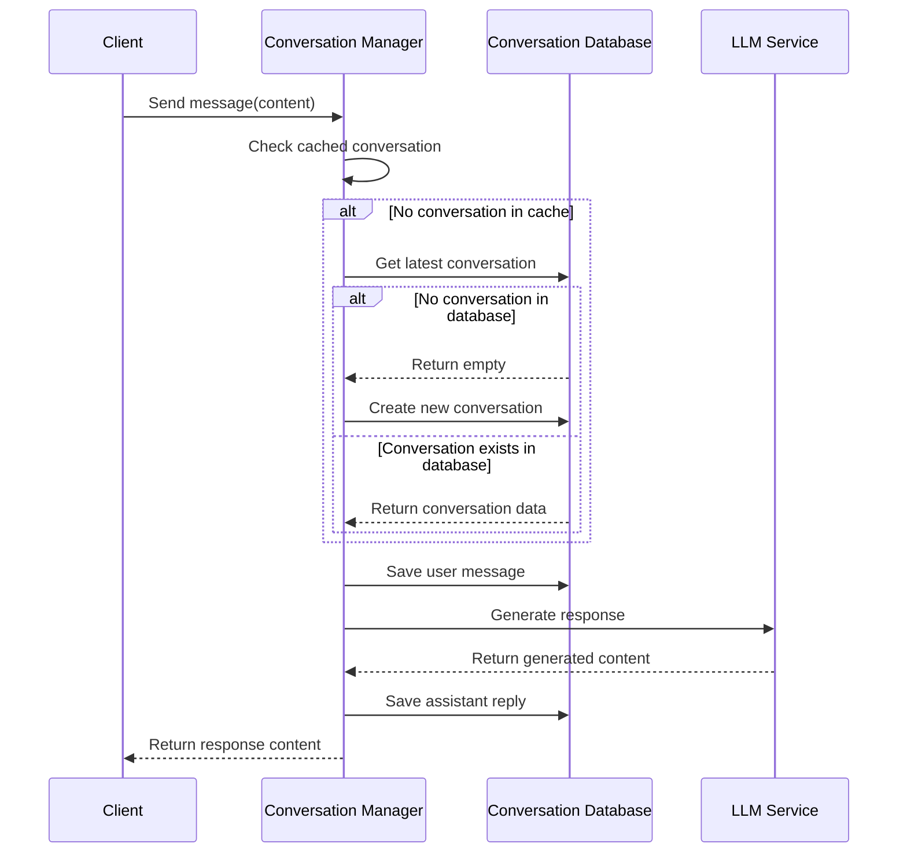
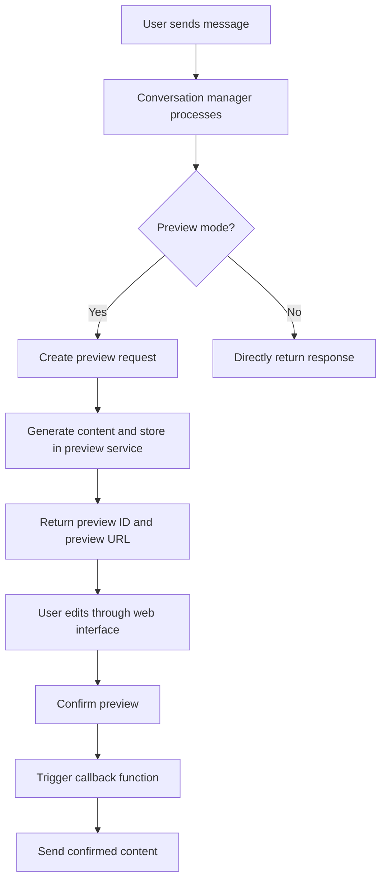
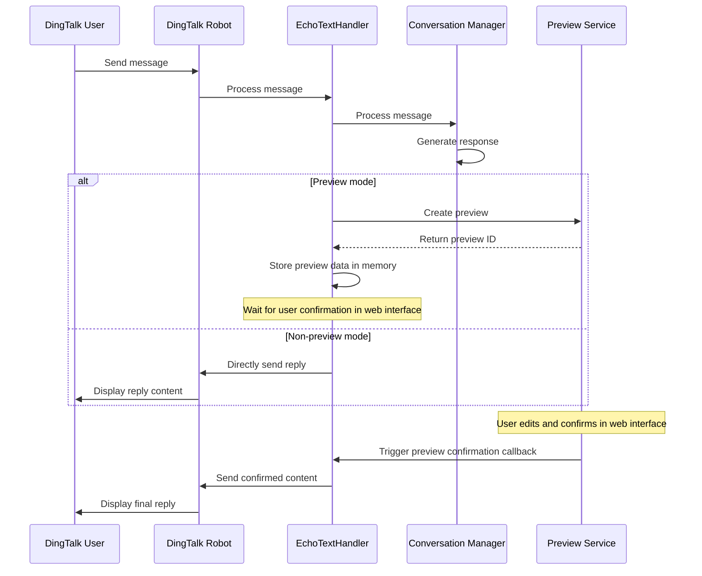

# ANY4ANY Conversation Management System Documentation

## 1. System Overview

The ANY4ANY Conversation Management System is a multi-platform dialogue management framework that provides complete conversation lifecycle management, context tracking, preview and editing functionality, and supports multiple platform integrations (especially DingTalk platform). The system design follows a modular architecture, achieving separation between business logic and data access layers.

### 1.1 Core Features

- **Multi-platform Conversation Management**: Supports tracking and maintaining user conversation history across different platforms (such as Web, DingTalk, API, etc.)
- **Preview Mode**: Provides preview and editing functionality for generated content, supporting human intervention
- **Streaming Responses**: Supports LLM streaming generation of response content
- **Persistent Storage**: Uses MySQL database to store conversation and message data
- **DingTalk Integration**: Supports DingTalk robot message processing and message sending after preview confirmation

### 1.2 System Architecture

The system mainly consists of the following core components:

1. **Conversation Manager**: Handles conversation business logic
2. **Conversation Database**: Responsible for data persistence
3. **Preview Service**: Manages preview and editing functionality
4. **DingTalk Message Manager**: Handles DingTalk platform-specific logic

## 2. Conversation Management Process

### 2.1 Basic Conversation Flow



### 2.2 Conversation Persistence Mechanism

The conversation management system uses MySQL database for persistent storage, containing two main tables:

1. **conversations table**: Stores basic conversation information
2. **messages table**: Stores message content, establishing foreign key relationships with the conversation table

The system uses memory caching (`active_conversations`) to improve performance, but all critical data is persisted to the database. The cache expiration time is configurable (default 1 hour).

## 3. Preview Mode Details

### 3.1 Preview Mode Working Principle

Preview mode allows users to view and edit LLM-generated content before final sending. The system saves the generated content to the preview service, and users can access and edit it through a web interface. The content is only sent to the end user after confirmation.

### 3.2 Preview Mode Process



### 3.3 Preview Service Core Features

- **Create Preview**: Generate unique preview ID and store request data
- **Content Editing**: Allow users to modify generated content
- **Preview Confirmation**: Trigger callbacks after user confirmation to complete subsequent operations
- **Data Persistence**: Save edited and pre-edited content to the previews table

## 4. DingTalk Platform Integration

### 4.1 DingTalk Message Processing Flow

DingTalk platform integration is an important feature of the conversation management system, supporting interaction through DingTalk robots and special handling in preview mode.



### 4.2 DingTalk Platform Special Handling

1. **Memory Storage Mechanism**: Uses memory dictionary to store preview-related information, including sender ID, original content, etc.
2. **Preview Confirmation Callback**: Registers dedicated callback functions to send DingTalk messages after user confirms preview
3. **Multi-format Preview ID Handling**: Supports extracting preview ID from different response formats

## 5. Database Design

### 5.1 Table Structure

#### conversations table
| Field Name | Type | Description |
|------------|------|-------------|
| conversation_id | varchar(50) | Conversation unique identifier (primary key) |
| sender | varchar(100) | Sender unique identifier |
| user_nick | varchar(100) | User nickname or display name |
| platform | varchar(50) | Source platform (e.g., wechat, web, app, etc.) |
| created_time | datetime | Conversation creation time |
| last_active | datetime | Conversation last active time |
| message_count | int(11) | Total number of messages in conversation |

#### messages table
| Field Name | Type | Description |
|------------|------|-------------|
| message_id | varchar(50) | Message unique identifier (primary key) |
| conversation_id | varchar(50) | Associated conversation ID (foreign key) |
| content | text | Message content |
| sender_type | varchar(20) | Sender type (user-assistant) |
| timestamp | datetime | Message sending time |
| sequence_number | int(11) | Message sequence number in conversation |

#### previews table
| Field Name | Type | Description |
|------------|------|-------------|
| id | int(11) | Auto-increment ID (primary key) |
| conversation_id | varchar(100) | Conversation ID |
| message_id | varchar(100) | Message ID |
| current_request | mediumtext | Current request content |
| saved_content | mediumtext | Edited and saved content |
| pre_content | mediumtext | Pre-editing content |
| full_request | mediumtext | Full history of requests and responses |
| response_time | float | Response time (seconds) |
| user_id | int(11) | Responder ID |
| created_at | timestamp | Creation time |
| updated_at | timestamp | Update time |

### 5.2 Index Design

The system establishes multiple indexes on key tables to improve query performance:

- conversations table: User-platform composite index, platform index, last active time index
- messages table: Conversation ID index, message time index, conversation message sequence index

## 6. Key Technical Solutions

### 6.1 Process-Safe Singleton Pattern

The conversation manager implements a process-safe singleton pattern to ensure each process has an independent conversation manager instance, avoiding conflicts in multi-process environments.

```python
# Singleton pattern implementation
def get_conversation_manager():
    """Get global conversation manager instance, implement singleton pattern"""
    import os
    import logging
    global _global_conversation_manager, _conversation_manager_pid
    
    current_pid = os.getpid()
    
    # Check if it's the main process
    is_main_process = os.environ.get('IS_MAIN_PROCESS') == 'true'
    if not is_main_process:
        current_port = os.environ.get('CURRENT_PORT', 'unknown')
        is_main_process = current_port != '9999' and current_port != 'unknown'
    
    # Ensure each process has an independent instance
    if _global_conversation_manager is None or _conversation_manager_pid != current_pid:
        _global_conversation_manager = ConversationManager()
        _conversation_manager_pid = current_pid
    
    return _global_conversation_manager
```

### 6.2 Preview Content Processing Mechanism

The preview service implements a complete process for content generation, editing, and confirmation, while supporting content persistence and callback notifications:

- **Content Extraction**: Extract visible content from LLM responses (processing think tags, etc.)
- **Content Editing**: Support users to edit generated content in web interface
- **Callback Notifications**: Notify relevant platforms (such as DingTalk) to send final content after user confirmation

### 6.3 Multi-platform Adaptation

The system distinguishes different source platforms through the platform field, implementing a unified conversation management interface while providing customized processing logic for specific platforms (such as DingTalk).

## 7. Configuration Items

Key configuration items for the conversation management system:

| Configuration Item | Description | Default Value |
|--------------------|-------------|---------------|
| PREVIEW_MODE | Whether to enable preview mode | Configurable |
| PREVIEW_TIMEOUT | Preview timeout time | Configurable |
| CLEANUP_INTERVAL | Preview cleanup interval | Configurable |
| MAX_PREVIEW_COUNT | Maximum number of previews | Configurable |
| cache_ttl | Conversation cache expiration time | 3600 seconds (1 hour) |

## 8. API Interfaces

### 8.1 Conversation Management Interfaces

- **Process Message**: `process_message(sender, user_nick, platform, content)`
- **Stream Process Message**: `process_stream_message(sender, user_nick, platform, content, generation_id)`
- **Get Conversation History**: Obtained through database query interfaces

### 8.2 Preview-Related Interfaces

- **Create Preview**: `create_preview(request_data)`
- **Update Preview Content**: `update_content(preview_id, edited_content)`
- **Confirm Preview**: `confirm_preview(preview_id)`
- **Get Preview**: `get_preview(preview_id)`

## 9. Summary

The ANY4ANY Conversation Management System provides complete multi-platform conversation management functionality, supporting both preview and non-preview modes, with special optimization for DingTalk platform integration experience. The system adopts a modular design, achieving separation between business logic and data access, with good scalability and maintainability.

Through reasonable database design and caching mechanisms, the system can efficiently process conversation data and support contextually continuous dialogue interactions. The implementation of preview mode provides flexible human intervention means for content quality control, especially suitable for scenarios requiring content review.