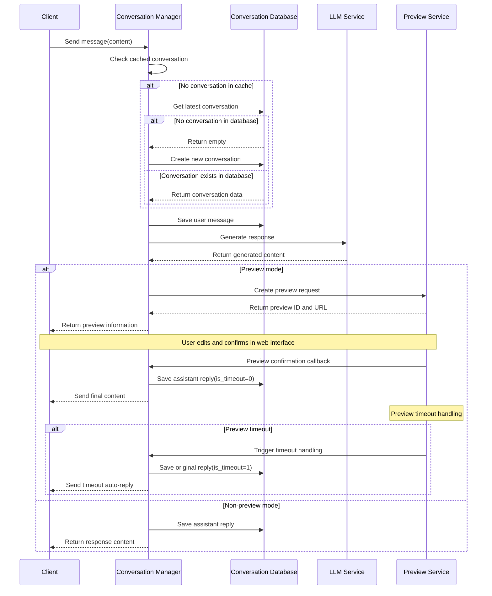
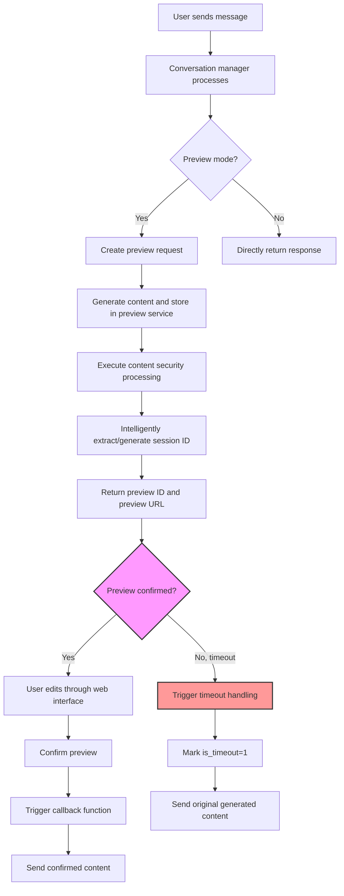
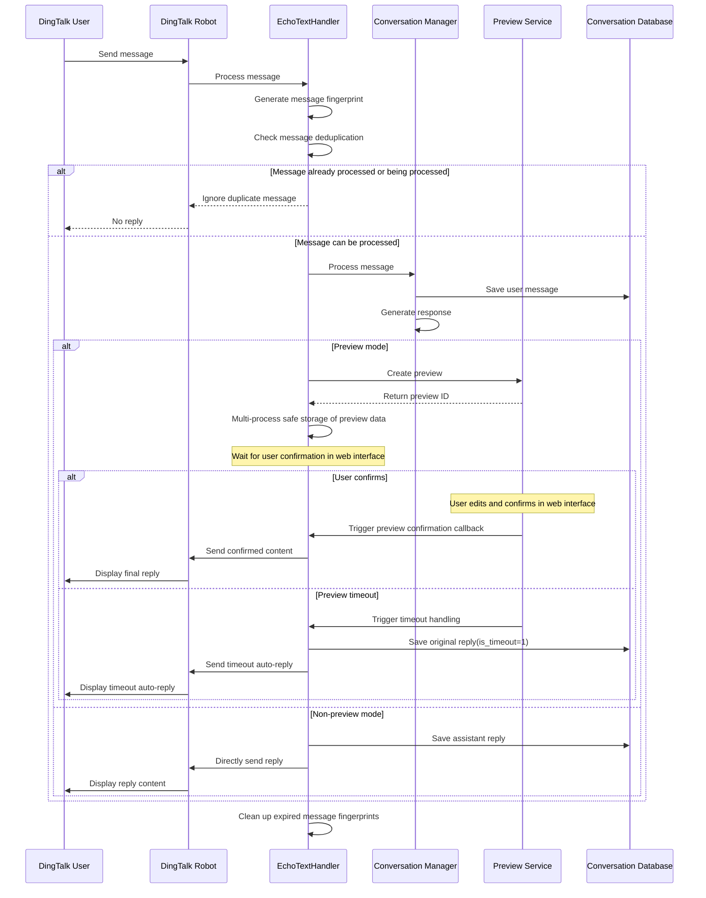

# any4any Conversation Management System Documentation

## 1. System Overview

The any4any Conversation Management System is a multi-platform dialogue management framework that provides complete conversation lifecycle management, context tracking, preview and editing functionality, and supports multiple platform integrations (especially DingTalk platform). The system design follows a modular architecture, achieving separation between business logic and data access layers.

### 1.1 Core Features

- **Multi-platform Conversation Management**: Supports tracking and maintaining user conversation history across different platforms (such as Web, DingTalk, API, etc.)
- **Preview Mode**: Provides preview and editing functionality for generated content, supporting human intervention
- **Streaming Responses**: Supports LLM streaming generation of response content
- **Persistent Storage**: Uses MySQL database to store conversation and message data
- **DingTalk Integration**: Supports DingTalk robot message processing and message sending after preview confirmation

### 1.2 System Architecture

The system mainly consists of the following core components:

1. **Conversation Manager (ConversationManager)**: Handles conversation business logic
2. **Conversation Database (ConversationDatabase)**: Responsible for data persistence
3. **Preview Service (PreviewService)**: Manages preview and editing functionality
4. **DingTalk Message Manager (EchoTextHandler)**: Handles DingTalk platform-specific logic

## 2. Conversation Management Process

### 2.1 Basic Conversation Flow



### 2.2 Conversation Persistence Mechanism

The conversation management system uses MySQL database for persistent storage, containing two main tables:

1. **conversations table**: Stores basic conversation information
2. **messages table**: Stores message content, establishing foreign key relationships with the conversation table

The system uses memory caching (`active_conversations`) to improve performance, but all critical data is persisted to the database. The cache expiration time is configurable (default 1 hour).

## 3. Preview Mode Details

### 3.1 Preview Mode Working Principle

Preview mode allows users to view and edit LLM-generated content before final sending. The system saves the generated content to the preview service, and users can access and edit it through a web interface. The content is only sent to the end user after confirmation.

The system implements a timeout mechanism (PREVIEW_TIMEOUT configuration item). When the preview confirmation time exceeds the set threshold, the system will automatically send the original generated content to the user and mark the message as a timeout auto-reply (is_timeout=1).

### 3.2 Preview Mode Process



### 3.3 Preview Service Core Features

- **Create Preview**: Generate unique preview ID and store request data, supporting preview mode check
- **Content Editing**: Allow users to modify generated content and save both edited and pre-edited content
- **Preview Confirmation**: Trigger all registered callback functions after user confirmation to complete subsequent operations such as sending DingTalk messages
- **Data Persistence**: Save edited and pre-edited content, session information, message information, etc. to the previews table, including preview_id field
- **Session Association**: Intelligently extract or generate session IDs to ensure correct association between preview content and conversations
- **Asynchronous Callback Support**: Support registering and triggering multiple asynchronous callback functions
- **Preview Timeout Handling**: Monitor preview confirmation status and support automatic timeout handling

## 4. DingTalk Platform Integration

### 4.1 DingTalk Message Processing Flow

DingTalk platform integration is an important feature of the conversation management system, supporting interaction through DingTalk robots and special handling in preview mode.



### 4.2 DingTalk Platform Special Handling

1. **Multi-process Safe Memory Storage Mechanism**: Uses file lock and file storage-based implementation to ensure safe storage of preview-related information in multi-process environments
2. **Message Deduplication Mechanism**: Implements message fingerprint-based deduplication logic to avoid repeated processing of the same message, with a deduplication window of preview timeout time + 300 seconds
3. **Preview Confirmation Callback**: Registers dedicated callback functions to send DingTalk messages after user confirms preview
4. **Timeout Auto-sending**: In preview mode, if the user does not confirm within the specified time, the system will automatically send the original generated content
5. **Multi-format Message ID Extraction**: Supports extracting message IDs from various data structures and locations to enhance compatibility
6. **Loop Message Detection**: Prevents robots from replying to messages they sent themselves, avoiding message loops
7. **Content Filtering**: Supports filtering think tag content according to configuration (NO_THINK configuration item)

## 5. Database Design

### 5.1 Table Structure

#### conversations table
| Field Name | Type | Description |
|------------|------|-------------|
| conversation_id | varchar(50) | Conversation unique identifier (primary key) |
| sender | varchar(100) | Sender unique identifier |
| user_nick | varchar(100) | User nickname or display name |
| platform | varchar(50) | Source platform (e.g., wechat, web, app, etc.) |
| created_time | datetime | Conversation creation time |
| last_active | datetime | Conversation last active time |
| message_count | int(11) | Total number of messages in conversation |

#### messages table
| Field Name | Type | Description |
|------------|------|-------------|
| message_id | varchar(50) | Message unique identifier (primary key) |
| conversation_id | varchar(50) | Associated conversation ID (foreign key) |
| content | text | Message content |
| sender_type | varchar(20) | Sender type (user-assistant) |
| timestamp | datetime | Message sending time |
| sequence_number | int(11) | Message sequence number in conversation |

#### previews table
| Field Name | Type | Description |
|------------|------|-------------|
| id | int(11) | Auto-increment ID (primary key) |
| conversation_id | varchar(100) | Conversation ID |
| message_id | varchar(100) | Message ID |
| current_request | mediumtext | Current request content |
| saved_content | mediumtext | Edited and saved content |
| pre_content | mediumtext | Pre-editing content |
| full_request | mediumtext | Full history of requests and responses |
| response_time | float | Response time (seconds) |
| user_id | int(11) | Responder ID |
| preview_id | varchar(50) | Preview unique identifier |
| created_at | timestamp | Creation time |
| updated_at | timestamp | Update time |

#### messages table update
| Field Name | Type | Description |
|------------|------|-------------|
| message_id | varchar(50) | Message unique identifier (primary key) |
| conversation_id | varchar(50) | Associated conversation ID (foreign key) |
| content | text | Message content |
| sender_type | varchar(20) | Sender type (user-assistant) |
| is_timeout | tinyint(1) | Whether it is a timeout auto-reply (0-No, 1-Yes) |
| timestamp | datetime | Message sending time |
| sequence_number | int(11) | Message sequence number in conversation |

### 5.2 Index Design

The system establishes multiple indexes on key tables to improve query performance:

- conversations table: User-platform composite index, platform index, last active time index
- messages table: Conversation ID index, message time index, conversation message sequence index

## 6. Key Technical Solutions

### 6.1 Process-Safe Singleton Pattern

The conversation manager implements a process-safe singleton pattern to ensure each process has an independent conversation manager instance, avoiding conflicts in multi-process environments. The system adopts a two-level initialization strategy: the main process fully initializes all resources (database connections, LLM services, etc.), while non-main processes use lightweight initialization, loading only necessary attributes.

```python
# Singleton pattern implementation
def get_conversation_manager():
    """Get global conversation manager instance, implement singleton pattern
    
    Ensure conversation manager is only instantiated in main process to avoid resource waste and conflicts
    Non-main processes will return a lightweight instance
    """
    import os
    import logging
    global _global_conversation_manager, _conversation_manager_pid
    
    current_pid = os.getpid()
    
    # Check if it's the main process
    # Method 1: Explicitly marked by environment variable (highest priority)
    is_main_process = os.environ.get('IS_MAIN_PROCESS') == 'true'
    
    # Method 2: If no explicit marking, judge by port
    if not is_main_process:
        current_port = os.environ.get('CURRENT_PORT', 'unknown')
        # From log observation, non-main processes use port 9999
        is_main_process = current_port != '9999' and current_port != 'unknown'
    
    # Create new instance only when needed
    if _global_conversation_manager is None or _conversation_manager_pid != current_pid:
        # Record log information
        if _global_conversation_manager is None:
            if is_main_process:
                logging.info(f"Creating new conversation manager for main process {current_pid}")
            else:
                logging.info(f"Creating lightweight conversation manager for non-main process {current_pid}")
        else:
            if is_main_process:
                logging.info(f"Process {current_pid} (main): Conversation manager belongs to process {_conversation_manager_pid}, recreating...")
            else:
                logging.info(f"Process {current_pid} (non-main): Conversation manager belongs to process {_conversation_manager_pid}, recreating lightweight instance...")
        
        # Create instance
        _global_conversation_manager = ConversationManager()
        _conversation_manager_pid = current_pid
    
    return _global_conversation_manager
```

### 6.2 Preview Content Processing Mechanism

The preview service implements a complete process for content generation, editing, and confirmation, while supporting content persistence and callback notifications. The system implements the preview service using a singleton pattern to ensure only one preview manager instance globally:

- **Content Extraction**: Extract visible content from LLM responses (processing think tags, etc.)
- **Content Editing**: Support users to edit generated content in web interface and save both edited and pre-edited content
- **Callback Notifications**: Notify relevant platforms (such as DingTalk) to send final content after user confirmation
- **Database Persistence**: Save preview data to the previews table, including session information, message information, preview ID, etc.
- **Content Security Processing**: Perform special processing on saved content to remove special characters that may cause problems
- **Session Association**: Intelligently extract or generate session IDs to ensure correct association between preview content and conversations
- **Timeout Management**: Implement timeout mechanism for preview confirmation, automatically processing after timeout

### 6.3 Multi-platform Adaptation

The system distinguishes different source platforms through the platform field, implementing a unified conversation management interface while providing customized processing logic for specific platforms (such as DingTalk).

### 6.4 Multi-process Safe Data Storage

The system implements a multi-process safe data storage mechanism based on file locks and file storage, used to safely store preview-related information and message deduplication data in multi-process environments:

- **File Lock Mechanism**: Use fcntl.flock to implement mutual exclusion access between multiple processes
- **JSON File Storage**: Serialize data and store it in temporary files
- **Expiration Time Management**: Support setting expiration time for stored data, automatically cleaning up expired data

### 6.5 Message Deduplication Mechanism

The system implements a message fingerprint-based deduplication mechanism to avoid repeated processing of the same message:

- **Message Fingerprint Generation**: Use combinations of sender ID, content, message ID, session ID, etc. to generate unique message fingerprints
- **Processing Message Marking**: Mark messages being processed to prevent concurrent processing
- **Deduplication Window**: Set a reasonable deduplication window (preview timeout time + 300 seconds) to avoid excessive deduplication

## 7. Configuration Items

Key configuration items for the conversation management system:

| Configuration Item | Description | Default Value |
|--------------------|-------------|---------------|
| PREVIEW_MODE | Whether to enable preview mode | Configurable |
| PREVIEW_TIMEOUT | Preview timeout time (seconds) | Configurable |
| NO_THINK | Whether to filter think tag content | Configurable |
| TEMPERATURE | LLM generation temperature parameter | Configurable |
| MAX_LENGTH | Maximum generation length | Configurable |
| TOP_P | Sampling parameter | Configurable |
| REPETITION_PENALTY | Repetition penalty parameter | Configurable |
| CLIENT_ID | DingTalk client ID | Configurable |
| CLIENT_SECRET | DingTalk client secret | Configurable |
| ROBOT_CODE | DingTalk robot code | Configurable |

## 8. API Interfaces

### 8.1 Conversation Management Interfaces

- **Process Message**: `process_message(sender, user_nick, platform, content, is_timeout=False)`
  - Parameter Description: sender-Sender ID, user_nick-User nickname, platform-Platform type, content-Message content, is_timeout-Whether it is a timeout auto-reply
  - Return Value: Assistant reply content and conversation ID
  
- **Stream Process Message**: `process_stream_message(sender, user_nick, platform, content, generation_id, is_timeout=False)`
  - Parameter Description: Same as process_message, with additional generation_id for identifying streaming generation
  - Return Value: Stream-generated text blocks
  
- **Get Latest Conversation**: `get_latest_conversation(sender, user_nick, platform)`
  - Parameter Description: sender-Sender ID, user_nick-User nickname, platform-Platform type
  - Return Value: Latest conversation data or None
  
- **Create New Conversation**: `create_new_conversation(sender, user_nick, platform)`
  - Parameter Description: sender-Sender ID, user_nick-User nickname, platform-Platform type
  - Return Value: Newly created conversation information
  
- **Cleanup Cache**: `cleanup_cache()`
  - Function: Clean up expired cached conversations

### 8.2 Preview-Related Interfaces

- **Create Preview**: `create_preview(request_data)`
  - Parameter Description: request_data-Request data dictionary
  - Return Value: Preview request object
  
- **Set Generated Content**: `set_generated_content(preview_id, content)`
  - Parameter Description: preview_id-Preview ID, content-Generated content
  - Return Value: Updated preview object
  
- **Update Preview Content**: `update_content(preview_id, edited_content, session=None)`
  - Parameter Description: preview_id-Preview ID, edited_content-Edited content, session-Session information
  - Return Value: Updated preview object
  
- **Confirm Preview**: `confirm_preview(preview_id)`
  - Parameter Description: preview_id-Preview ID
  - Return Value: OpenAI-compatible format response data
  
- **Get Preview**: `get_preview(preview_id)`
  - Parameter Description: preview_id-Preview ID
  - Return Value: Preview request object
  
- **Get Preview Content**: `get_content(preview_id)`
  - Parameter Description: preview_id-Preview ID
  - Return Value: Preview content (priority returns edited content)
  
- **Get Pending Previews**: `get_pending_previews()`
  - Return Value: List of pending previews
  
- **Register Confirm Callback**: `register_confirm_callback(callback)`
  - Parameter Description: callback-Callback function
  - Function: Register callback function for preview confirmation

## 9. Summary

The any4any Conversation Management System provides complete multi-platform conversation management functionality, supporting both preview and non-preview modes, with special optimization for DingTalk platform integration experience. The system adopts a modular design, achieving separation between business logic and data access, with good scalability and maintainability.

Through reasonable database design and caching mechanisms, the system can efficiently process conversation data and support contextually continuous dialogue interactions. The implementation of preview mode provides flexible human intervention means for content quality control, especially suitable for scenarios requiring content review.