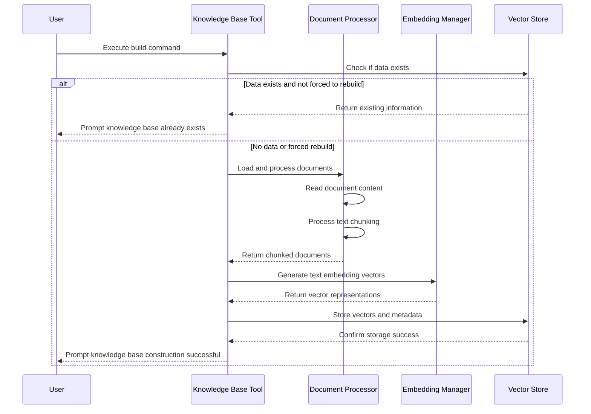
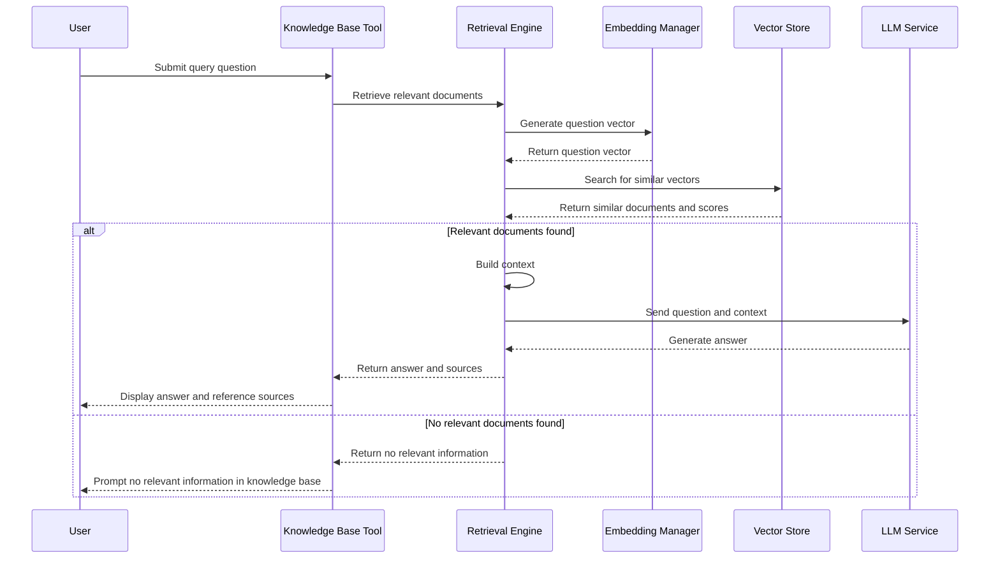

# any4any Knowledge Base System Documentation

## 1. System Overview

The any4any Knowledge Base System is a vector search-based intelligent document management and question-answering framework that provides comprehensive document processing, vector storage, semantic search, and intelligent question-answering capabilities. The system adopts a modular architecture design, decoupling document processing, vector generation, vector storage, and retrieval engine, supporting multiple document formats and flexible configuration options.

### 1.1 Core Features

- **Multi-format document processing**: Supports loading and parsing of various common document formats including PDF, DOCX, and TXT
- **Intelligent text chunking**: Implements sentence-based text chunking algorithms with configurable chunk size and overlap size
- **Efficient vector generation**: Integrates Hugging Face's Transformer models to support generating high-quality text embedding vectors
- **Persistent vector storage**: Based on ChromaDB for efficient storage and retrieval of vectors, supporting cosine similarity calculation
- **Semantic search**: Provides vector similarity-based semantic search functionality with Top-K retrieval support
- **Intelligent question answering**: Combines retrieval results with LLM models to generate precise answers based on document content
- **Command-line tools**: Provides a complete command-line toolset supporting knowledge base construction, querying, searching, statistics, and other operations
- **OpenAI-compatible API**: Offers interfaces compatible with OpenAI Embedding API

### 1.2 System Architecture

The knowledge base system mainly consists of the following core components:

1. **Document Processor**: Responsible for document loading, parsing, and chunking
2. **Embedding Manager**: Responsible for text vector generation and management
3. **Vector Store**: Responsible for vector storage, retrieval, and management
4. **Retrieval Engine**: Responsible for semantic retrieval and intelligent question answering
5. **Knowledge Base Tool**: Provides command-line interfaces and utility functions
6. **API Interfaces**: Provides OpenAI-compatible embedding API interfaces

## 2. Workflow

### 2.1 Knowledge Base Construction Flow



### 2.2 Intelligent Question Answering Flow



## 3. Core Components Detailed Explanation

### 3.1 Document Processor

The Document Processor is responsible for loading, parsing, and chunking various document formats, serving as the first step in knowledge base construction.

**Main Features:**
- **Multi-format support**: Supports parsing of PDF, DOCX, and TXT file formats
- **Intelligent chunking**: Sentence-based text chunking algorithm to maintain semantic integrity
- **Auto-encoding detection**: Automatically detects encoding format for TXT files to ensure correct reading
- **Metadata extraction**: Extracts document name, path, and other metadata information

**Working Principle:**
1. Iterate through all files in the specified directory
2. Select corresponding parser based on file extension
3. Read and merge document content
4. Split text by sentences using regular expressions
5. Chunk according to configured chunk size and overlap size
6. Add metadata information to each chunk

### 3.2 Embedding Manager

The Embedding Manager is responsible for converting text into vector representations, serving as the core component for semantic retrieval in the knowledge base.

**Main Features:**
- **Model loading**: Automatically loads configured embedding models
- **Batch vectorization**: Supports batch text vector generation for improved efficiency
- **Vector format conversion**: Supports numpy array and Python list format vector outputs
- **Mean pooling**: Uses attention mask mean pooling to calculate sentence embeddings

**Working Principle:**
1. Load model using Hugging Face's AutoTokenizer and AutoModel
2. Perform tokenization and padding on input text
3. Obtain token-level embeddings through model forward propagation
4. Apply attention mask mean pooling to obtain sentence-level embeddings
5. Perform L2 normalization on embedding vectors
6. Return standardized vector representations

### 3.3 Vector Store

The Vector Store is implemented based on ChromaDB and is responsible for persistent storage and efficient retrieval of vectors.

**Main Features:**
- **Vector addition**: Adds text vectors and metadata to the vector database
- **Similarity search**: Top-K retrieval based on cosine similarity
- **File management**: Supports querying and deleting vectors by file name
- **Statistics**: Provides statistical information about the vector database, such as total vectors, number of files, etc.

**Working Principle:**
1. Initialize ChromaDB client and create collection
2. Associate vectors, document content, and metadata during storage
3. Convert cosine distance to similarity score (1-distance) during retrieval
4. When deleting by file name, first query all relevant IDs, then batch delete
5. ChromaDB automatically handles vector indexing and persistent storage

### 3.4 Retrieval Engine

The Retrieval Engine integrates the Embedding Manager and Vector Store, providing end-to-end retrieval and question-answering capabilities.

**Main Features:**
- **Semantic retrieval**: Converts queries into vectors and searches for similar documents
- **Context building**: Automatically builds context containing retrieval results
- **Intelligent question answering**: Combines retrieval results with LLM to generate answers
- **OpenAI API compatibility**: Supports calling OpenAI-compatible model APIs

**Working Principle:**
1. Receive user query and generate vector representation
2. Search for Top-K most similar documents in the vector database
3. Build context prompt containing retrieval results
4. Call LLM model to generate context-based answers
5. Return answers, source documents, and similarity scores

### 3.5 Knowledge Base Tool

The Knowledge Base Tool provides command-line interfaces, serving as the primary way for users to interact with the knowledge base system.

**Main Features:**
- **Knowledge base construction**: Scans document directories and builds vector database
- **Intelligent query**: Answers questions based on knowledge base content
- **Semantic search**: Searches for relevant documents without generating answers
- **Statistical query**: Views statistical information about the knowledge base
- **File management**: Deletes vectors for specific files

**Working Principle:**
1. Initializes all components (Embedding Manager, Vector Store, Retrieval Engine)
2. Parses command-line parameters and executes corresponding operations
3. Processes documents and generates vectors during construction
4. Executes retrieval and question-answering flow during querying
5. Provides detailed log output and error handling

## 4. Database Design

The knowledge base system uses ChromaDB as the vector database with the following data model:

### 4.1 Collection Structure

The system uses a single collection ("documents") to store vector representations of all documents, using cosine similarity space.

### 4.2 Data Structure

Each vector entry contains the following:

| Field Name | Type | Description |
|------------|------|-------------|
| documents | str | Original text content of the document chunk |
| embeddings | List[float] | Vector representation of the text |
| metadatas | Dict | Metadata information |
| ids | str | Unique identifier (UUID) |

### 4.3 Metadata Structure

Metadata contains the following key fields:

| Field Name | Type | Description |
|------------|------|-------------|
| file_name | str | Original file name |
| chunk_text | str | Document chunk text content |
| chunk_index | int | Index of the document chunk in the original document |
| total_chunks | int | Total number of chunks in the original document |

## 5. Key Technical Solutions

### 5.1 Text Chunking Strategy

The system implements a sentence-based text chunking algorithm to ensure chunk boundaries are at sentence endings, maintaining semantic integrity.

```python
# Core text chunking logic
sentences = re.split(r'[。！？!?\.\n]', text)  # Split sentences by multiple punctuation marks
chunks = []
current_chunk = ""

for sentence in sentences:
    if len(current_chunk) + len(sentence) <= self.chunk_size:  # Check if it exceeds length
        current_chunk += sentence + "。"
    else:
        if current_chunk:
            chunks.append(current_chunk.strip())
        current_chunk = sentence + "。"
```

### 5.2 Vector Generation and Normalization

The system uses mean pooling and L2 normalization techniques to ensure vector quality and stability:

1. **Mean pooling**: Considering attention masks, perform weighted average on valid token embeddings
2. **L2 normalization**: Project vectors onto the unit sphere to make cosine similarity calculations more stable

### 5.3 Similarity Calculation and Conversion

The system uses cosine distance for similarity calculation and converts distance to similarity score:

```python
# Distance to similarity conversion
similarity = 1 - results['distances'][0][i]
```

This conversion makes the results more intuitive to users (larger values indicate higher similarity).

### 5.4 Error Handling and Logging

The system implements comprehensive error handling and logging mechanisms in each component to ensure system stability and provide debugging information:

- All key operations have try-except blocks
- Detailed logging (INFO, ERROR levels)
- Unified log configuration and initialization

### 5.5 Modular Design

The system adopts strict modular design with clear responsibilities and interfaces for each component:

- Components are decoupled through dependency injection
- Unified configuration management
- Clear function interfaces and return types

## 6. Configuration Item Description

Key configuration items for the knowledge base system:

| Configuration Item | Description | Default Value |
|--------------------|-------------|---------------|
| KNOWLEDGE_BASE_ENABLED | Whether to enable knowledge base functionality | Configurable |
| EMBEDDING_MODEL_DIR | Embedding model path | /mnt/c/models/bge-small-zh-v1.5 |
| VECTOR_DB_PATH | Vector database storage path | data/vector_db |
| DOCS_PATH | Document directory path | data/docs |
| DOC_CHUNK_SIZE | Document chunk size | 500 |
| DOC_CHUNK_OVERLAP | Document chunk overlap size | 50 |
| TOP_K | Number of most relevant documents returned by retrieval | 3 |
| SUPPORTED_FILE_TYPES | Supported file types | ['.pdf', '.docx', '.txt'] |

## 7. API Interfaces

### 7.1 OpenAI-Compatible API

#### Create Embeddings

- **Interface Path**: `POST /v1/embeddings`
- **Function Description**: Convert input text to vector representation
- **Request Parameters**:
  - `input`: str or List[str], text to generate embeddings for
  - `model`: str, model name
- **Response Format**:
  ```json
  {
    "object": "list",
    "data": [
      {
        "object": "embedding",
        "embedding": [0.1, 0.2, ...],
        "index": 0
      }
    ],
    "model": "model_name",
    "usage": {
      "prompt_tokens": 10,
      "total_tokens": 10
    }
  }
  ```

### 7.2 Command-Line Interface

#### Build Knowledge Base

```bash
python -m core.embedding.kb_tool build [--force]
```
- `--force`: Force rebuild knowledge base, clearing existing data

#### Query Knowledge Base

```bash
python -m core.embedding.kb_tool query "your question" [--top-k 3]
```
- `question`: The question to query
- `--top-k`: Number of most relevant documents to return (default 3)

#### Search Related Documents

```bash
python -m core.embedding.kb_tool search "search keywords" [--top-k 5]
```
- `question`: Search keywords
- `--top-k`: Number of most relevant documents to return (default 5)

#### View Statistics

```bash
python -m core.embedding.kb_tool stats
```

#### Delete File Vectors

```bash
python -m core.embedding.kb_tool delete "filename.pdf"
```
- `file_name`: Name of the file to delete

## 8. Usage Examples

### 8.1 Building Knowledge Base

1. Place documents in the `data/docs` directory
2. Execute build command:
   ```bash
   python -m core.embedding.kb_tool build
   ```
3. View build progress and statistical information

### 8.2 Querying Knowledge Base

```bash
python -m core.embedding.kb_tool query "What is a vector database?"
```

Output Example:
```
Query: What is a vector database?

Answer: A vector database is a database system specifically designed for storing and retrieving vector embeddings. It can efficiently perform similarity searches to find the most similar vector collection to a query vector.

Reference sources (total 3):

1. File: vector_database_intro.pdf
   Similarity: 0.921
   Content: A vector database is a special type of database specifically optimized for storing and retrieving high-dimensional vector data. Unlike traditional relational databases, vector databases...

2. File: ai_models_overview.docx
   Similarity: 0.785
   Content: Modern AI systems often use vector representations for data, such as text embeddings, image features, etc. Vector databases provide efficient similarity search mechanisms...

3. File: data_storage_trends.txt
   Similarity: 0.712
   Content: With the development of artificial intelligence technology, the storage demand for vector data is rapidly growing. Vector databases, as an emerging type of database...
```

### 8.3 Using Search Function

```bash
python -m core.embedding.kb_tool search "machine learning models"
```

Output Example:
```
Search query: machine learning models
Found 5 relevant results:

1. File: ml_basics.pdf
   Similarity: 0.897
   Content: A machine learning model is an algorithm that can learn from data and make predictions. Common machine learning models include linear regression, decision trees, neural networks, etc...

2. File: ai_models_overview.docx
   Similarity: 0.876
   Content: Modern machine learning models can be divided into three main categories: supervised learning, unsupervised learning, and reinforcement learning. Each type of model has its specific application scenarios...

3. File: deep_learning_notes.txt
   Similarity: 0.812
   Content: Deep learning is a branch of machine learning, and its models are mainly based on artificial neural networks. Deep neural network models typically contain multiple hidden layers...

4. File: model_training_guide.pdf
   Similarity: 0.765
   Content: Training a machine learning model is an iterative process, including data preparation, model selection, parameter tuning, evaluation, and deployment steps...

5. File: nlp_models.pdf
   Similarity: 0.721
   Content: The field of Natural Language Processing (NLP) has many specialized machine learning models, such as bag-of-words models, TF-IDF, Word2Vec, etc...
```

## 9. Performance Optimization Recommendations

### 9.1 Chunk Size Tuning

Based on document type and content characteristics, you can adjust the `DOC_CHUNK_SIZE` and `DOC_CHUNK_OVERLAP` parameters:
- For long texts, increasing chunk size can reduce the total number of chunks
- For short texts, decreasing chunk size can improve retrieval accuracy
- Appropriate overlap helps maintain context continuity

### 9.2 Model Selection

- For Chinese content, bge-small-zh-v1.5 or other Chinese-optimized models are recommended
- For English content, bge-small-en-v1.5 or other English models can be selected
- For higher accuracy, larger models such as bge-base or bge-large can be considered

### 9.3 Retrieval Parameter Adjustment

- The `TOP_K` parameter controls the number of retrieval results, with a default value of 3
- Increasing `TOP_K` can obtain more relevant documents but may introduce noise
- Decreasing `TOP_K` can improve relevance but may miss some useful information

### 9.4 Batch Processing

When processing a large number of documents, batch processing is recommended over individual processing to improve efficiency.