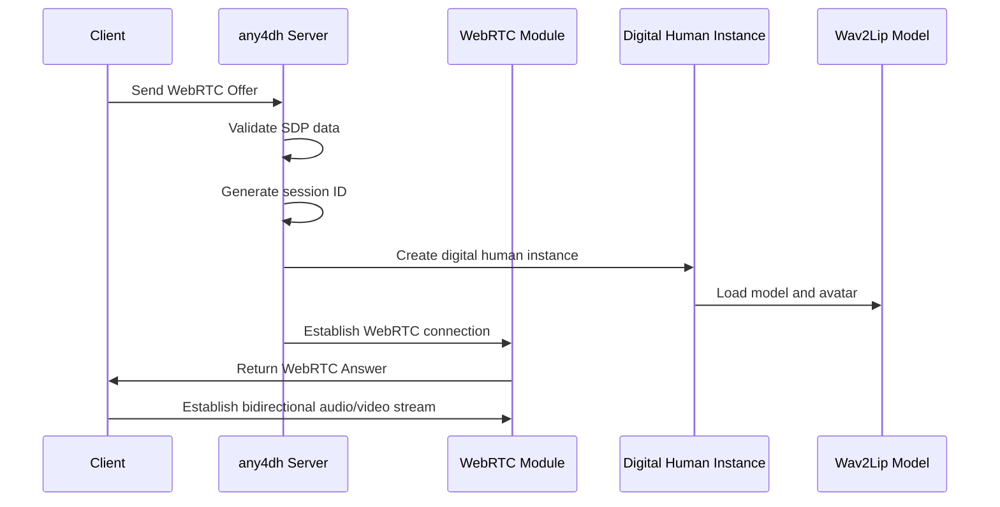
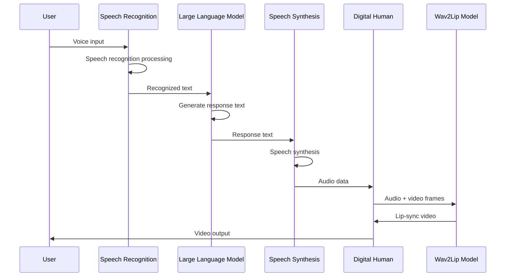
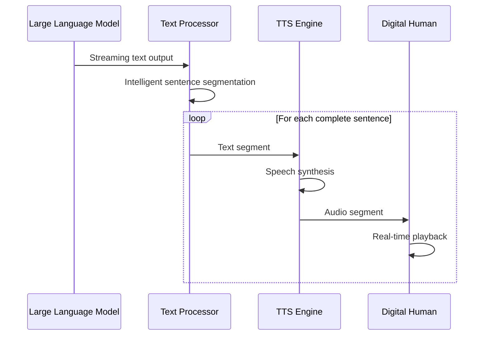

# any4dh Digital Human System Documentation

## 1. System Overview

The any4dh digital human system is a real-time interactive digital human platform based on Wav2Lip, providing a complete human-computer interaction solution including speech recognition, large language model dialogue, text-to-speech synthesis, and digital human lip-sync functionality. The system adopts a modular architecture design, implementing core features such as WebRTC real-time communication, streaming TTS processing, and multi-session management.

### 1.1 Core Features

- **Real-time Voice Interaction**: Complete pipeline supporting ASR speech recognition, LLM intelligent dialogue, and TTS speech synthesis
- **Digital Human Lip Sync**: Precise audio-video synchronization based on Wav2Lip technology
- **WebRTC Real-time Communication**: Low-latency audio/video streaming and bidirectional communication
- **Streaming TTS Processing**: Support for segmented TTS synthesis and real-time audio output
- **Multi-session Management**: Support for multiple concurrent digital human sessions
- **Multiple Transmission Modes**: Support for both WebRTC and RTMP streaming transmission modes
- **Intelligent Interruption Handling**: Support for speech interruption and state management
- **Recording Functionality**: Support for digital human audio and video recording

### 1.2 System Architecture

The digital human system mainly includes the following core components:

1. **any4dh_server.py**: FastAPI server providing HTTP API and WebRTC services
2. **live_talking/**: Real-time interaction module
   - `basereal.py`: Digital human base class
   - `lipreal.py`: Wav2Lip digital human implementation
   - `lipasr.py`: Speech recognition processing
   - `ttsreal.py`: Speech synthesis processing
   - `llm.py`: Large language model dialogue
   - `webrtc.py`: WebRTC communication handling
3. **wav2lip/**: Wav2Lip model core
   - `models/`: Neural network model definitions
   - `face_detection/`: Face detection module
4. **streaming_utils.py`: Streaming TTS processing utilities

## 2. Workflows

### 2.1 Digital Human Session Establishment Flow



### 2.2 Voice Dialogue Processing Flow



### 2.3 Streaming TTS Processing Flow



## 3. Core Component Details

### 3.1 any4dh_server.py - FastAPI Server

Responsible for providing HTTP API interfaces and WebRTC services for the digital human system.

**Main Features:**
- **WebRTC Connection Management**: Handle offer/answer exchange, establish real-time communication
- **Session Management**: Create and manage digital human session instances
- **Voice Dialogue Interface**: Provide complete voice dialogue APIs
- **Streaming Processing**: Support streaming voice dialogue and real-time audio output
- **File Management**: Creation and cleanup of temporary audio files

**Key API Interfaces:**

#### WebRTC Connection
- `POST /any4dh/offer`: Establish WebRTC connection, return answer and sessionid
- `POST /any4dh/human`: Send text message to digital human
- `POST /any4dh/interrupt_talk`: Interrupt current speech

#### Voice Dialogue
- `POST /any4dh/voice-chat`: Complete voice dialogue (recording->ASR->LLM->TTS)
- `POST /any4dh/voice-chat-stream`: Streaming voice dialogue with real-time output
- `POST /any4dh/humanaudio`: Upload audio file

#### Session Control
- `POST /any4dh/set_audiotype`: Set audio type
- `POST /any4dh/record`: Start/stop recording
- `POST /any4dh/is_speaking`: Check if currently speaking
- `POST /any4dh/play-audio`: Play audio to digital human

**Working Principle:**
1. Receive WebRTC offer request, validate SDP data validity
2. Create new digital human session instance, load Wav2Lip model and avatar resources
3. Establish WebRTC connection, set audio/video tracks and codec preferences
4. Handle various interaction requests, pass data and commands to corresponding digital human instances
5. Manage lifecycle of temporary audio files, ensure timely resource cleanup

### 3.2 live_talking/basereal.py - Digital Human Base Class

Abstract base class for the digital human system, defining common digital human behaviors and interfaces.

**Main Features:**
- **TTS Engine Integration**: Support for both EdgeTTS and IndexTTS engines
- **Audio Processing**: Audio frame processing and file input support
- **State Management**: Speaking state, recording state management
- **Custom Configuration**: Support for custom action and audio configurations

**Working Principle:**
1. Select appropriate TTS engine based on configuration during initialization
2. Provide standard interfaces for audio input, supporting both frame and file formats
3. Manage various states of the digital human (speaking, recording, etc.)
4. Load and apply custom configuration files

### 3.3 live_talking/lipreal.py - Wav2Lip Digital Human Implementation

Specific digital human implementation class based on Wav2Lip model.

**Main Features:**
- **Model Loading**: Load Wav2Lip pre-trained model
- **Avatar Management**: Load and manage digital human avatar resources
- **Lip Sync Generation**: Real-time generation of lip movements synchronized with audio
- **Video Stream Output**: Generate continuous video frame output

**Key Functions:**

#### Model Management
```python
def load_model(path):
    """Load Wav2Lip model"""
    model = Wav2Lip()
    checkpoint = _load(path)
    # Handle state_dict, remove 'module.' prefix
    model.load_state_dict(new_s)
    return model.eval()

def load_avatar(avatar_path_or_id):
    """Load digital human avatar resources"""
    # Load complete image list
    # Load face image list
    # Load coordinate information
    return frame_list_cycle, face_list_cycle, coord_list_cycle
```

#### Warm-up Mechanism
```python
def warm_up(batch_size, model, modelres):
    """Warm up model, optimize first inference performance"""
    img_batch = torch.ones(batch_size, 6, modelres, modelres).to(device)
    mel_batch = torch.ones(batch_size, 1, 80, 16).to(device)
    model(mel_batch, img_batch)
```

**Working Principle:**
1. Load pre-trained Wav2Lip model, handle state_dict compatibility
2. Load digital human avatar resources, including complete images, face images, and coordinate information
3. Execute model warm-up to optimize first inference performance
4. Process audio input in real-time during runtime, generate corresponding lip-sync video

### 3.4 wav2lip/models/ - Wav2Lip Neural Network Models

Contains core neural network architecture definitions for Wav2Lip.

**Main Models:**
- `wav2lip.py`: Main Wav2Lip model structure
- `wav2lip_v2.py`: Improved model structure
- `syncnet.py`: Synchronization discriminator network
- `conv.py`: Convolutional layer definitions

**Model Features:**
- **End-to-end Training**: Direct mapping from audio to video
- **High-quality Lip Sync**: Precise audio-video synchronization effects
- **Real-time Inference**: Support for real-time video generation
- **Identity Preservation**: Maintain speaker identity characteristics

### 3.5 streaming_utils.py - Streaming TTS Processing Utilities

Provide core utilities for streaming text processing and TTS synthesis.

**Main Features:**
- **Intelligent Sentence Segmentation**: Text segmentation algorithm based on punctuation
- **Streaming Processing**: Support for real-time processing of LLM streaming output
- **Segmented Synthesis**: Segment text for TTS synthesis
- **Concurrency Control**: Use semaphore to control concurrent TTS tasks

**Key Algorithms:**

#### Intelligent Sentence Segmentation
```python
def split_text_by_punctuation(text: str) -> List[str]:
    """Intelligent sentence segmentation based on punctuation"""
    sentence_endings = r'[。！？.!?；;]'
    # Split by punctuation
    # Intelligently merge short sentences to avoid over-fragmentation
    # Filter special characters
    return filtered_sentences
```

#### Streaming Processing
```python
class StreamingTTSProcessor:
    """Streaming TTS Processor"""
    async def process_streaming_response(self, user_input: str):
        """Process streaming response"""
        # Stream LLM output
        # Detect complete sentences
        # Concurrent TTS synthesis
        # Real-time audio segment output
```

**Working Principle:**
1. Receive LLM streaming text output
2. Use regular expressions to detect sentence boundaries
3. Intelligently merge complete sentences to avoid over-fragmentation
4. Execute multiple TTS tasks concurrently to improve processing efficiency
5. Output synthesized audio segments in real-time

### 3.6 live_talking/webrtc.py - WebRTC Communication Handling

Handle WebRTC connection establishment and data transmission.

**Main Features:**
- **Connection Management**: WebRTC connection establishment and maintenance
- **Audio/Video Streams**: Audio and video data transmission
- **Codecs**: Support for multiple audio/video codecs
- **ICE Handling**: ICE candidate and connection state management

## 4. Data Model Design

### 4.1 Request Data Models

```python
class OfferRequest(BaseModel):
    sdp: str          # WebRTC Session Description Protocol
    type: str         # Offer type

class HumanRequest(BaseModel):
    sessionid: int    # Session ID
    type: str         # Message type (echo/chat)
    text: str         # Text content
    interrupt: bool   # Whether to interrupt

class VoiceChatRequest:
    file: UploadFile  # Audio file
    sessionid: str    # Optional session ID
```

### 4.2 Response Data Formats

#### WebRTC Connection Response
```json
{
    "sdp": "WebRTC Answer SDP",
    "type": "answer",
    "sessionid": 123456
}
```

#### Voice Dialogue Response
```json
{
    "success": true,
    "recognized_text": "Recognized text",
    "response_text": "AI response text",
    "audio_synced": true,
    "audio_duration": 15000,
    "session_id": "voice_chat_session"
}
```

#### Streaming Response Format
```json
{
    "type": "audio_segment",
    "data": {
        "success": true,
        "text": "Text segment",
        "audio_synced": true
    },
    "segment_index": 0
}
```

### 4.3 Configuration Data Structure

```python
class OptConfig:
    def __init__(self, cfg):
        self.fps = cfg.ANY4DH_FPS                    # Frame rate
        self.W = 450                                 # Video width
        self.H = 450                                 # Video height
        self.avatar_id = cfg.ANY4DH_AVATAR_ID        # Avatar ID
        self.batch_size = cfg.ANY4DH_BATCH_SIZE      # Batch size
        self.tts_engine = cfg.ANY4DH_TTS             # TTS engine type
        self.model = cfg.ANY4DH_MODEL                # Model path
        self.transport = cfg.ANY4DH_TRANSPORT        # Transmission mode
```

## 5. Key Technical Solutions

### 5.1 WebRTC Connection Optimization

**STUN Server Configuration:**
```python
ice_server = RTCIceServer(urls='stun:stun.miwifi.com:3478')
```

**Codec Preference Settings:**
```python
# Prioritize H.264, then VP8
preferences = h264_codecs + vp8_codecs + rtx_codecs
transceiver.setCodecPreferences(preferences)
```

**Connection State Monitoring:**
```python
@pc.on("connectionstatechange")
async def on_connectionstatechange():
    if pc.connectionState == "failed":
        await pc.close()
        pcs.discard(pc)
        del any4dh_reals[sessionid]
```

### 5.2 Real-time Audio Synchronization

**Audio Frame Processing:**
```python
def put_audio_file(self, filebyte, datainfo={}):
    """Convert audio file to frame sequence"""
    input_stream = BytesIO(filebyte)
    stream = self.__create_bytes_stream(input_stream)
    # Process in 20ms chunks
    while streamlen >= self.chunk:
        self.put_audio_frame(stream[idx:idx+self.chunk], datainfo)
```

**Audio-Video Synchronization:**
- Use fixed frame rate (50fps) to ensure synchronization
- Audio chunked in 20ms intervals corresponding to video frame time intervals
- Wav2Lip model directly handles correspondence between audio spectrum and video frames

### 5.3 Streaming TTS Processing

**Intelligent Sentence Segmentation Algorithm:**
1. Use regular expressions to identify sentence-ending punctuation
2. Avoid breaking in the middle of words
3. Intelligently merge overly short sentences
4. Filter special characters to ensure TTS quality

**Concurrency Control:**
```python
self.semaphore = asyncio.Semaphore(6)  # Limit concurrent TTS tasks

async with self.semaphore:
    result = await synthesize_speech_segment(sentence, sessionid, any4dh_reals)
```

**Temporary File Management:**
- Use unified temporary file manager
- Automatic cleanup mechanism to prevent disk space leaks
- Support file access counting and delayed cleanup

### 5.4 Model Loading Optimization

**Lazy Loading:**
```python
_any4dh_initialized = False

def initialize_any4dh(config=None):
    global _any4dh_initialized
    if _any4dh_initialized:
        return opt, model, avatar
    # Execute initialization
```

**Model Warm-up:**
```python
@torch.no_grad()
def warm_up(batch_size, model, modelres):
    """Warm up model, optimize first inference performance"""
    img_batch = torch.ones(batch_size, 6, modelres, modelres).to(device)
    mel_batch = torch.ones(batch_size, 1, 80, 16).to(device)
    model(mel_batch, img_batch)
```

**Device Adaptation:**
```python
device = "cuda" if torch.cuda.is_available() else \
          ("mps" if (hasattr(torch.backends, "mps") and torch.backends.mps.is_available()) else "cpu")
```

### 5.5 Error Handling and Resource Management

**WebRTC Connection Error Handling:**
- SDP format validation
- Connection state monitoring
- Automatic cleanup of failed connections

**Model Loading Error Handling:**
- File existence checks
- Model compatibility handling
- Device memory management

**Audio Processing Error Handling:**
- File format validation
- Size limit checks
- Encoding error handling

## 6. Configuration Item Descriptions

Key configuration items for the digital human system:

| Configuration Item | Description | Default Value |
|-------------------|-------------|---------------|
| ANY4DH_FPS | Video frame rate | 50 |
| ANY4DH_AVATAR_ID | Digital human avatar ID | 001 |
| ANY4DH_BATCH_SIZE | Wav2Lip batch size | 16 |
| ANY4DH_TTS | TTS engine type | edgetts |
| ANY4DH_WAV2LIP_MODEL_DIR | Wav2Lip model path | /path/to/wav2lip |
| ANY4DH_AVATARS_DIR | Avatar resource directory | ./data/avatars |
| ANY4DH_TRANSPORT | Transmission mode | webrtc |
| INDEX_TTS_MODEL_ENABLED | IndexTTS switch | true |
| INDEX_TTS_FAST_ENABLED | Fast mode switch | true |
| INDEX_TTS_FAST_MAX_TOKENS | Fast mode max tokens | 50 |
| INDEX_TTS_FAST_BATCH_SIZE | Fast mode batch size | 1 |

### 6.1 Audio Processing Configuration

```python
# Audio parameters
self.sample_rate = 16000
self.chunk = self.sample_rate // opt.fps  # 320 samples per chunk

# TTS configuration
self.tts_engine = cfg.ANY4DH_TTS
self.index_tts_model_dir = cfg.INDEX_TTS_MODEL_DIR
self.index_tts_device = cfg.INDEX_TTS_DEVICE
```

### 6.2 WebRTC Configuration

```python
# ICE server configuration
ice_server = RTCIceServer(urls='stun:stun.miwifi.com:3478')

# Codec preferences
capabilities = RTCRtpSender.getCapabilities("video")
h264_codecs = [codec for codec in capabilities.codecs if codec.name == "H264"]
```

### 6.3 Streaming Processing Configuration

```python
# Streaming TTS configuration
INDEX_TTS_STREAMING_MIN_SENTENCE_CHARS = 10  # Minimum sentence character count
INDEX_TTS_FAST_ENABLED = true               # Fast mode
INDEX_TTS_FAST_MAX_TOKENS = 50              # Fast mode token limit
INDEX_TTS_FAST_BATCH_SIZE = 1               # Fast mode batch size
```

## 7. Deployment and Operation

### 7.1 Environment Requirements

**Hardware Requirements:**
- GPU: Recommended NVIDIA GPU (with CUDA support)
- Memory: At least 8GB RAM
- Storage: Sufficient space for models and avatar resources

**Software Requirements:**
- Python 3.10+
- PyTorch
- OpenCV
- FFmpeg
- Other dependencies in requirements.txt

### 7.2 Model Preparation

**Wav2Lip Model:**
```bash
# Download pre-trained model
wget https://github.com/Rudrabha/Wav2Lip/releases/download/v1.0/wav2lip_gan.pth
```

**Avatar Resource Preparation:**
```
data/avatars/
├── 001/
│   ├── full_imgs/     # Complete image sequence
│   ├── face_imgs/     # Face image sequence
│   └── coords.pkl     # Face coordinate information
```

### 7.3 Configuration Files

```bash
# .env configuration example
ANY4DH_FPS=50
ANY4DH_AVATAR_ID=001
ANY4DH_BATCH_SIZE=16
ANY4DH_TTS=index
ANY4DH_WAV2LIP_MODEL_DIR=/models/wav2lip_gan.pth
ANY4DH_AVATARS_DIR=./data/avatars
ANY4DH_TRANSPORT=webrtc

# IndexTTS configuration
INDEX_TTS_MODEL_ENABLED=true
INDEX_TTS_MODEL_DIR=/models/indextts
INDEX_TTS_DEVICE=cuda
INDEX_TTS_FAST_ENABLED=true
```

### 7.4 Startup Methods

**Integrated Mode (Recommended):**
```bash
# Start through main application
python cli.py
```

**Standalone Mode:**
```bash
# Start digital human service directly
python core/any4dh/any4dh_server.py --listenport 8888
```

**Docker Deployment:**
```dockerfile
FROM python:3.10
COPY . /app
WORKDIR /app
RUN pip install -r requirements.txt
EXPOSE 8888
CMD ["python", "core/any4dh/any4dh_server.py"]
```

## 8. Performance Optimization Recommendations

### 8.1 Model Optimization

**Batch Processing Optimization:**
- Adjust `batch_size` parameter to balance latency and throughput
- Use model warm-up to reduce first inference latency
- Enable mixed precision training to improve inference speed

**Memory Management:**
- Release unnecessary tensors in a timely manner
- Use gradient accumulation to reduce memory usage
- Monitor GPU memory usage

### 8.2 Network Optimization

**WebRTC Optimization:**
- Choose appropriate codecs (H.264 is generally more efficient)
- Configure suitable STUN/TURN servers
- Monitor network connection quality

**Audio Optimization:**
- Use appropriate audio formats (16kHz, mono)
- Enable audio compression to reduce bandwidth usage
- Implement audio buffering strategies to handle network jitter

### 8.3 Concurrency Optimization

**Session Management:**
- Limit concurrent session count to avoid resource exhaustion
- Implement session pooling for resource reuse
- Clean up idle sessions promptly

**TTS Optimization:**
- Use semaphores to control concurrent TTS tasks
- Implement TTS result caching
- Enable streaming processing to reduce latency

### 8.4 System Monitoring

**Performance Metrics:**
- Inference latency (audio input to video output)
- Network latency (WebRTC connection quality)
- Resource utilization (CPU, GPU, memory)

**Log Monitoring:**
- Detailed error log recording
- Performance metric recording
- User behavior analysis

## 9. Troubleshooting

### 9.1 Common Issues

**WebRTC Connection Failure:**
- Check STUN server configuration
- Verify firewall settings
- Confirm network connection quality

**Model Loading Failure:**
- Check model file paths
- Verify model file integrity
- Confirm sufficient device memory

**Audio Synchronization Issues:**
- Check audio sampling rate settings
- Verify audio format compatibility
- Adjust buffer size

### 9.2 Debugging Tools

**Log Analysis:**
```python
# Enable detailed logging
import logging
logging.basicConfig(level=logging.DEBUG)
```

**Performance Analysis:**
```python
# Use cProfile for performance analysis
python -m cProfile -o profile.out script.py
```

**Network Diagnostics:**
- WebRTC internal statistics
- Network latency testing
- Bandwidth usage analysis

### 9.3 Performance Tuning

**Latency Optimization:**
- Reduce batch size
- Optimize model inference
- Use faster codecs

**Quality Optimization:**
- Increase video resolution
- Use higher quality audio
- Optimize model parameters

**Stability Optimization:**
- Add error retry mechanisms
- Implement graceful degradation
- Add health checks

## 10. Extension Development

### 10.1 Custom Avatars

**Avatar Creation Process:**
1. Prepare video materials
2. Extract key frames
3. Face detection and cropping
4. Generate coordinate information
5. Organize directory structure

**Tool Scripts:**
```python
# Avatar processing script example
def process_avatar(video_path, output_dir):
    # Extract video frames
    # Face detection
    # Generate coordinates
    # Save results
    pass
```

### 10.2 Custom TTS Engines

**TTS Engine Interface:**
```python
class CustomTTS:
    def __init__(self, opt, real):
        self.opt = opt
        self.real = real

    def put_msg_txt(self, msg, datainfo={}):
        # Implement TTS synthesis logic
        pass

    def put_audio_file(self, filebyte, datainfo={}):
        # Handle audio file input
        pass
```

### 10.3 Adding New Transmission Protocols

**Transmission Protocol Interface:**
```python
class CustomTransport:
    def __init__(self, opt):
        self.opt = opt

    async def handle_connection(self, sessionid):
        # Implement custom transmission logic
        pass

    def send_audio(self, sessionid, audio_data):
        # Send audio data
        pass

    def send_video(self, sessionid, video_frame):
        # Send video data
        pass
```

### 10.4 External Service Integration

**AI Service Integration:**
- Integrate more LLM models
- Support emotion recognition
- Add action generation

**Business System Integration:**
- User authentication system
- Session recording storage
- Data analysis platform

---

Through the detailed explanation in this documentation, developers can comprehensively understand the architecture design, core functionality, and implementation details of the any4dh digital human system, providing complete technical guidance for system deployment, usage, and extension.