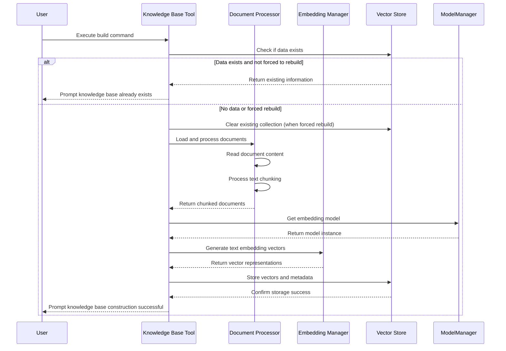
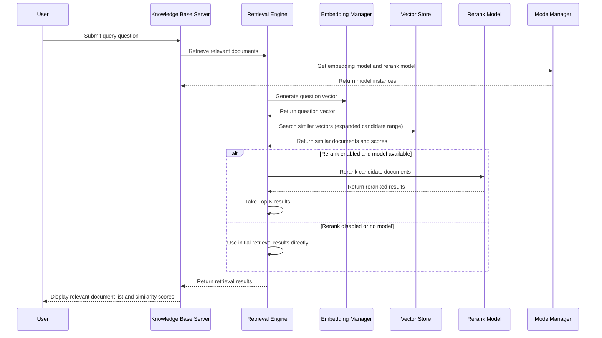

# any4any Knowledge Base System Documentation

## 1. System Overview

The any4any Knowledge Base System is a vector search-based intelligent document management and question-answering framework that provides comprehensive document processing, vector storage, semantic search, and intelligent question-answering capabilities. The system adopts a modular architecture design, decoupling document processing, vector generation, vector storage, and retrieval engine, supporting multiple document formats and flexible configuration options.

### 1.1 Core Features

- **Multi-format document processing**: Supports loading and parsing of various common document formats including PDF, DOCX, and TXT
- **Intelligent text chunking**: Implements sentence-based text chunking algorithms with configurable chunk size and overlap size
- **Efficient vector generation**: Integrates Hugging Face's Transformer models to support generating high-quality text embedding vectors
- **Persistent vector storage**: Based on ChromaDB for efficient storage and retrieval of vectors, supporting cosine similarity calculation
- **Semantic search**: Provides vector similarity-based semantic search functionality with Top-K retrieval support
- **Rerank optimization**: Integrates rerank models to further optimize retrieval result relevance
- **Intelligent question answering**: Combines retrieval results with LLM models to generate precise answers based on document content
- **OpenAI-compatible API**: Offers interfaces compatible with OpenAI Embedding API
- **Knowledge Base Service**: Provides API services for knowledge base-related functionality
- **Lazy initialization**: Components adopt lazy initialization mechanism to improve system startup efficiency

### 1.2 System Architecture

The knowledge base system mainly consists of the following core components:

1. **Document Processor**: Responsible for document loading, parsing, and chunking
2. **Embedding Manager**: Responsible for text vector generation and management, supports lazy loading
3. **Vector Store**: Responsible for vector storage, retrieval, and management, based on ChromaDB
4. **Retrieval Engine**: Responsible for semantic retrieval, supports rerank functionality
5. **Knowledge Base Server**: Provides API services for knowledge base-related functionality
6. **API Interfaces**: Provides OpenAI-compatible embedding API interfaces

## 2. Workflow

### 2.1 Knowledge Base Construction Flow



### 2.2 Intelligent Retrieval Flow



## 3. Core Components Detailed Explanation

### 3.1 Document Processor

The Document Processor is responsible for loading, parsing, and chunking various document formats, serving as the first step in knowledge base construction.

**Main Features:**
- **Multi-format support**: Supports parsing of PDF, DOCX, and TXT file formats
- **Intelligent chunking**: Sentence-based text chunking algorithm to maintain semantic integrity
- **Auto-encoding detection**: Automatically detects encoding format for TXT files to ensure correct reading
- **Metadata extraction**: Extracts document name, path, and other metadata information

**Working Principle:**
1. Iterate through all files in the specified directory
2. Select corresponding parser based on file extension
3. Read and merge document content
4. Split text by sentences using regular expressions
5. Chunk according to configured chunk size and overlap size
6. Add metadata information to each chunk

### 3.2 Embedding Manager

The Embedding Manager is responsible for converting text into vector representations, serving as the core component for semantic retrieval in the knowledge base.

**Main Features:**
- **Global model sharing**: Prioritizes using global embedding models from ModelManager
- **Local model loading**: Loads local models when global models are unavailable
- **Lazy loading mechanism**: Only loads models when first used, improving system startup efficiency
- **Batch vectorization**: Supports batch text vector generation for improved efficiency
- **Vector format conversion**: Supports numpy array and Python list format vector outputs
- **Mean pooling**: Uses attention mask mean pooling to calculate sentence embeddings

**Working Principle:**
1. No model loading during initialization, adopting lazy loading strategy
2. Model loading is triggered when get_embeddings is first called
3. Attempts to use global embedding model from ModelManager, falls back to local loading on failure
4. Uses Hugging Face's AutoTokenizer and AutoModel to process text
5. Performs tokenization and padding on input text
6. Obtains token-level embeddings through model forward propagation
7. Applies attention mask mean pooling to obtain sentence-level embeddings
8. Performs L2 normalization on embedding vectors
9. Returns vectors in numpy array or Python list format as needed

### 3.3 Vector Store

The Vector Store is implemented based on ChromaDB and is responsible for persistent storage and efficient retrieval of vectors.

**Main Features:**
- **Vector addition**: Adds text vectors and metadata to the vector database
- **Similarity search**: Top-K retrieval based on cosine similarity
- **File management**: Supports querying and deleting vectors by file name
- **Statistics**: Provides statistical information about the vector database, including total vectors, number of files, etc.
- **Persistent storage**: Automatically handles vector persistence

**Working Principle:**
1. Initializes ChromaDB persistent client with anonymous telemetry disabled
2. Creates or gets a collection named "documents" using cosine similarity space
3. Generates unique IDs during storage, associating vectors, document content, and complete metadata
4. Converts cosine distance to similarity score (1-distance) during retrieval
5. When deleting by file name, first queries all relevant IDs, then deletes in bulk
6. ChromaDB automatically handles vector indexing and persistent storage
7. When calculating statistics, retrieves all metadata and analyzes file count

### 3.4 Retrieval Engine

The Retrieval Engine integrates the Embedding Manager and Vector Store, providing end-to-end retrieval functionality with rerank optimization support.

**Main Features:**
- **Semantic retrieval**: Converts queries into vectors and searches for similar documents
- **Rerank optimization**: Supports rerank models to further optimize retrieval results
- **Batch processing for rerank**: Supports batch processing of rerank calculations for improved efficiency
- **Flexible configuration**: Supports configuration of retrieval parameters and rerank options
- **Statistical query**: Provides vector database statistics query functionality
- **Document management**: Supports deleting documents by file name

**Working Principle:**
1. Receives embedding manager, vector store, and optional reranker during initialization
2. First converts query text into vector representation during retrieval
3. Expands retrieval range to obtain sufficient candidate documents (for reranking)
4. If reranking is enabled and rerank model is available:
   - Extract candidate document text content
   - Build (query, document) pairs
   - Call rerank model in batches to calculate relevance scores
   - Reorder documents based on scores
   - Take top Top-K results
5. If reranking is not enabled or no model available, use initial retrieval results directly
6. Format and return results, including document information, file name, score, etc.
7. Provides auxiliary functions such as statistical query and document deletion


## 4. Database Design

The knowledge base system uses ChromaDB as the vector database with the following data model:

### 4.1 Collection Structure

The system uses a single collection ("documents") to store vector representations of all documents, using cosine similarity space.

### 4.2 Data Structure

Each vector entry contains the following:

| Field Name | Type | Description |
|------------|------|-------------|
| documents | str | Original text content of the document chunk |
| embeddings | List[float] | Vector representation of the text |
| metadatas | Dict | Metadata information |
| ids | str | Unique identifier (UUID) |

### 4.3 Metadata Structure

Metadata contains the following key fields:

| Field Name | Type | Description |
|------------|------|-------------|
| file_name | str | Original file name |
| chunk_text | str | Document chunk text content |
| chunk_index | int | Index of the document chunk in the original document |
| total_chunks | int | Total number of chunks in the original document |

## 5. Key Technical Solutions

### 5.1 Text Chunking Strategy

The system implements a sentence-based text chunking algorithm to ensure chunk boundaries are at sentence endings, maintaining semantic integrity.

```python
# Core text chunking logic
sentences = re.split(r'[。！？!?\.\n]', text)  # Split sentences by multiple punctuation marks
chunks = []
current_chunk = ""

for sentence in sentences:
    if len(current_chunk) + len(sentence) <= self.chunk_size:  # Check if it exceeds length
        current_chunk += sentence + "。"
    else:
        if current_chunk:
            chunks.append(current_chunk.strip())
        current_chunk = sentence + "。"
```

### 5.2 Vector Generation and Normalization

The system uses mean pooling and L2 normalization techniques to ensure vector quality and stability:

1. **Mean pooling**: Considering attention masks, perform weighted average on valid token embeddings
2. **L2 normalization**: Project vectors onto the unit sphere to make cosine similarity calculations more stable

### 5.3 Similarity Calculation and Conversion

The system uses cosine distance for similarity calculation and converts distance to similarity score:

```python
# Distance to similarity conversion
similarity = 1 - results['distances'][0][i]
```

This conversion makes the results more intuitive to users (larger values indicate higher similarity).

### 5.4 Rerank Optimization

The system integrates rerank functionality to further optimize preliminary retrieval results:

```python
# Rerank core logic
if use_rerank and self.reranker and Config.RERANK_MODEL_ENABLED:
    documents = [metadata['chunk_text'] for _, metadata in similar_docs]
    # Batch process to calculate relevance scores
    batch_pairs = [[question, doc] for doc in documents]
    batch_scores = self.reranker.compute_score(batch_pairs)
    # Sort and take Top-K results
    reranked_results.sort(key=lambda x: x['score'], reverse=True)
    final_docs = reranked_results[:top_k]
```

### 5.5 Error Handling and Logging

The system implements comprehensive error handling and logging mechanisms in each component to ensure system stability and provide debugging information:

- All key operations have try-except blocks
- Detailed logging (INFO, ERROR levels)
- Unified log configuration and initialization
- Exception information and stack trace logging

### 5.6 Modular Design

The system adopts strict modular design with clear responsibilities and interfaces for each component:

- Components are decoupled through dependency injection
- Unified configuration management
- Clear function interfaces and return types
- Lazy initialization mechanism
- Global model sharing strategy

## 6. Configuration Item Description

Key configuration items for the knowledge base system:

| Configuration Item | Description | Default Value |
|--------------------|-------------|---------------|
| KNOWLEDGE_BASE_ENABLED | Whether to enable knowledge base functionality | Configurable |
| RERANK_MODEL_ENABLED | Whether to enable rerank functionality | Configurable |
| RERANK_CANDIDATE_FACTOR | Rerank candidate document multiplier | 10 |
| RERANK_BATCH_SIZE | Rerank batch processing size | Configurable |
| EMBEDDING_MODEL_DIR | Embedding model path | /mnt/c/models/bge-small-zh-v1.5 |
| VECTOR_DB_PATH | Vector database storage path | data/vector_db |
| DOCS_PATH | Document directory path | data/docs |
| DOC_CHUNK_SIZE | Document chunk size | 500 |
| DOC_CHUNK_OVERLAP | Document chunk overlap size | 50 |
| TOP_K | Number of most relevant documents returned by retrieval | 3 |
| SUPPORTED_FILE_TYPES | Supported file types | ['.pdf', '.docx', '.txt'] |

## 7. API Interfaces

### 7.1 OpenAI-Compatible API

#### Create Embeddings

- **Interface Path**: `POST /v1/embeddings`
- **Function Description**: Convert input text to vector representation
- **Request Parameters**:
  - `input`: str or List[str], text to generate embeddings for
  - `model`: str, model name
- **Response Format**:
  ```json
  {
    "object": "list",
    "data": [
      {
        "object": "embedding",
        "embedding": [0.1, 0.2, ...],
        "index": 0
      }
    ],
    "model": "model_name",
    "usage": {
      "prompt_tokens": 10,
      "total_tokens": 10
    }
  }
  ```

### 7.2 Service API Interfaces

#### Knowledge Base Service

The KnowledgeBaseServer class provides the following main methods:

- **build_knowledge_base(force_rebuild=False)**: Build knowledge base
- **retrieve_documents(question, top_k=3, use_rerank=True)**: Retrieve relevant documents
- **simple_search(question, top_k=5)**: Simple search
- **get_collection_stats()**: Get collection statistics

## 8. Usage Examples

### 8.1 Using API Interfaces

Knowledge base functionality is now accessed through API interfaces. Please refer to the API documentation for specific usage methods.

## 9. Performance Optimization Recommendations

### 9.1 Chunk Size Tuning

Based on document type and content characteristics, you can adjust the `DOC_CHUNK_SIZE` parameter:
- For long texts, increasing chunk size can reduce the total number of chunks
- For short texts, decreasing chunk size can improve retrieval accuracy

### 9.2 Model Selection

- For Chinese content, bge-small-zh-v1.5 or other Chinese-optimized models are recommended
- For English content, bge-small-en-v1.5 or other English models can be selected
- For higher accuracy, larger models such as bge-base or bge-large can be considered

### 9.3 Retrieval Parameter Adjustment

- `TOP_K` parameter controls the number of retrieval results, default is 3
- `RERANK_CANDIDATE_FACTOR` controls rerank candidate document multiplier, default is 10
- `RERANK_BATCH_SIZE` controls rerank batch processing size
- Increasing `TOP_K` can obtain more relevant documents but may introduce noise
- Adjusting rerank parameters appropriately can balance retrieval quality and performance

### 9.4 Batch Processing

When processing a large number of documents, batch processing is recommended over individual processing to improve efficiency.

### 9.5 Rerank Optimization

- Enabling rerank can improve retrieval quality but increases computational overhead
- Balance retrieval speed and quality according to actual needs
- Adjust `RERANK_CANDIDATE_FACTOR` to control the number of candidate documents