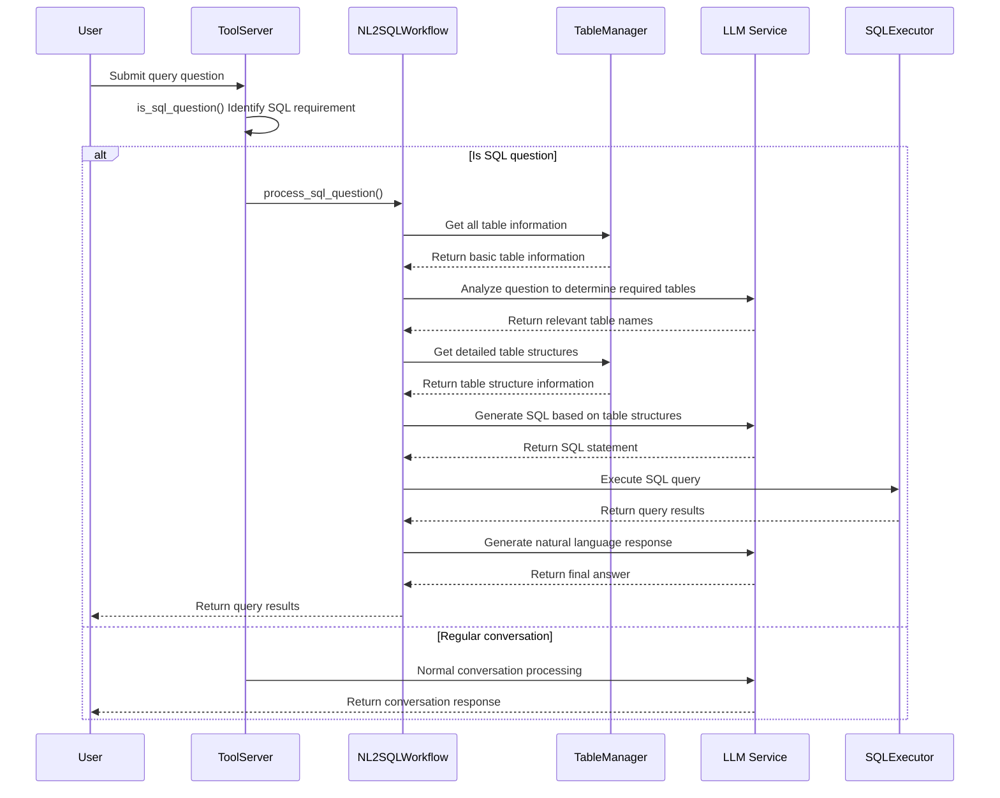

# any4any NL2SQL Intelligent Query System Documentation

## 1. System Overview

The any4any NL2SQL Intelligent Query System is a natural language to SQL conversion framework based on large language models. It allows users to query databases directly using Chinese language, automatically identifies query requirements, generates and executes SQL statements, and returns query results in natural language format. The system adopts a modular architecture design, implementing a complete workflow including question identification, table structure retrieval, SQL generation, query execution, and result generation.

### 1.1 Core Features

- **Intelligent Question Identification**: Automatically identifies user's data query requirements, distinguishing between SQL queries and regular conversations
- **Dynamic Table Structure Retrieval**: Intelligently retrieves relevant database table structure information based on user questions
- **LLM-Driven SQL Generation**: Utilizes large language models to generate accurate SQL query statements based on table structures and user questions
- **Secure Query Execution**: Provides a secure SQL execution environment that only allows SELECT queries to ensure database security
- **Intelligent Result Processing**: Automatically formats query results and generates natural language responses
- **Error Handling Mechanism**: Comprehensive exception handling and fallback mechanisms to ensure system stability
- **Asynchronous Processing Support**: All database operations and LLM calls adopt asynchronous processing to improve response efficiency

### 1.2 System Architecture

The NL2SQL Intelligent Query System mainly includes the following core components:

1. **ToolServer**: Responsible for intelligent identification of SQL questions and tool management
2. **NL2SQLWorkflow**: Executes the complete 6-step SQL query workflow
3. **TableManager**: Provides database table information retrieval and management functionality
4. **SQLExecutor**: Responsible for SQL statement security validation and execution
5. **LLMService**: Large language model service integrated with NL2SQL functionality

## 2. Workflow

### 2.1 Complete 6-Step Workflow



### 2.2 Detailed Execution Steps

1. **Question Identification Phase**:
   - Use keyword matching and pattern recognition to determine if user questions require SQL queries
   - Support multiple query patterns: statistics, calculations, sorting, grouping, etc.

2. **Table Information Retrieval Phase**:
   - Get basic information of all tables in the database (table names, comments, estimated row counts)
   - LLM analyzes user questions to intelligently determine which tables need to be queried

3. **Table Structure Retrieval Phase**:
   - Get detailed structure information of relevant tables (field names, types, comments, constraints, etc.)
   - Support table structure retrieval for multi-table join queries

4. **SQL Generation Phase**:
   - LLM generates accurate SQL query statements based on user questions and table structures
   - Use specialized SQL generation prompts to optimize generation quality

5. **SQL Execution Phase**:
   - Multi-layer security validation ensures query security
   - Execute SQL queries in a secure environment
   - Process and format query results

6. **Result Generation Phase**:
   - LLM generates natural language responses based on query results
   - Intelligently handle query success, failure, and empty result scenarios

## 3. Core Components Details

### 3.1 ToolServer (Tool Server)

**File Location**: `core/chat/tool_server.py`

**Main Responsibilities**:
- Intelligent identification of SQL questions
- Tool registration and management (simplified version)
- Provide SQL question identification interface

**Core Methods**:
```python
def is_sql_question(self, question: str) -> bool:
    """
    Determine if a question requires SQL querying

    Supported query types:
    - Statistical queries: how many, total, average, etc.
    - Data queries: show, list, query, etc.
    - Calculation queries: highest, lowest, maximum, minimum, etc.
    - Sorting queries: sort, group, etc.
    """
```

### 3.2 NL2SQLWorkflow (Workflow Manager)

**File Location**: `core/tools/nl2sql/workflow.py`

**Main Responsibilities**:
- Manage complete NL2SQL workflow
- Coordinate interactions between various components
- Handle exceptions and error situations

**Core Methods**:
```python
async def process_sql_question(self, question: str, context: str = "") -> Dict[str, Any]:
    """
    Process complete workflow for SQL questions

    Returns dictionary containing:
    - success: Whether successful
    - question: Original question
    - generated_sql: Generated SQL statement
    - query_result: Query results
    - final_answer: Final answer
    - row_count: Result row count
    """
```

### 3.3 TableManager (Table Manager)

**File Location**: `core/tools/nl2sql/table_info.py`

**Main Responsibilities**:
- Database connection management
- Table information retrieval and management
- Table structure querying and formatting

**Core Methods**:
```python
def get_all_tables_with_comments(self) -> Dict[str, Any]:
    """Get basic information of all tables in the database"""

def get_table_schema(self, table_name: str) -> Dict[str, Any]:
    """Get detailed structure information of specified table"""

def get_multiple_table_schemas(self, table_names: List[str]) -> Dict[str, Any]:
    """Batch retrieve structure information of multiple tables"""
```

### 3.4 SQLExecutor (SQL Executor)

**File Location**: `core/tools/nl2sql/sql_executor.py`

**Main Responsibilities**:
- SQL statement security validation
- SQL query execution
- Query result formatting

**Core Methods**:
```python
def _validate_sql_safety(self, sql_query: str) -> Tuple[bool, str]:
    """
    SQL security validation

    Security rules:
    - Only allow SELECT queries
    - Prohibit dangerous keywords (DROP, DELETE, UPDATE, etc.)
    - Prevent SQL injection
    - Prohibit multi-statement execution
    """

def execute_sql_query(self, sql_query: str) -> Dict[str, Any]:
    """Execute validated SQL query"""
```

## 4. Configuration

### 4.1 Environment Variables Configuration

Add the following configuration to the `.env` file:

```bash
# Database configuration
SQL_DB_TYPE=mysql                          # Database type
SQL_DB_HOST=localhost                       # Database host
SQL_DB_PORT=3306                           # Database port
SQL_DB_USERNAME=root                       # Database username
SQL_DB_PASSWORD=root                       # Database password
SQL_DB_DATABASE=your_database_name         # Database name

# Tool system configuration
TOOLS_ENABLED=true                          # Enable tool system
TOOLS_DEBUG=false                          # Tool debug mode
TOOLS_TIMEOUT=30                           # Tool execution timeout
```

### 4.2 Database Permissions Configuration

To ensure security, it is recommended to use a database user with read-only permissions:

```sql
-- Create read-only user
CREATE USER 'nl2sql_user'@'localhost' IDENTIFIED BY 'your_password';

-- Grant read-only permissions
GRANT SELECT ON your_database_name.* TO 'nl2sql_user'@'localhost';

-- Refresh privileges
FLUSH PRIVILEGES;
```

### 4.3 Model Configuration

Ensure LLM model is correctly configured in the `.env` file:

```bash
LLM_MODEL_DIR=/path/to/your/llm/model     # LLM model path
```

## 5. Usage Guide

### 5.1 Basic Usage

The system automatically identifies user's SQL query requirements. When you ask data query questions in conversation, the system will automatically enter the NL2SQL workflow:

**Usage Examples**:
```python
# Direct conversation usage
user_questions = [
    "How many orders are there?",
    "Query the average price of all products",
    "Count products in each category",
    "Show the 10 most expensive products",
    "What's the weather like today?"  # This will be identified as regular conversation
]
```

### 5.2 API Calls

Use through OpenAI-compatible interface:

```bash
curl -X POST http://localhost:8888/v1/chat/completions \
  -H "Content-Type: application/json" \
  -d '{
    "model": "default",
    "messages": [
      {"role": "user", "content": "Query total order count"}
    ]
  }'
```

### 5.3 Supported Query Types

The system supports the following types of natural language queries:

1. **Statistical Queries**:
   - "How many orders are there?"
   - "Count total users"
   - "Calculate average product price"

2. **Data Queries**:
   - "Show all products"
   - "List recent orders"
   - "Query user information"

3. **Calculation Queries**:
   - "What is the highest price?"
   - "Product with lowest inventory"
   - "What is the total sales amount?"

4. **Sorting Queries**:
   - "Show products sorted by price"
   - "Latest 10 orders"
   - "Best-selling products"

5. **Grouping Queries**:
   - "Product count in each category"
   - "User count by region"
   - "Order count by status"

## 6. Security Mechanisms

### 6.1 SQL Security Validation

The system implements multi-layer security validation mechanisms:

1. **Statement Type Validation**: Only allows SELECT queries
2. **Keyword Filtering**: Prohibits dangerous operations like DROP, DELETE, UPDATE
3. **Injection Protection**: Checks for SQL injection characteristics
4. **Multi-statement Protection**: Prohibits execution of multiple SQL statements

### 6.2 Access Control

- Recommend using read-only database users
- Database connection configuration isolation
- Query execution environment isolation

### 6.3 Logging

- Complete operation logging
- SQL query statement logging
- Error and exception logging
- User query history

## 7. Performance Optimization

### 7.1 Asynchronous Processing

- All database operations are asynchronous
- LLM calls are executed asynchronously
- Non-blocking response generation

### 7.2 Connection Pool Management

- SQLAlchemy connection pool
- Connection reuse and management
- Connection timeout and retry mechanisms

### 7.3 Caching Strategy

- Table structure information caching
- Query result caching (optional)
- LRU caching strategy

## 8. Troubleshooting

### 8.1 Common Issues

**Q: System cannot identify SQL questions**
- Check if the question contains query keywords
- Confirm TOOLS_ENABLED=true
- View identification results in logs

**Q: SQL execution fails**
- Check database connection configuration
- Confirm database user permissions
- View SQL security validation logs

**Q: Generated SQL statements are incorrect**
- Check if table structure information is correctly retrieved
- Confirm LLM model is working properly
- View SQL generation prompts

### 8.2 Debug Mode

Enable debug mode:
```bash
TOOLS_DEBUG=true
```

Debug mode outputs detailed execution process logs, including:
- Question identification results
- Table structure retrieval process
- SQL generation details
- Query execution results

## 9. Extension Development

### 9.1 Custom SQL Question Identification

Modify the `is_sql_question` method in `core/chat/tool_server.py`:

```python
def is_sql_question(self, question: str) -> bool:
    # Add custom keywords
    custom_keywords = ['your_keywords', 'your_patterns']
    # Add custom identification logic
```

### 9.2 Custom SQL Generation Prompts

Modify the `_generate_sql` method in `core/tools/nl2sql/workflow.py`:

```python
async def _generate_sql(self, question: str, table_schemas: str, context: str):
    # Custom SQL generation prompts
    custom_prompt = """Your custom prompts"""
```

### 9.3 Support Other Databases

Modify database connection logic in `core/tools/nl2sql/table_info.py` and `core/tools/nl2sql/sql_executor.py` to support other database types like PostgreSQL, SQLite, etc.

## 10. Summary

The NL2SQL Intelligent Query System provides powerful natural language database query capabilities for the any4any project, allowing users to query databases without learning SQL language. The system adopts modular design with good scalability and maintainability, while providing comprehensive security mechanisms to ensure database security.

Through intelligent workflow design, the system can accurately understand user query intentions, automatically generate high-quality SQL queries, and return results in natural language format, greatly reducing the barrier to using database queries.