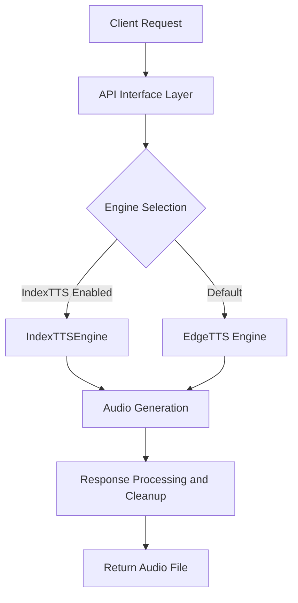
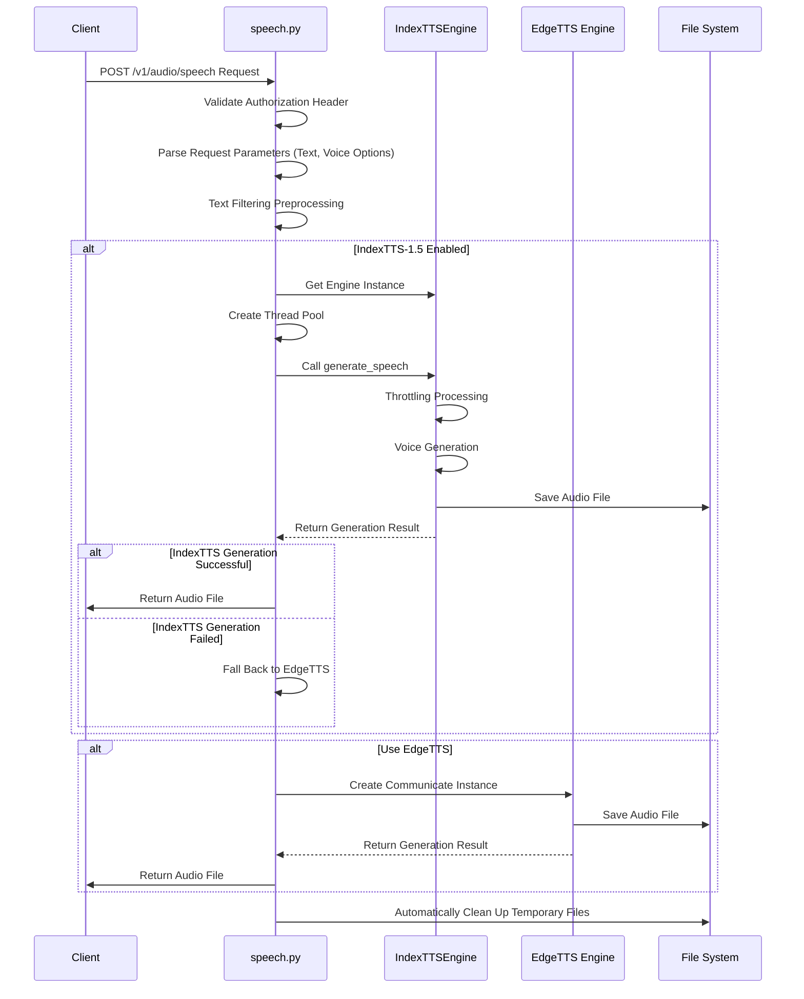

# ANY4ANY TTS Implementation and Integration Documentation

## 1. System Overview

### 1.1 Core Features

The TTS (Text-to-Speech) system of the ANY4ANY project provides voice generation capabilities with the following main features:

- **Multi-engine support**: Integrates EdgeTTS cloud service and IndexTTS-1.5 local model
- **Unified interface**: Provides standardized API interfaces compatible with OpenAI voice API specifications
- **Flexible configuration**: Supports flexible adjustment of system parameters through environment variables and configuration files
- **File management**: Automatically creates and cleans up temporary audio files
- **Error handling**: Exception capture and logging, supporting automatic engine degradation

### 1.2 System Architecture

The TTS system adopts a modular design, mainly consisting of the following components:



- **API Interface Layer**: Handles HTTP requests, verifies permissions, and parses request parameters
- **Engine Implementation**: Includes two implementations: EdgeTTS cloud service and IndexTTS-1.5 local model
- **File Management**: Responsible for the creation and automatic cleanup of temporary files

## 2. Workflow

### 2.1 Voice Generation Main Process

The following is the complete workflow of the TTS system processing a voice generation request:



## 3. Core Components Detailed Explanation

### 3.1 API Interface Layer (speech.py)

The API interface layer is responsible for handling HTTP requests, verifying permissions, parsing request parameters, and returning generated audio files.

**Main Functions:**
- **Request validation**: Verifies Authorization header to ensure users have permission to call the TTS service
- **Parameter parsing**: Parses text and voice parameters in the request body
- **Text preprocessing**: Filters special characters to improve voice quality
- **Engine selection**: Selects appropriate TTS engine according to configuration
- **Response return**: Returns audio files in FileResponse format, including automatic cleanup mechanism

**Core Implementation:**

```python
# create_speech function in core/tts/speech.py
async def create_speech(
    request: Request,
    authorization: str = Header(None),
):
    """Generate speech file from input text"""
    # Verify authorization
    await verify_token(authorization)
    # Generate temporary file name
    output_file = f"temp_{uuid.uuid4().hex}.mp3"
    
    try:
        # Get request data
        data = await request.json()
        text = data.get("input", "")
        voice = data.get("voice", str(Config.DEFAULT_VOICE))
        
        # Text filtering
        text = filter_special_chars(text)

        # Try to use IndexTTS-1.5 engine
        if Config.INDEX_TTS_ENABLED:
            try:
                index_tts_engine = IndexTTSEngine.get_instance({
                    'model_path': Config.INDEX_TTS_MODEL_DIR,
                    'device': Config.INDEX_TTS_DEVICE
                })
                
                # Use thread pool to execute synchronous operations to avoid blocking the event loop
                with ThreadPoolExecutor() as executor:
                    success = await asyncio.get_event_loop().run_in_executor(
                        executor,
                        index_tts_engine.generate_speech,
                        text,
                        output_file,
                        voice
                    )
                
                if success and os.path.exists(output_file):
                    return file_response_with_cleanup(
                        output_file,
                        media_type="audio/mpeg",
                        filename="speech.mp3",
                        cleanup_file=output_file
                    )
                else:
                    logger.warning("IndexTTS-1.5 generation failed, falling back to edge-tts")
            except Exception as e:
                logger.error(f"Error generating speech with IndexTTS-1.5 engine: {str(e)}")
                logger.info("Falling back to edge-tts")
        
        # Process with EdgeTTS
        if not text:
            with open(output_file, 'wb') as f:
                f.write(b'')  # Write empty content
        else:
            communicate = Communicate(text, voice)
            await communicate.save(output_file)

        # Return audio file
        return file_response_with_cleanup(
            output_file,
            media_type="audio/mpeg",
            filename="speech.mp3",
            cleanup_file=output_file
        )
    except Exception as e:
        logger.error(f"TTS generation failed: {str(e)}")
        # Clean up temporary file and raise exception
        if output_file and os.path.exists(output_file):
            os.remove(output_file)
        raise HTTPException(status_code=500, detail=str(e))
```

### 3.2 IndexTTSEngine

IndexTTSEngine is the engine implementation for the local IndexTTS-1.5 model, supporting singleton pattern and basic lifecycle management.

**Main Functions:**
- **Singleton pattern**: Ensures only one model instance exists globally to avoid repeated loading
- **Model initialization**: Loads IndexTTS-1.5 model into memory
- **Device management**: Supports GPU and CPU device selection
- **Voice generation**: Calls IndexTTS-1.5 model to generate voice
- **Request throttling**: Prevents system overload caused by too many requests in a short time
- **Resource cleanup**: Provides model resource release mechanism

**Core Implementation:**

```python
# Main functions in core/tts/index_tts_engine.py
class IndexTTSEngine:
    """IndexTTS-1.5 model engine"""
    # Singleton pattern implementation
    _instance = None
    _lock = threading.Lock()
    _initialized = False
    
    def __new__(cls, config=None):
        with cls._lock:
            if cls._instance is None:
                cls._instance = super(IndexTTSEngine, cls).__new__(cls)
        return cls._instance
    
    def __init__(self, config=None):
        if not IndexTTSEngine._initialized:
            with self._lock:
                if not IndexTTSEngine._initialized:
                    # Initialize parameters from configuration or environment variables
                    self.config = config or {}
                    self.model_path = self.config.get('model_path', Config.INDEX_TTS_MODEL_DIR)
                    self.device = self.config.get('device', Config.INDEX_TTS_DEVICE)
                    self.max_workers = self.config.get('max_workers', Config.INDEX_TTS_MAX_WORKERS)
                    self.timeout = self.config.get('timeout', Config.INDEX_TTS_TIMEOUT)
                    self.supported_voices = self.config.get('supported_voices', Config.INDEX_TTS_SUPPORTED_VOICES)
                    # Initialize other properties
                    self.model = None
                    self._min_request_interval = self.config.get('min_request_interval', 0.5)
                    self._last_request_time = 0
                    self._processing_lock = threading.Lock()
                    # Initialize model
                    self._initialize()
    
    def _initialize(self):
        """Initialize IndexTTS-1.5 engine"""
        try:
            # Check model path and configuration file
            if not os.path.exists(self.model_path):
                raise FileNotFoundError(f"Model path not found: {self.model_path}")
            
            config_path = os.path.join(self.model_path, "config.yaml")
            if not os.path.exists(config_path):
                raise FileNotFoundError(f"Config file not found: {config_path}")
            
            # Add module path to system path
            current_dir = os.path.dirname(os.path.abspath(__file__))
            indextts_path = os.path.join(current_dir, "indextts")
            if os.path.exists(indextts_path):
                sys.path.insert(0, current_dir)
                sys.path.insert(0, indextts_path)
            
            # Import model
            from indextts.infer import IndexTTSInference
            
            # Initialize model
            self.model = IndexTTSInference(model_path=self.model_path, device=self.device)
            logger.info(f"IndexTTS-1.5 engine loaded with {'CUDA' if self.device == 'cuda' else 'CPU'}")
            IndexTTSEngine._initialized = True
            
        except Exception as e:
            logger.error(f"Failed to initialize IndexTTS-1.5 engine: {str(e)}")
            IndexTTSEngine._initialized = False
            self.model = None
    
    def generate_speech(self, text: str, output_path: str, voice: Optional[str] = None) -> bool:
        """Generate speech file"""
        try:
            return self._process_with_throttling(text, output_path, voice)
        except Exception as e:
            logger.error(f"Error in generate_speech: {str(e)}")
            return False
    
    def _process_with_throttling(self, text: str, output_path: str, voice: Optional[str] = None) -> bool:
        """Process TTS request with throttling"""
        current_time = time.time()
        time_since_last = current_time - self._last_request_time
        
        # If the time since the last request is too short, wait
        if time_since_last < self._min_request_interval:
            time.sleep(self._min_request_interval - time_since_last)
        
        # Use lock to ensure only one request is being processed at the same time
        with self._processing_lock:
            self._last_request_time = time.time()
            return self._generate_speech(text, output_path, voice)
```

### 3.3 File Management Tools (file.py)

The file.py module provides file management and automatic cleanup functions to ensure that temporary files do not occupy too much disk space.

**Main Functions:**
- **Temporary file cleanup**: Provides file deletion functionality
- **Automatic cleanup response**: Implements a FileResponse subclass that automatically cleans up files after response completion
- **Audio duration retrieval**: Supports getting the duration information of audio files

**Core Implementation:**

```python
# Main functions in core/tts/file.py
def cleanup_file(filepath: str):
    """Clean up temporary file"""
    if not filepath:
        return
    try:
        if os.path.exists(filepath):
            os.remove(filepath)
            logging.info(f"Cleaned up temporary file: {filepath}")
    except Exception as e:
        logging.error(f"Error cleaning up file {filepath}: {str(e)}")

class file_response_with_cleanup(FileResponse):
    """File response with automatic cleanup function"""
    def __init__(self, *args, cleanup_file: str = None, **kwargs):
        super().__init__(*args, **kwargs)
        self.cleanup_file = cleanup_file
    
    async def __call__(self, scope, receive, send):
        try:
            await super().__call__(scope, receive, send)
        finally:
            if self.cleanup_file:
                cleanup_file(self.cleanup_file)

def get_audio_duration(file_path: str) -> float:
    """Get audio file duration"""
    try:
        info = torchaudio.info(file_path)
        return info.num_frames / info.sample_rate
    except Exception as e:
        logging.warning(f"Cannot get audio duration: {str(e)}")
        return 0.0
```

## 4. Data Structures and API Design

### 4.1 Request Data Structure

The TTS API accepts a JSON format request body, containing the following fields:

| Field Name | Type | Required | Description |
|-----------|------|----------|-------------|
| input | string | Yes | Text content to be converted to speech |
| voice | string | No | Voice identifier to use, defaults to DEFAULT_VOICE in configuration |

**Request Example:**
```json
{
  "input": "This is a test text to demonstrate TTS functionality.",
  "voice": "zh-CN-XiaoyiNeural"
}
```

### 4.2 Response Data Structure

The TTS API returns an audio file, responding in binary stream form:

| Response Property | Description |
|------------------|-------------|
| Status Code | 200 for success, 4xx or 5xx for failures |
| Content-Type | audio/mpeg (MP3 format) |
| Content-Length | Audio file size (bytes) |
| Response Body | Binary audio data |

### 4.3 Configuration Parameters

The configuration parameters for the TTS module are defined in `config.py`:

```python
# TTS-related configuration in config.py

# Default voice configuration
DEFAULT_VOICE = os.getenv("DEFAULT_VOICE", "zh-CN-XiaoyiNeural")

# IndexTTS-1.5 engine configuration
INDEX_TTS_ENABLED = os.getenv("INDEX_TTS_ENABLED", "False").lower() == "true"
INDEX_TTS_MODEL_DIR = os.getenv("INDEX_TTS_MODEL_DIR", "/mnt/c/models/IndexTTS-1.5")
INDEX_TTS_DEVICE = os.getenv("INDEX_TTS_DEVICE", "cuda" if torch.cuda.is_available() else "cpu")
INDEX_TTS_MAX_WORKERS = int(os.getenv("INDEX_TTS_MAX_WORKERS", "2"))
INDEX_TTS_TIMEOUT = int(os.getenv("INDEX_TTS_TIMEOUT", "60"))  # seconds
INDEX_TTS_SUPPORTED_VOICES = ["default"]  # List of supported voices
```

## 5. Key Technical Implementations

### 5.1 Singleton Pattern Design

IndexTTSEngine uses the singleton pattern to ensure that the model is loaded only once, avoiding repeated initialization and resource waste:

```python
@classmethod
def get_instance(cls, config=None):
    """Get engine instance"""
    if cls._instance is None:
        return cls(config)
    return cls._instance
```

### 5.2 Asynchronous Processing and Thread Pool

To avoid blocking the event loop with synchronous operations, a thread pool is used to handle synchronous calls to IndexTTS-1.5:

```python
# Using thread pool in speech.py
with ThreadPoolExecutor() as executor:
    success = await asyncio.get_event_loop().run_in_executor(
        executor,
        index_tts_engine.generate_speech,
        text,
        output_file,
        voice
    )
```

### 5.3 Request Throttling Mechanism

To avoid system overload caused by frequent requests, a simple request throttling mechanism is implemented:

```python
def _process_with_throttling(self, text: str, output_path: str, voice: Optional[str] = None) -> bool:
    """Process TTS request with throttling"""
    current_time = time.time()
    time_since_last = current_time - self._last_request_time
    
    # If the time since the last request is too short, wait
    if time_since_last < self._min_request_interval:
        time.sleep(self._min_request_interval - time_since_last)
    
    # Use lock to ensure only one request is being processed at the same time
    with self._processing_lock:
        self._last_request_time = time.time()
        return self._generate_speech(text, output_path, voice)
```

### 5.4 Automatic Cleanup Mechanism

Through the custom `file_response_with_cleanup` class, it is ensured that temporarily generated audio files are automatically cleaned up after the response:

```python
# Return file response with automatic cleanup function
return file_response_with_cleanup(
    output_file,
    media_type="audio/mpeg",
    filename="speech.mp3",
    cleanup_file=output_file
)
```

### 5.5 Engine Degradation Mechanism

When the IndexTTS-1.5 engine fails, the system automatically degrades to the EdgeTTS engine to ensure service availability:

```python
# Engine degradation logic
if Config.INDEX_TTS_ENABLED:
    try:
        # Try to use IndexTTS-1.5
        # ...
        if success:
            return result
        else:
            logger.warning("IndexTTS-1.5 generation failed, falling back to edge-tts")
    except Exception as e:
        logger.error(f"Error generating speech with IndexTTS-1.5 engine: {str(e)}")
        logger.info("Falling back to edge-tts")

# Degrade to EdgeTTS
# ...
```

## 6. Summary

### 6.1 Implementation Points

1. **EdgeTTS Integration**: Interact with Microsoft EdgeTTS cloud service through the Communicate class to implement text-to-speech functionality
2. **IndexTTS-1.5 Local Model Integration**:
   - Implement singleton pattern to avoid repeated model loading
   - Asynchronously call synchronous models through thread pool
   - Support configuration-driven model path and device selection
   - Implement request throttling to protect system resources
3. **File Management**: Provide automatic creation and cleanup mechanisms for temporary files to avoid disk space waste
4. **Error Handling**: Implement exception capture, logging, and degradation processing to ensure service stability
5. **Configuration Driven**: Flexibly control system behavior through environment variables and configuration files

### 6.2 Usage Instructions

1. **Enable IndexTTS-1.5**:
   - Set environment variable `INDEX_TTS_ENABLED=true`
   - Configure `INDEX_TTS_MODEL_DIR` to point to the model directory
   - Select appropriate device (CPU/GPU) through `INDEX_TTS_DEVICE`

2. **API Call Example**:
   - Use POST request to access `/v1/audio/speech`
   - Provide valid API key for authorization
   - Send JSON data containing `input` and optional `voice` parameters

3. **Voice Selection**:
   - EdgeTTS supports multiple voices, such as `zh-CN-XiaoyiNeural`
   - IndexTTS-1.5 currently only supports the `default` voice

### 6.3 Notes

1. Ensure that the IndexTTS-1.5 model directory exists and contains necessary files
2. For GPU acceleration, ensure that CUDA-supported PyTorch is correctly installed
3. For long-running services, regularly check if disk space is occupied by temporary files
4. For high-concurrency scenarios, consider adjusting thread pool size and throttling parameters

Through the above implementation, the TTS module provides flexible and reliable text-to-speech functionality, supporting seamless switching between cloud and local models to meet different scenario requirements.