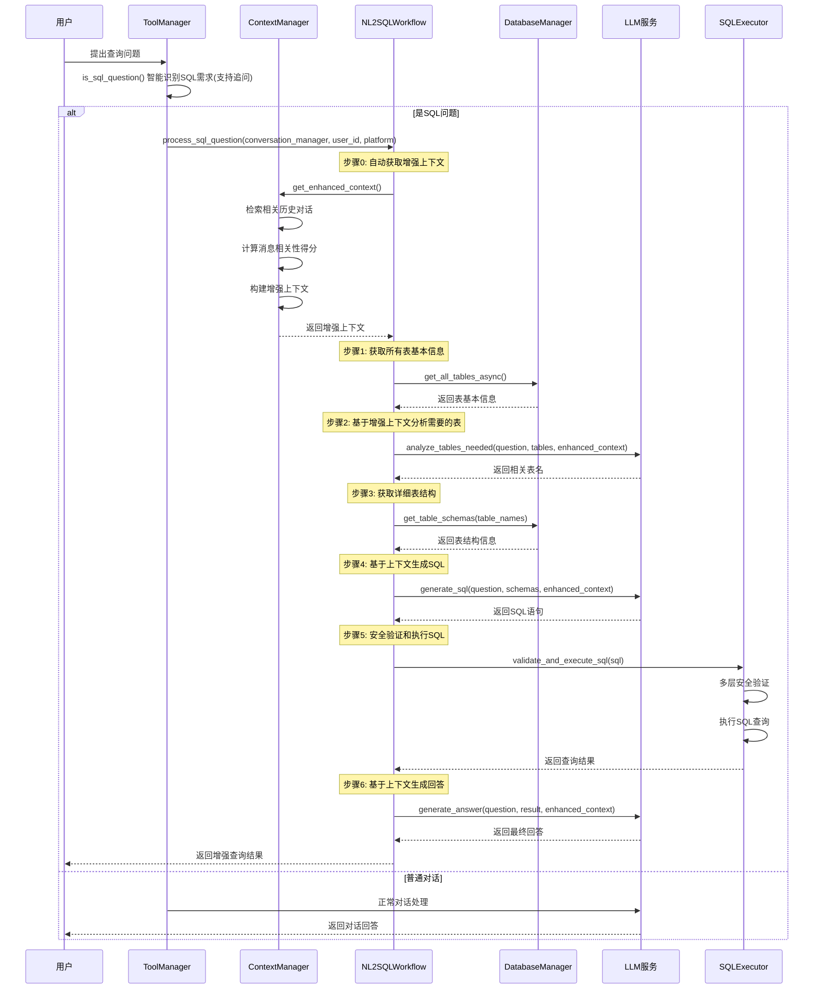
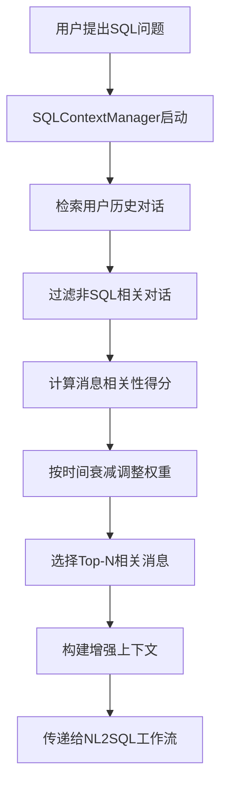

# any4any NL2SQL智能查询系统说明文档

## 1. 系统概述

any4any NL2SQL智能查询系统是一个基于大语言模型的增强型自然语言到SQL转换框架，具备完整的上下文感知能力。系统允许用户使用中文直接查询数据库，自动识别查询需求，智能检索相关对话历史，生成并执行SQL语句，最后以自然语言形式返回查询结果。系统采用模块化架构设计，实现了问题识别、上下文管理、表结构获取、SQL生成、查询执行和结果生成的完整工作流程。

### 1.1 核心功能

- **智能问题识别**：自动识别用户的数据查询需求，支持追问和多轮对话识别
- **上下文感知查询**：基于会话历史的智能上下文检索和整合，支持跨轮对话的连续查询
- **动态表结构获取**：根据用户问题和上下文智能获取相关的数据库表结构信息
- **LLM驱动SQL生成**：基于增强上下文、表结构和用户问题，生成准确的SQL查询语句
- **安全查询执行**：提供多层安全验证的SQL执行环境，仅允许SELECT查询，确保数据库安全
- **智能结果处理**：自动格式化查询结果，结合历史上下文生成自然语言回答
- **错误处理机制**：完善的异常处理和回退机制，确保系统稳定性
- **异步处理支持**：所有数据库操作和LLM调用均采用异步处理，提高响应效率
- **追问支持**：智能识别追问场景，支持"分别"、"都"、"谁"等追问关键词

### 1.2 系统架构

NL2SQL智能查询系统主要包含以下核心组件：

1. **ToolManager**：负责SQL问题的智能识别、工具管理和追问识别
2. **SQLContextManager**：负责会话历史的智能检索和上下文管理
3. **NL2SQLWorkflow**：执行增强的8步SQL查询工作流程
4. **TableManager**：提供数据库表信息的获取和管理功能
5. **SQLExecutor**：负责SQL语句的多层安全验证和执行
6. **LLMService**：集成了NL2SQL功能的大语言模型服务
7. **ConversationManager**：提供会话历史数据支持

## 2. 工作流程

### 2.1 增强的8步工作流程



### 2.2 详细执行步骤

#### 步骤0：增强上下文获取阶段
- **会话历史检索**：智能检索用户相关的历史对话记录
- **相关性计算**：基于时间衰减、关键词匹配计算消息相关性得分
- **上下文构建**：自动构建增强上下文，支持跨轮对话的连续查询
- **长度控制**：智能控制上下文长度，避免超出LLM处理能力

#### 步骤1：问题识别阶段
- **智能关键词匹配**：使用增强的关键词库和模式识别判断SQL查询需求
- **追问识别**：支持"分别"、"都"、"谁"、"什么"等追问关键词识别
- **上下文相关判断**：结合历史上下文判断是否为SQL相关问题
- **多模式支持**：支持统计、计算、排序、分组、追问等多种查询模式

#### 步骤2：表信息获取阶段
- **全表信息获取**：异步获取数据库中所有表的基本信息（表名、注释、预估行数）
- **智能表选择**：LLM基于用户问题和增强上下文分析，智能确定需要查询的表
- **上下文引导**：利用历史上下文信息辅助表选择决策

#### 步骤3：表结构获取阶段
- **详细结构获取**：获取相关表的详细结构信息（字段名、类型、注释、约束等）
- **多表关联支持**：支持复杂多表关联查询的表结构获取
- **异步批处理**：批量获取多个表的结构信息，提高效率

#### 步骤4：增强SQL生成阶段
- **上下文驱动生成**：LLM基于用户问题、表结构和增强上下文生成SQL查询语句
- **追问处理**：智能处理追问场景，生成相应的SQL查询
- **提示词优化**：使用专门的增强SQL生成提示词优化生成质量

#### 步骤5：安全执行阶段
- **多层安全验证**：语句类型验证、关键词过滤、注入防护、多语句防护
- **异步执行**：在安全环境中异步执行SQL查询
- **结果处理**：智能格式化查询结果，处理各种数据类型

#### 步骤6：增强结果生成阶段
- **上下文整合回答**：LLM基于查询结果和历史上下文生成自然语言回答
- **追问响应**：针对追问问题提供准确的上下文相关回答
- **智能格式化**：根据查询结果类型智能选择最佳展示格式

#### 步骤7：异常处理与回退
- **完善错误处理**：处理SQL语法错误、执行错误、连接错误等各种异常
- **智能回退机制**：当查询失败时提供合理的回退策略
- **用户友好提示**：为不同类型的错误提供用户友好的错误信息

## 3. 核心组件详解

### 3.1 ToolManager (工具管理器)

**文件位置**: `core/chat/tool_manager.py`

**主要职责**:
- 增强的SQL问题智能识别和追问识别
- 工具注册和管理
- 提供SQL问题和语音知识库问题判断接口
- 支持工具执行和结果封装

**核心方法**:
```python
def is_sql_question(self, question: str) -> bool:
    """
    增强的SQL问题识别，支持追问和上下文相关判断

    支持的查询类型：
    - 统计查询：有多少、总数、平均等
    - 数据查询：显示、列出、查询等
    - 计算查询：最高、最低、最大、最小等
    - 排序查询：排序、分组等
    - 追问查询：分别、都、谁、什么等
    """

async def execute_tool(self, tool_name: str, parameters: Dict[str, Any]) -> ToolResult:
    """
    执行指定的工具，支持SQL查询和其他扩展工具
    """
```

**增强特性**:
- **追问关键词识别**：支持"分别"、"都"、"谁"、"什么"、"哪个"、"哪些"等追问关键词
- **上下文相关判断**：结合对话历史判断问题是否需要SQL查询
- **多模式正则匹配**：使用多种正则表达式模式识别复杂查询需求

### 3.2 SQLContextManager (上下文管理器)

**文件位置**: `core/tools/nl2sql/context_manager.py`

**主要职责**:
- 智能检索相关的历史对话记录
- 计算消息与当前问题的相关性得分
- 构建增强上下文信息
- 管理上下文长度和历史记录数量

**核心方法**:
```python
async def get_enhanced_context(
    self,
    current_question: str,
    conversation_manager,
    user_id: str,
    platform: str,
    manual_context: str = "",
    max_history: int = 5
) -> str:
    """
    获取增强的上下文信息

    整合手动上下文和自动检索的历史对话上下文
    """

def _calculate_relevance_score(self, message: str, current_question: str) -> float:
    """
    计算消息与当前问题的相关性得分

    考虑因素：
    - 时间衰减因子
    - 关键词匹配度
    - 语义相似度
    """
```

**上下文增强特性**:
- **时间衰减算法**：越近的消息权重越高
- **关键词匹配**：基于预定义的SQL相关关键词进行匹配
- **语义相似度**：基于词汇重叠度计算语义相似性
- **长度控制**：智能控制上下文长度，避免超出LLM处理限制

### 3.3 NL2SQLWorkflow (工作流程管理器)

**文件位置**: `core/tools/nl2sql/workflow.py`

**主要职责**:
- 管理增强的8步NL2SQL工作流程
- 协调各个组件之间的交互
- 集成上下文管理器进行智能查询
- 处理异常和错误情况

**核心方法**:
```python
async def process_sql_question(
    self,
    question: str,
    context: str = "",
    conversation_manager=None,
    user_id: str = None,
    platform: str = None
) -> Dict[str, Any]:
    """
    处理SQL问题的增强工作流程

    步骤：
    0. 自动获取增强上下文
    1. 获取所有表基本信息
    2. 基于上下文分析需要的表
    3. 获取详细表结构
    4. 基于上下文生成SQL
    5. 安全验证和执行SQL
    6. 基于上下文生成回答

    返回包含以下信息的字典：
    - success: 是否成功
    - question: 原始问题
    - enhanced_context: 增强上下文
    - generated_sql: 生成的SQL语句
    - query_result: 查询结果
    - final_answer: 最终回答
    - row_count: 结果行数
    """
```

**工作流增强特性**:
- **自动上下文集成**：自动从会话管理器获取相关历史记录
- **异步处理优化**：所有步骤均为异步处理，提高响应效率
- **智能错误处理**：完善的异常处理和回退机制
- **步骤追踪**：详细的执行步骤日志，便于调试和监控

### 3.4 TableManager (表管理器)

**文件位置**: `core/tools/nl2sql/table_info.py`

**主要职责**:
- 异步数据库连接管理
- 表信息的获取和管理
- 表结构的查询和格式化
- 支持批量操作优化性能

**核心方法**:
```python
async def get_all_tables_async(self) -> Dict[str, Any]:
    """异步获取数据库中所有表的基本信息"""

def get_table_schema(self, table_name: str) -> Dict[str, Any]:
    """获取指定表的详细结构信息"""

def get_multiple_table_schemas(self, table_names: List[str]) -> Dict[str, Any]:
    """批量获取多个表的结构信息"""

async def get_table_info_async(self, table_name: str) -> Dict[str, Any]:
    """异步获取指定表的基本信息和结构"""
```

**性能优化特性**:
- **异步操作**：所有数据库操作均为异步执行
- **连接池管理**：使用SQLAlchemy连接池提高连接效率
- **批量处理**：支持批量获取多个表的结构信息
- **信息缓存**：可选的表结构信息缓存机制

### 3.5 SQLExecutor (SQL执行器)

**文件位置**: `core/tools/nl2sql/sql_executor.py`

**主要职责**:
- 多层SQL语句安全验证
- 异步SQL查询执行
- 查询结果的智能格式化
- 完善的错误处理机制

**核心方法**:
```python
def _validate_sql_safety(self, sql_query: str) -> Tuple[bool, str]:
    """
    多层SQL安全验证

    安全规则：
    - 仅允许SELECT查询
    - 禁止危险关键词（DROP、DELETE、UPDATE等）
    - 防止SQL注入攻击
    - 禁止多语句执行
    - 检查特殊字符和编码
    """

async def execute_query(self, sql_query: str) -> Dict[str, Any]:
    """异步执行已验证的SQL查询"""

def _format_query_results(self, results: List) -> Dict[str, Any]:
    """智能格式化查询结果"""
```

**安全增强特性**:
- **多层验证机制**：语句类型、关键词、注入、多语句等全面验证
- **SQL注入防护**：检查常见的SQL注入特征和模式
- **权限控制**：建议使用只读数据库用户进行查询
- **执行环境隔离**：在受控环境中执行SQL查询
- **详细审计日志**：记录所有SQL查询操作和验证结果

## 4. 配置说明

### 4.1 环境变量配置

在`.env`文件中添加以下配置：

```bash
# 数据库配置
SQL_DB_TYPE=mysql                          # 数据库类型
SQL_DB_HOST=localhost                       # 数据库主机
SQL_DB_PORT=3306                           # 数据库端口
SQL_DB_USERNAME=root                       # 数据库用户名
SQL_DB_PASSWORD=root                       # 数据库密码
SQL_DB_DATABASE=your_database_name         # 数据库名称

# 工具系统配置
TOOLS_ENABLED=true                          # 是否启用工具系统
TOOLS_DEBUG=false                          # 工具系统调试模式
TOOLS_TIMEOUT=30                           # 工具调用超时时间(秒)

# 模型配置
LLM_MODEL_DIR=/path/to/your/llm/model     # LLM模型路径

# 上下文管理配置(可选)
# SQL_CONTEXT_MAX_LENGTH=2000              # 上下文最大字符数
# SQL_CONTEXT_MAX_HISTORY=5                # 最大历史记录数
```

### 4.2 数据库权限配置

为了确保安全性，强烈建议使用具有只读权限的数据库用户：

```sql
-- 创建只读用户
CREATE USER 'nl2sql_user'@'localhost' IDENTIFIED BY 'your_strong_password';

-- 授予只读权限
GRANT SELECT ON your_database_name.* TO 'nl2sql_user'@'localhost';

-- 禁止修改操作
REVOKE INSERT, UPDATE, DELETE, CREATE, DROP, ALTER ON your_database_name.* FROM 'nl2sql_user'@'localhost';

-- 刷新权限
FLUSH PRIVILEGES;
```

**安全最佳实践**:
- 使用强密码
- 限制数据库连接来源IP
- 定期轮换数据库密码
- 监控数据库查询日志

### 4.3 上下文管理配置

SQL上下文管理器支持以下配置参数：

```python
# 在代码中或环境变量中配置
SQL_CONTEXT_MAX_LENGTH = 2000              # 上下文最大字符数
SQL_CONTEXT_MAX_HISTORY = 5                # 最大历史记录数
SQL_CONTEXT_KEYWORDS = [                   # SQL相关关键词列表
    '查询', '统计', '计算', '显示', '列出', '多少', '几个',
    # ... 更多关键词
]
```

### 4.4 模型配置

确保在`.env`文件中正确配置LLM模型：

```bash
LLM_MODEL_DIR=/path/to/your/llm/model     # LLM模型路径
# 其他模型相关配置...
```

## 5. 使用指南

### 5.1 基本使用

系统会自动识别用户的SQL查询需求，当您在对话中提出数据查询问题时，系统将自动进入增强的NL2SQL工作流程：

**基础查询示例**：
```python
# 直接对话使用
user_questions = [
    "有多少订单？",                           # 基础统计查询
    "查询所有产品的平均价格",                 # 计算查询
    "统计每个分类的产品数量",                 # 分组查询
    "显示价格最高的10个产品",                # 排序查询
    "今天天气怎么样？"                        # 普通对话(不会触发SQL)
]
```

**上下文感知查询示例**：
```python
# 多轮对话示例
conversation_flow = [
    "用户：查询所有产品分类",                 # 第一轮：获取分类信息
    "助手：共有3个分类：电子产品、服装、食品",
    "用户：分别有多少个产品？",               # 追问：基于上下文的分别统计
    "助手：电子产品有50个，服装有30个，食品有20个",
    "用户：价格最高的分别是哪个？"             # 追问：基于上下文的详细查询
]
```

### 5.2 API调用

通过OpenAI兼容接口使用：

```bash
curl -X POST http://localhost:8888/v1/chat/completions \
  -H "Content-Type: application/json" \
  -d '{
    "model": "default",
    "messages": [
      {"role": "user", "content": "查询订单总数"}
    ]
  }'
```

**带用户ID的API调用（启用上下文感知）**：
```bash
curl -X POST http://localhost:8888/v1/chat/completions \
  -H "Content-Type: application/json" \
  -d '{
    "model": "default",
    "messages": [
      {"role": "user", "content": "查询用户总数"}
    ],
    "user": "user123",                          # 用户ID用于上下文检索
    "stream": false
  }'
```

### 5.3 支持的查询类型

系统支持以下类型的自然语言查询：

1. **基础统计查询**：
   - "有多少订单？"
   - "统计用户总数"
   - "计算产品平均价格"

2. **数据查询**：
   - "显示所有产品"
   - "列出最近的订单"
   - "查询用户信息"

3. **计算查询**：
   - "最高价格是多少？"
   - "最低库存量的产品"
   - "总销售额是多少"

4. **排序查询**：
   - "按价格排序显示产品"
   - "最新的10个订单"
   - "销量最好的产品"

5. **分组查询**：
   - "每个分类的产品数量"
   - "按地区统计用户数"
   - "各状态订单的数量"

6. **上下文感知查询（增强功能）**：
   - "分别有多少个？"          # 基于上下文的分别统计
   - "他们都是什么？"           # 基于上下文的详细信息查询
   - "价格最高的是哪个？"       # 基于上下文的条件查询
   - "具体信息是什么？"         # 基于上下文的详细查询

7. **复杂多轮查询**：
   - 第一轮："查询所有部门"
   - 第二轮："分别有多少员工？"
   - 第三轮："薪资最高的是谁？"
   - 第四轮："详细情况如何？"

## 6. 上下文感知功能详解

### 6.1 上下文管理机制

NL2SQL系统的核心增强功能是智能上下文感知能力，通过SQLContextManager实现：

#### 6.1.1 上下文检索流程


#### 6.1.2 相关性评分算法

系统使用多维度的相关性评分算法：

**时间衰减因子**：
- 越近的消息权重越高
- 使用指数衰减函数计算时间权重
- 可配置的时间衰减参数

**关键词匹配度**：
- 基于预定义的SQL相关关键词列表
- 计算问题与历史消息的关键词重叠度
- 支持同义词和相关词扩展

**语义相似度**：
- 基于词汇重叠度计算语义相似性
- 考虑问题类型的相似性
- 支持上下文语义理解

#### 6.1.3 上下文构建策略

**智能过滤**：
- 自动过滤无关的历史对话
- 保留SQL相关的查询和结果
- 维护上下文的连贯性和相关性

**长度控制**：
- 智能控制上下文总长度
- 避免超出LLM处理限制
- 优先保留高相关性内容

**格式优化**：
- 结构化上下文信息
- 清晰标注查询历史和结果
- 便于LLM理解和处理

### 6.2 追问识别与处理

系统增强了追问识别能力，支持复杂的上下文相关查询：

#### 6.2.1 追问关键词识别
```python
follow_up_keywords = [
    # 基础追问词
    '分别', '都', '谁', '什么', '哪个', '哪些',
    '详情', '具体', '详细', '更多信息',

    # 组合追问词
    '分别都', '都是谁', '是什么', '有什么', '有哪些',
    '怎么样', '如何', '为什么',

    # 上下文相关词
    '刚才', '之前', '上面提到的', '前面说的'
]
```

#### 6.2.2 追问处理策略

**上下文依赖分析**：
- 分析追问问题与历史查询的依赖关系
- 确定追问的目标和范围
- 构建完整的查询上下文

**智能查询重构**：
- 基于上下文重构完整的查询意图
- 补充缺失的查询条件
- 生成符合语义的SQL查询

**结果关联整合**：
- 将追问结果与历史结果关联
- 提供连贯的查询响应
- 维护对话的上下文一致性

### 6.3 多轮对话支持

系统支持复杂的多轮SQL查询对话：

**对话状态管理**：
- 维护多轮对话的状态信息
- 跟踪查询的历史和上下文
- 支持对话的暂停和恢复

**上下文连续性**：
- 确保多轮对话的上下文连续性
- 智能处理跨轮的查询引用
- 支持复杂的查询依赖关系

**查询历史追踪**：
- 记录完整的查询历史
- 支持查询结果的回溯
- 提供查询执行的审计轨迹

## 7. 安全机制

### 7.1 多层SQL安全验证

系统实现了多层安全验证机制：

1. **语句类型验证**：仅允许SELECT查询
2. **关键词过滤**：禁止DROP、DELETE、UPDATE等危险操作
3. **注入防护**：检查SQL注入特征和模式
4. **多语句防护**：禁止执行多个SQL语句
5. **特殊字符检查**：检查和过滤特殊字符
6. **编码验证**：验证字符编码的安全性

### 7.2 权限控制

- 建议使用只读数据库用户
- 数据库连接配置隔离
- 查询执行环境隔离
- IP白名单限制
- 连接数限制和超时控制

### 7.3 审计日志

- 完整的操作日志记录
- SQL查询语句记录
- 错误和异常日志
- 用户查询历史
- 上下文使用记录
- 安全事件记录

### 7.4 数据隐私保护

- 敏感数据脱敏处理
- 查询结果过滤
- 用户数据隔离
- 数据访问权限控制

## 8. 性能优化

### 8.1 异步处理架构

- **全异步化设计**：所有数据库操作和LLM调用均为异步执行
- **并发处理**：支持多个查询的并发处理
- **非阻塞响应**：实时流式响应生成
- **资源管理**：智能的异步资源管理和释放

### 8.2 连接池管理

- **SQLAlchemy连接池**：高性能的数据库连接池
- **连接复用**：智能的连接复用策略
- **连接健康检查**：定期检查连接健康状态
- **超时和重试**：完善的连接超时和重试机制

### 8.3 智能缓存策略

- **表结构缓存**：缓存数据库表结构信息
- **上下文缓存**：智能缓存用户查询上下文
- **查询结果缓存**：可选的查询结果缓存机制
- **LRU策略**：基于LRU算法的缓存淘汰策略

### 8.4 上下文检索优化

- **索引优化**：为历史对话建立高效的检索索引
- **并行检索**：并行处理多个用户的历史检索
- **增量更新**：增量更新上下文缓存
- **内存管理**：智能的上下文内存管理

## 9. 故障排除

### 9.1 常见问题

**Q: 系统无法识别SQL问题**
- 检查问题是否包含查询关键词或追问关键词
- 确认TOOLS_ENABLED=true
- 查看日志中的问题识别结果
- 检查是否有相关的历史上下文

**Q: 上下文感知功能不工作**
- 检查是否提供了有效的用户ID和平台信息
- 确认会话管理器是否正常工作
- 查看上下文检索日志
- 检查历史对话记录是否存在

**Q: 追问识别不准确**
- 检查追问关键词是否在预定义列表中
- 确认是否有相关的历史SQL查询
- 查看上下文相关性评分日志
- 考虑增加自定义追问关键词

**Q: SQL执行失败**
- 检查数据库连接配置
- 确认数据库用户权限（建议只读权限）
- 查看SQL安全验证日志
- 检查生成的SQL语句是否符合语法

**Q: 生成的SQL语句不正确**
- 检查表结构信息是否正确获取
- 确认LLM模型是否正常工作
- 查看SQL生成提示词和上下文信息
- 检查相关历史对话是否干扰了SQL生成

**Q: 查询响应时间过长**
- 检查数据库连接池配置
- 优化查询的表结构获取
- 考虑启用表结构缓存
- 检查上下文检索是否过于耗时

### 9.2 调试模式

启用调试模式：
```bash
TOOLS_DEBUG=true
```

调试模式会输出详细的执行过程日志，包括：
- 问题识别结果和依据
- 上下文检索过程和相关性评分
- 表结构获取过程
- SQL生成详情和使用的上下文
- 查询执行结果
- 各步骤的执行时间

### 9.3 日志分析

**关键日志位置**：
- 问题识别：`core.chat.tool_manager`
- 上下文管理：`core.tools.nl2sql.context_manager`
- 工作流程：`core.tools.nl2sql.workflow`
- 表管理：`core.tools.nl2sql.table_info`
- SQL执行：`core.tools.nl2sql.sql_executor`

**日志级别建议**：
- 生产环境：INFO
- 开发环境：DEBUG
- 故障排查：DEBUG + TOOLS_DEBUG=true

## 10. 扩展开发

### 10.1 自定义SQL问题识别

修改`core/chat/tool_manager.py`中的`is_sql_question`方法：

```python
def is_sql_question(self, question: str) -> bool:
    # 添加自定义关键词
    custom_keywords = ['你的关键词', '你的模式']

    # 添加自定义追问关键词
    custom_follow_up_keywords = ['你的追问词']

    # 添加自定义识别逻辑
    # 可以基于业务需求添加特定的识别模式
```

### 10.2 自定义上下文管理

修改`core/tools/nl2sql/context_manager.py`中的上下文管理逻辑：

```python
def _calculate_relevance_score(self, message: str, current_question: str) -> float:
    # 自定义相关性评分算法
    # 可以添加业务特定的评分逻辑

def get_enhanced_context(self, ...):
    # 自定义上下文构建策略
    # 可以添加特定的上下文过滤和格式化逻辑
```

### 10.3 自定义SQL生成提示词

修改`core/tools/nl2sql/workflow.py`中的SQL生成方法：

```python
async def _generate_sql(self, question: str, table_schemas: str, enhanced_context: str):
    # 自定义增强SQL生成提示词
    custom_prompt = """
    基于以下上下文信息生成SQL查询：
    历史上下文：{enhanced_context}
    用户问题：{question}
    表结构：{table_schemas}

    请生成准确的SQL查询语句。
    """
```

### 10.4 支持其他数据库

修改`core/tools/nl2sql/table_info.py`和`core/tools/nl2sql/sql_executor.py`中的数据库连接逻辑：

```python
# 支持PostgreSQL
if SQL_DB_TYPE == 'postgresql':
    # PostgreSQL特定的连接和查询逻辑

# 支持SQLite
elif SQL_DB_TYPE == 'sqlite':
    # SQLite特定的连接和查询逻辑
```

### 10.5 添加新的工具类型

在`core/chat/tool_manager.py`中添加新的工具类型：

```python
def __init__(self):
    # 添加自定义工具
    self._tools = [
        # 现有工具...
        {
            "name": "custom_tool",
            "description": "自定义工具描述",
            "parameters": {
                # 参数定义
            }
        }
    ]
```

## 11. 最佳实践

### 11.1 上下文管理最佳实践

**合理的上下文长度**：
- 设置合适的上下文长度限制（建议2000字符以内）
- 根据LLM模型处理能力调整上下文大小
- 定期评估上下文效果并优化

**关键词优化**：
- 根据业务需求定制SQL相关关键词
- 定期更新追问关键词列表
- 收集用户反馈优化关键词识别

**性能考虑**：
- 监控上下文检索的性能影响
- 合理设置历史记录数量限制
- 考虑上下文缓存的内存使用

### 11.2 查询优化建议

**表结构设计**：
- 为数据库表添加清晰的注释
- 使用规范的字段命名
- 建立合适的索引提高查询性能

**查询模式优化**：
- 引导用户使用清晰的查询语言
- 提供查询示例和模板
- 收集常见查询模式优化识别

### 11.3 安全最佳实践

**数据库安全**：
- 使用专用的只读数据库用户
- 定期轮换数据库密码
- 限制数据库连接来源IP

**查询监控**：
- 监控异常查询模式
- 记录所有SQL查询操作
- 设置查询频率限制

## 12. 总结

NL2SQL智能查询系统已经发展成为any4any项目的核心增强功能，具备了完整的上下文感知能力。系统不仅提供了强大的自然语言数据库查询能力，还通过智能的上下文管理和追问识别，实现了真正的对话式数据查询体验。

### 12.1 技术创新亮点

1. **上下文感知查询**：基于历史对话的智能上下文检索和整合
2. **追问识别处理**：支持复杂的多轮对话和追问场景
3. **增强工作流程**：从6步扩展到8步的完整查询处理流程
4. **异步性能优化**：全异步化设计提供高性能查询体验
5. **多层安全保护**：完善的SQL安全验证和权限控制

### 12.2 核心价值

- **降低使用门槛**：用户无需学习SQL即可进行复杂数据查询
- **提升查询效率**：通过上下文感知减少重复查询信息
- **增强用户体验**：支持自然的对话式数据查询交互
- **保障数据安全**：多层安全机制确保数据库安全
- **支持业务扩展**：模块化设计支持定制化扩展

### 12.3 应用场景

系统适用于各种需要数据查询的业务场景：
- **企业数据报表**：支持业务人员自主查询数据
- **客服数据分析**：快速查询客户相关信息
- **销售业绩分析**：自然的销售数据查询方式
- **运营数据监控**：实时的运营数据查询和分析

通过持续的技术创新和功能完善，NL2SQL智能查询系统已成为any4any项目的核心竞争力之一，为用户提供了智能、高效、安全的数据查询体验。