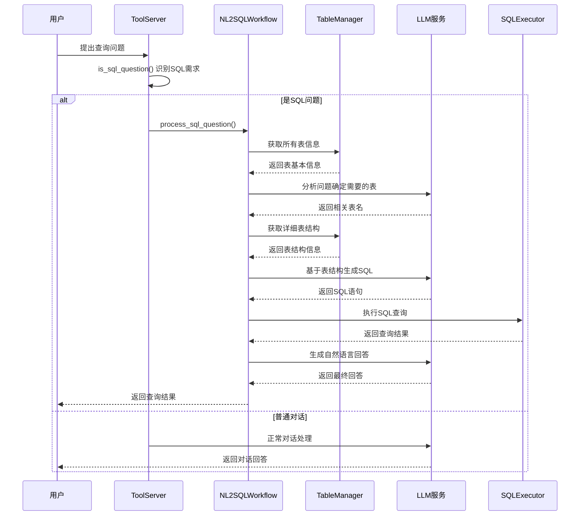

# any4any NL2SQL智能查询系统说明文档

## 1. 系统概述

any4any NL2SQL智能查询系统是一个基于大语言模型的自然语言到SQL转换框架，允许用户使用中文直接查询数据库，系统自动识别查询需求，生成并执行SQL语句，最后以自然语言形式返回查询结果。系统采用模块化架构设计，实现了问题识别、表结构获取、SQL生成、查询执行和结果生成的完整工作流程。

### 1.1 核心功能

- **智能问题识别**：自动识别用户的数据查询需求，区分SQL查询和普通对话
- **动态表结构获取**：根据用户问题智能获取相关的数据库表结构信息
- **LLM驱动SQL生成**：基于表结构和用户问题，利用大语言模型生成准确的SQL查询语句
- **安全查询执行**：提供安全的SQL执行环境，仅允许SELECT查询，确保数据库安全
- **智能结果处理**：自动格式化查询结果，并生成自然语言的回答
- **错误处理机制**：完善的异常处理和回退机制，确保系统稳定性
- **异步处理支持**：所有数据库操作和LLM调用均采用异步处理，提高响应效率

### 1.2 系统架构

NL2SQL智能查询系统主要包含以下核心组件：

1. **ToolServer**：负责SQL问题的智能识别和工具管理
2. **NL2SQLWorkflow**：执行完整的6步SQL查询工作流程
3. **TableManager**：提供数据库表信息的获取和管理功能
4. **SQLExecutor**：负责SQL语句的安全验证和执行
5. **LLMService**：集成了NL2SQL功能的大语言模型服务

## 2. 工作流程

### 2.1 完整的6步工作流程



### 2.2 详细执行步骤

1. **问题识别阶段**：
   - 使用关键词匹配和模式识别判断用户问题是否需要SQL查询
   - 支持多种查询模式：统计、计算、排序、分组等

2. **表信息获取阶段**：
   - 获取数据库中所有表的基本信息（表名、注释、预估行数）
   - LLM分析用户问题，智能确定需要查询的表

3. **表结构获取阶段**：
   - 获取相关表的详细结构信息（字段名、类型、注释、约束等）
   - 支持多表关联查询的表结构获取

4. **SQL生成阶段**：
   - LLM基于用户问题和表结构生成准确的SQL查询语句
   - 使用专门的SQL生成提示词优化生成质量

5. **SQL执行阶段**：
   - 多层安全验证确保查询安全性
   - 在安全环境中执行SQL查询
   - 处理查询结果并进行格式化

6. **结果生成阶段**：
   - LLM基于查询结果生成自然语言回答
   - 智能处理查询成功、失败和空结果的情况

## 3. 核心组件详解

### 3.1 ToolServer (工具服务器)

**文件位置**: `core/chat/tool_server.py`

**主要职责**:
- SQL问题的智能识别
- 工具注册和管理（简化版本）
- 提供SQL问题判断接口

**核心方法**:
```python
def is_sql_question(self, question: str) -> bool:
    """
    判断问题是否需要SQL查询

    支持的查询类型：
    - 统计查询：有多少、总数、平均等
    - 数据查询：显示、列出、查询等
    - 计算查询：最高、最低、最大、最小等
    - 排序查询：排序、分组等
    """
```

### 3.2 NL2SQLWorkflow (工作流程管理器)

**文件位置**: `core/tools/nl2sql/workflow.py`

**主要职责**:
- 管理完整的NL2SQL工作流程
- 协调各个组件之间的交互
- 处理异常和错误情况

**核心方法**:
```python
async def process_sql_question(self, question: str, context: str = "") -> Dict[str, Any]:
    """
    处理SQL问题的完整工作流程

    返回包含以下信息的字典：
    - success: 是否成功
    - question: 原始问题
    - generated_sql: 生成的SQL语句
    - query_result: 查询结果
    - final_answer: 最终回答
    - row_count: 结果行数
    """
```

### 3.3 TableManager (表管理器)

**文件位置**: `core/tools/nl2sql/table_info.py`

**主要职责**:
- 数据库连接管理
- 表信息的获取和管理
- 表结构的查询和格式化

**核心方法**:
```python
def get_all_tables_with_comments(self) -> Dict[str, Any]:
    """获取数据库中所有表的基本信息"""

def get_table_schema(self, table_name: str) -> Dict[str, Any]:
    """获取指定表的详细结构信息"""

def get_multiple_table_schemas(self, table_names: List[str]) -> Dict[str, Any]:
    """批量获取多个表的结构信息"""
```

### 3.4 SQLExecutor (SQL执行器)

**文件位置**: `core/tools/nl2sql/sql_executor.py`

**主要职责**:
- SQL语句的安全验证
- SQL查询的执行
- 查询结果的格式化

**核心方法**:
```python
def _validate_sql_safety(self, sql_query: str) -> Tuple[bool, str]:
    """
    SQL安全验证

    安全规则：
    - 仅允许SELECT查询
    - 禁止危险关键词（DROP、DELETE、UPDATE等）
    - 防止SQL注入
    - 禁止多语句执行
    """

def execute_sql_query(self, sql_query: str) -> Dict[str, Any]:
    """执行已验证的SQL查询"""
```

## 4. 配置说明

### 4.1 环境变量配置

在`.env`文件中添加以下配置：

```bash
# 数据库配置
SQL_DB_TYPE=mysql                          # 数据库类型
SQL_DB_HOST=localhost                       # 数据库主机
SQL_DB_PORT=3306                           # 数据库端口
SQL_DB_USERNAME=root                       # 数据库用户名
SQL_DB_PASSWORD=root                       # 数据库密码
SQL_DB_DATABASE=your_database_name         # 数据库名称

# 工具系统配置
TOOLS_ENABLED=true                          # 是否启用工具系统
TOOLS_DEBUG=false                          # 工具调试模式
TOOLS_TIMEOUT=30                           # 工具执行超时时间
```

### 4.2 数据库权限配置

为了确保安全性，建议使用具有只读权限的数据库用户：

```sql
-- 创建只读用户
CREATE USER 'nl2sql_user'@'localhost' IDENTIFIED BY 'your_password';

-- 授予只读权限
GRANT SELECT ON your_database_name.* TO 'nl2sql_user'@'localhost';

-- 刷新权限
FLUSH PRIVILEGES;
```

### 4.3 模型配置

确保在`.env`文件中正确配置LLM模型：

```bash
LLM_MODEL_DIR=/path/to/your/llm/model     # LLM模型路径
```

## 5. 使用指南

### 5.1 基本使用

系统会自动识别用户的SQL查询需求，当您在对话中提出数据查询问题时，系统将自动进入NL2SQL工作流程：

**使用示例**：
```python
# 直接对话使用
user_questions = [
    "有多少订单？",
    "查询所有产品的平均价格",
    "统计每个分类的产品数量",
    "显示价格最高的10个产品",
    "今天天气怎么样？"  # 这会被识别为普通对话
]
```

### 5.2 API调用

通过OpenAI兼容接口使用：

```bash
curl -X POST http://localhost:8888/v1/chat/completions \
  -H "Content-Type: application/json" \
  -d '{
    "model": "default",
    "messages": [
      {"role": "user", "content": "查询订单总数"}
    ]
  }'
```

### 5.3 支持的查询类型

系统支持以下类型的自然语言查询：

1. **统计查询**：
   - "有多少订单？"
   - "统计用户总数"
   - "计算产品平均价格"

2. **数据查询**：
   - "显示所有产品"
   - "列出最近的订单"
   - "查询用户信息"

3. **计算查询**：
   - "最高价格是多少？"
   - "最低库存量的产品"
   - "总销售额是多少"

4. **排序查询**：
   - "按价格排序显示产品"
   - "最新的10个订单"
   - "销量最好的产品"

5. **分组查询**：
   - "每个分类的产品数量"
   - "按地区统计用户数"
   - "各状态订单的数量"

## 6. 安全机制

### 6.1 SQL安全验证

系统实现了多层安全验证机制：

1. **语句类型验证**：仅允许SELECT查询
2. **关键词过滤**：禁止DROP、DELETE、UPDATE等危险操作
3. **注入防护**：检查SQL注入特征
4. **多语句防护**：禁止执行多个SQL语句

### 6.2 权限控制

- 建议使用只读数据库用户
- 数据库连接配置隔离
- 查询执行环境隔离

### 6.3 日志记录

- 完整的操作日志记录
- SQL查询语句记录
- 错误和异常日志
- 用户查询历史

## 7. 性能优化

### 7.1 异步处理

- 所有数据库操作异步化
- LLM调用异步执行
- 非阻塞的响应生成

### 7.2 连接池管理

- SQLAlchemy连接池
- 连接复用和管理
- 连接超时和重试机制

### 7.3 缓存策略

- 表结构信息缓存
- 查询结果缓存（可选）
- LRU缓存策略

## 8. 故障排除

### 8.1 常见问题

**Q: 系统无法识别SQL问题**
- 检查问题是否包含查询关键词
- 确认TOOLS_ENABLED=true
- 查看日志中的识别结果

**Q: SQL执行失败**
- 检查数据库连接配置
- 确认数据库用户权限
- 查看SQL安全验证日志

**Q: 生成的SQL语句不正确**
- 检查表结构信息是否正确获取
- 确认LLM模型是否正常工作
- 查看SQL生成提示词

### 8.2 调试模式

启用调试模式：
```bash
TOOLS_DEBUG=true
```

调试模式会输出详细的执行过程日志，包括：
- 问题识别结果
- 表结构获取过程
- SQL生成详情
- 查询执行结果

## 9. 扩展开发

### 9.1 自定义SQL问题识别

修改`core/chat/tool_server.py`中的`is_sql_question`方法：

```python
def is_sql_question(self, question: str) -> bool:
    # 添加自定义关键词
    custom_keywords = ['你的关键词', '你的模式']
    # 添加自定义识别逻辑
```

### 9.2 自定义SQL生成提示词

修改`core/tools/nl2sql/workflow.py`中的`_generate_sql`方法：

```python
async def _generate_sql(self, question: str, table_schemas: str, context: str):
    # 自定义SQL生成提示词
    custom_prompt = """你的自定义提示词"""
```

### 9.3 支持其他数据库

修改`core/tools/nl2sql/table_info.py`和`core/tools/nl2sql/sql_executor.py`中的数据库连接逻辑，支持PostgreSQL、SQLite等其他数据库类型。

## 10. 总结

NL2SQL智能查询系统为any4any项目提供了强大的自然语言数据库查询能力，用户无需学习SQL语言即可查询数据库。系统采用模块化设计，具有良好的可扩展性和可维护性，同时提供了完善的安全机制保障数据库安全。

通过智能的工作流程设计，系统能够准确理解用户的查询意图，自动生成高质量的SQL查询，并以自然语言形式返回结果，大大降低了数据库查询的使用门槛。