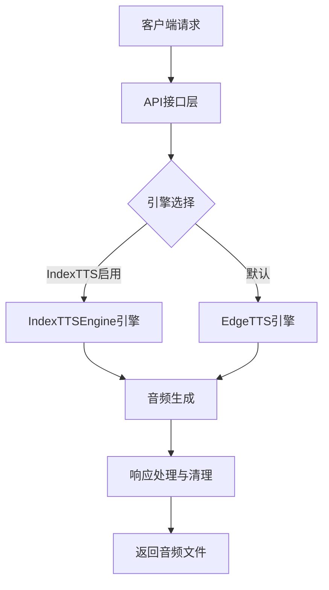
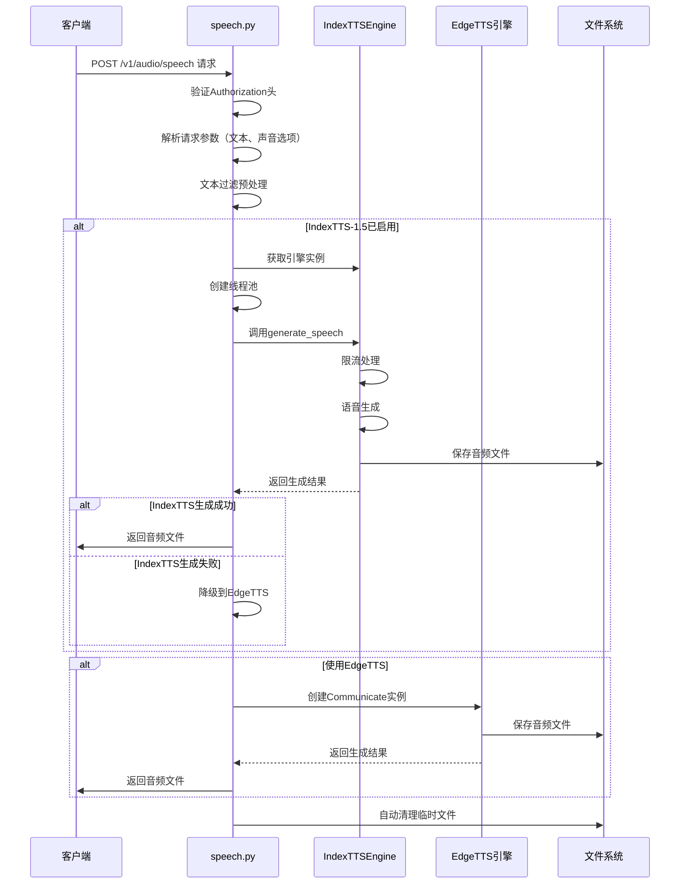

# ANY4ANY TTS 实现与集成说明文档

## 1. 系统概述

### 1.1 核心功能

ANY4ANY项目的TTS（文本转语音）系统提供了语音生成能力，主要功能包括：

- **多引擎支持**：集成EdgeTTS云服务和IndexTTS-1.5本地模型
- **统一接口**：提供标准化的API接口，兼容OpenAI语音API规范
- **灵活配置**：支持通过环境变量和配置文件灵活调整系统参数
- **文件管理**：自动创建和清理临时音频文件
- **错误处理**：异常捕获和日志记录，支持引擎自动降级

### 1.2 系统架构

TTS系统采用模块化设计，主要包含以下组件：



- **API接口层**：处理HTTP请求，验证权限，解析请求参数
- **引擎实现**：包括EdgeTTS云服务和IndexTTS-1.5本地模型两种实现
- **文件管理**：负责临时文件的创建和自动清理

## 2. 工作流程

### 2.1 语音生成主流程

以下是TTS系统处理一个语音生成请求的完整工作流程：



## 3. 核心组件详解

### 3.1 API接口层 (speech.py)

API接口层负责处理HTTP请求，验证权限，解析请求参数，并返回生成的音频文件。

**主要功能：**
- **请求验证**：验证Authorization头，确保用户有权限调用TTS服务
- **参数解析**：解析请求体中的文本和声音参数
- **文本预处理**：过滤特殊字符，提高语音质量
- **引擎选择**：根据配置选择合适的TTS引擎
- **响应返回**：以FileResponse形式返回音频文件，包含自动清理机制

**核心实现：**

```python
# core/tts/speech.py中的create_speech函数
async def create_speech(
    request: Request,
    authorization: str = Header(None),
):
    """根据输入文本生成语音文件"""
    # 验证授权
    await verify_token(authorization)
    # 生成临时文件名
    output_file = f"temp_{uuid.uuid4().hex}.mp3"
    
    try:
        # 获取请求数据
        data = await request.json()
        text = data.get("input", "")
        voice = data.get("voice", str(Config.DEFAULT_VOICE))
        
        # 文本过滤
        text = filter_special_chars(text)

        # 尝试使用IndexTTS-1.5引擎
        if Config.INDEX_TTS_ENABLED:
            try:
                index_tts_engine = IndexTTSEngine.get_instance({
                    'model_path': Config.INDEX_TTS_MODEL_DIR,
                    'device': Config.INDEX_TTS_DEVICE
                })
                
                # 使用线程池执行同步操作，避免阻塞事件循环
                with ThreadPoolExecutor() as executor:
                    success = await asyncio.get_event_loop().run_in_executor(
                        executor,
                        index_tts_engine.generate_speech,
                        text,
                        output_file,
                        voice
                    )
                
                if success and os.path.exists(output_file):
                    return file_response_with_cleanup(
                        output_file,
                        media_type="audio/mpeg",
                        filename="speech.mp3",
                        cleanup_file=output_file
                    )
                else:
                    logger.warning("IndexTTS-1.5 generation failed, falling back to edge-tts")
            except Exception as e:
                logger.error(f"Error generating speech with IndexTTS-1.5 engine: {str(e)}")
                logger.info("Falling back to edge-tts")
        
        # 使用EdgeTTS处理
        if not text:
            with open(output_file, 'wb') as f:
                f.write(b'')  # 写入空内容
        else:
            communicate = Communicate(text, voice)
            await communicate.save(output_file)

        # 返回音频文件
        return file_response_with_cleanup(
            output_file,
            media_type="audio/mpeg",
            filename="speech.mp3",
            cleanup_file=output_file
        )
    except Exception as e:
        logger.error(f"TTS generation failed: {str(e)}")
        # 清理临时文件并抛出异常
        if output_file and os.path.exists(output_file):
            os.remove(output_file)
        raise HTTPException(status_code=500, detail=str(e))
```

### 3.2 IndexTTSEngine引擎

IndexTTSEngine是本地IndexTTS-1.5模型的引擎实现，支持单例模式和基本的生命周期管理。

**主要功能：**
- **单例模式**：确保全局只有一个模型实例，避免重复加载
- **模型初始化**：加载IndexTTS-1.5模型到内存
- **设备管理**：支持GPU和CPU设备选择
- **语音生成**：调用IndexTTS-1.5模型生成语音
- **请求限流**：防止短时间内过多请求导致系统过载
- **资源清理**：提供模型资源释放机制

**核心实现：**

```python
# core/tts/index_tts_engine.py中的主要功能
class IndexTTSEngine:
    """IndexTTS-1.5模型引擎"""
    # 单例模式实现
    _instance = None
    _lock = threading.Lock()
    _initialized = False
    
    def __new__(cls, config=None):
        with cls._lock:
            if cls._instance is None:
                cls._instance = super(IndexTTSEngine, cls).__new__(cls)
        return cls._instance
    
    def __init__(self, config=None):
        if not IndexTTSEngine._initialized:
            with self._lock:
                if not IndexTTSEngine._initialized:
                    # 从配置或环境变量初始化参数
                    self.config = config or {}
                    self.model_path = self.config.get('model_path', Config.INDEX_TTS_MODEL_DIR)
                    self.device = self.config.get('device', Config.INDEX_TTS_DEVICE)
                    self.max_workers = self.config.get('max_workers', Config.INDEX_TTS_MAX_WORKERS)
                    self.timeout = self.config.get('timeout', Config.INDEX_TTS_TIMEOUT)
                    self.supported_voices = self.config.get('supported_voices', Config.INDEX_TTS_SUPPORTED_VOICES)
                    # 初始化其他属性
                    self.model = None
                    self._min_request_interval = self.config.get('min_request_interval', 0.5)
                    self._last_request_time = 0
                    self._processing_lock = threading.Lock()
                    # 初始化模型
                    self._initialize()
    
    def _initialize(self):
        """初始化IndexTTS-1.5引擎"""
        try:
            # 检查模型路径和配置文件
            if not os.path.exists(self.model_path):
                raise FileNotFoundError(f"Model path not found: {self.model_path}")
            
            config_path = os.path.join(self.model_path, "config.yaml")
            if not os.path.exists(config_path):
                raise FileNotFoundError(f"Config file not found: {config_path}")
            
            # 添加模块路径到系统路径
            current_dir = os.path.dirname(os.path.abspath(__file__))
            indextts_path = os.path.join(current_dir, "indextts")
            if os.path.exists(indextts_path):
                sys.path.insert(0, current_dir)
                sys.path.insert(0, indextts_path)
            
            # 导入模型
            from indextts.infer import IndexTTSInference
            
            # 初始化模型
            self.model = IndexTTSInference(model_path=self.model_path, device=self.device)
            logger.info(f"IndexTTS-1.5 engine loaded with {'CUDA' if self.device == 'cuda' else 'CPU'}")
            IndexTTSEngine._initialized = True
            
        except Exception as e:
            logger.error(f"Failed to initialize IndexTTS-1.5 engine: {str(e)}")
            IndexTTSEngine._initialized = False
            self.model = None
    
    def generate_speech(self, text: str, output_path: str, voice: Optional[str] = None) -> bool:
        """生成语音文件"""
        try:
            return self._process_with_throttling(text, output_path, voice)
        except Exception as e:
            logger.error(f"Error in generate_speech: {str(e)}")
            return False
    
    def _process_with_throttling(self, text: str, output_path: str, voice: Optional[str] = None) -> bool:
        """限流处理TTS请求"""
        current_time = time.time()
        time_since_last = current_time - self._last_request_time
        
        # 如果距离上次请求时间太短，进行等待
        if time_since_last < self._min_request_interval:
            time.sleep(self._min_request_interval - time_since_last)
        
        # 使用锁确保同一时间只有一个请求在处理
        with self._processing_lock:
            self._last_request_time = time.time()
            return self._generate_speech(text, output_path, voice)
```

### 3.3 文件管理工具 (file.py)

file.py模块提供了文件管理和自动清理功能，确保临时文件不会占用过多磁盘空间。

**主要功能：**
- **临时文件清理**：提供文件删除功能
- **自动清理响应**：实现响应完成后自动清理文件的FileResponse子类
- **音频时长获取**：支持获取音频文件的时长信息

**核心实现：**

```python
# core/tts/file.py中的主要功能
def cleanup_file(filepath: str):
    """清理临时文件"""
    if not filepath:
        return
    try:
        if os.path.exists(filepath):
            os.remove(filepath)
            logging.info(f"Cleaned up temporary file: {filepath}")
    except Exception as e:
        logging.error(f"Error cleaning up file {filepath}: {str(e)}")

class file_response_with_cleanup(FileResponse):
    """带自动清理功能的文件响应"""
    def __init__(self, *args, cleanup_file: str = None, **kwargs):
        super().__init__(*args, **kwargs)
        self.cleanup_file = cleanup_file
    
    async def __call__(self, scope, receive, send):
        try:
            await super().__call__(scope, receive, send)
        finally:
            if self.cleanup_file:
                cleanup_file(self.cleanup_file)

def get_audio_duration(file_path: str) -> float:
    """获取音频文件时长"""
    try:
        info = torchaudio.info(file_path)
        return info.num_frames / info.sample_rate
    except Exception as e:
        logging.warning(f"Cannot get audio duration: {str(e)}")
        return 0.0
```

## 4. 数据结构与API设计

### 4.1 请求数据结构

TTS API接收JSON格式的请求体，包含以下字段：

| 字段名 | 类型 | 必填 | 说明 |
|-------|------|------|------|
| input | string | 是 | 需要转换为语音的文本内容 |
| voice | string | 否 | 指定使用的声音标识符，默认为配置中的DEFAULT_VOICE |

**请求示例：**
```json
{
  "input": "这是一段测试文本，用于演示TTS功能。",
  "voice": "zh-CN-XiaoyiNeural"
}
```

### 4.2 响应数据结构

TTS API返回一个音频文件，以二进制流的形式响应：

| 响应属性 | 说明 |
|---------|------|
| 状态码 | 成功时为200，失败时为4xx或5xx |
| Content-Type | audio/mpeg（MP3格式） |
| Content-Length | 音频文件大小（字节） |
| 响应体 | 二进制音频数据 |

### 4.3 配置参数

TTS模块的配置参数在`config.py`中定义：

```python
# config.py中的TTS相关配置

# 默认声音配置
DEFAULT_VOICE = os.getenv("DEFAULT_VOICE", "zh-CN-XiaoyiNeural")

# IndexTTS-1.5引擎配置
INDEX_TTS_ENABLED = os.getenv("INDEX_TTS_ENABLED", "False").lower() == "true"
INDEX_TTS_MODEL_DIR = os.getenv("INDEX_TTS_MODEL_DIR", "/mnt/c/models/IndexTTS-1.5")
INDEX_TTS_DEVICE = os.getenv("INDEX_TTS_DEVICE", "cuda" if torch.cuda.is_available() else "cpu")
INDEX_TTS_MAX_WORKERS = int(os.getenv("INDEX_TTS_MAX_WORKERS", "2"))
INDEX_TTS_TIMEOUT = int(os.getenv("INDEX_TTS_TIMEOUT", "60"))  # 秒
INDEX_TTS_SUPPORTED_VOICES = ["default"]  # 支持的声音列表
```

## 5. 关键技术实现

### 5.1 单例模式设计

IndexTTSEngine使用单例模式确保模型只被加载一次，避免重复初始化和资源浪费：

```python
@classmethod
def get_instance(cls, config=None):
    """获取引擎实例"""
    if cls._instance is None:
        return cls(config)
    return cls._instance
```

### 5.2 异步处理与线程池

为避免同步操作阻塞事件循环，使用线程池处理IndexTTS-1.5的同步调用：

```python
# 在speech.py中使用线程池
with ThreadPoolExecutor() as executor:
    success = await asyncio.get_event_loop().run_in_executor(
        executor,
        index_tts_engine.generate_speech,
        text,
        output_file,
        voice
    )
```

### 5.3 请求限流机制

为避免频繁请求导致系统过载，实现了简单的请求限流机制：

```python
def _process_with_throttling(self, text: str, output_path: str, voice: Optional[str] = None) -> bool:
    """限流处理TTS请求"""
    current_time = time.time()
    time_since_last = current_time - self._last_request_time
    
    # 如果距离上次请求时间太短，进行等待
    if time_since_last < self._min_request_interval:
        time.sleep(self._min_request_interval - time_since_last)
    
    # 使用锁确保同一时间只有一个请求在处理
    with self._processing_lock:
        self._last_request_time = time.time()
        return self._generate_speech(text, output_path, voice)
```

### 5.4 自动清理机制

通过自定义的`file_response_with_cleanup`类，确保临时生成的音频文件在响应后被自动清理：

```python
# 返回带自动清理功能的文件响应
return file_response_with_cleanup(
    output_file,
    media_type="audio/mpeg",
    filename="speech.mp3",
    cleanup_file=output_file
)
```

### 5.5 引擎降级机制

当IndexTTS-1.5引擎出现故障时，系统会自动降级到EdgeTTS引擎，确保服务可用性：

```python
# 引擎降级逻辑
if Config.INDEX_TTS_ENABLED:
    try:
        # 尝试使用IndexTTS-1.5
        # ...
        if success:
            return result
        else:
            logger.warning("IndexTTS-1.5 generation failed, falling back to edge-tts")
    except Exception as e:
        logger.error(f"Error generating speech with IndexTTS-1.5 engine: {str(e)}")
        logger.info("Falling back to edge-tts")

# 降级到EdgeTTS
# ...
```

## 6. 总结

### 6.1 实现要点

1. **EdgeTTS集成**：通过Communicate类与Microsoft EdgeTTS云服务交互，实现文本转语音功能
2. **IndexTTS-1.5本地模型集成**：
   - 实现单例模式避免重复加载模型
   - 通过线程池异步调用同步模型
   - 支持配置驱动的模型路径和设备选择
   - 实现请求限流保护系统资源
3. **文件管理**：提供临时文件自动创建和清理机制，避免磁盘空间浪费
4. **错误处理**：实现异常捕获、日志记录和降级处理，确保服务稳定性
5. **配置驱动**：通过环境变量和配置文件灵活控制系统行为

### 6.2 使用说明

1. **启用IndexTTS-1.5**：
   - 设置环境变量`INDEX_TTS_ENABLED=true`
   - 配置`INDEX_TTS_MODEL_DIR`指向模型目录
   - 选择适当的设备（CPU/GPU）通过`INDEX_TTS_DEVICE`

2. **API调用示例**：
   - 使用POST请求访问`/v1/audio/speech`
   - 提供有效的API密钥进行授权
   - 发送包含`input`和可选`voice`参数的JSON数据

3. **声音选择**：
   - EdgeTTS支持多种声音，如`zh-CN-XiaoyiNeural`
   - IndexTTS-1.5当前仅支持`default`声音

### 6.3 注意事项

1. 确保IndexTTS-1.5模型目录存在且包含必要的文件
2. 对于GPU加速，确保正确安装了CUDA支持的PyTorch
3. 对于长时间运行的服务，定期检查磁盘空间是否被临时文件占用
4. 对于高并发场景，考虑调整线程池大小和限流参数

通过以上实现，TTS模块提供了灵活、可靠的文本转语音功能，支持云端和本地模型的无缝切换，满足不同场景的需求。