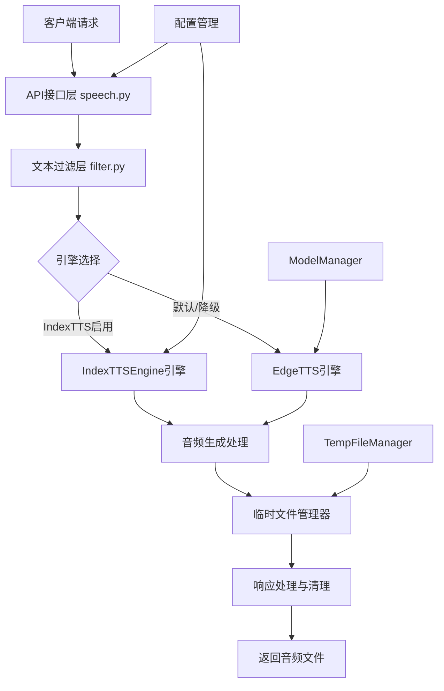
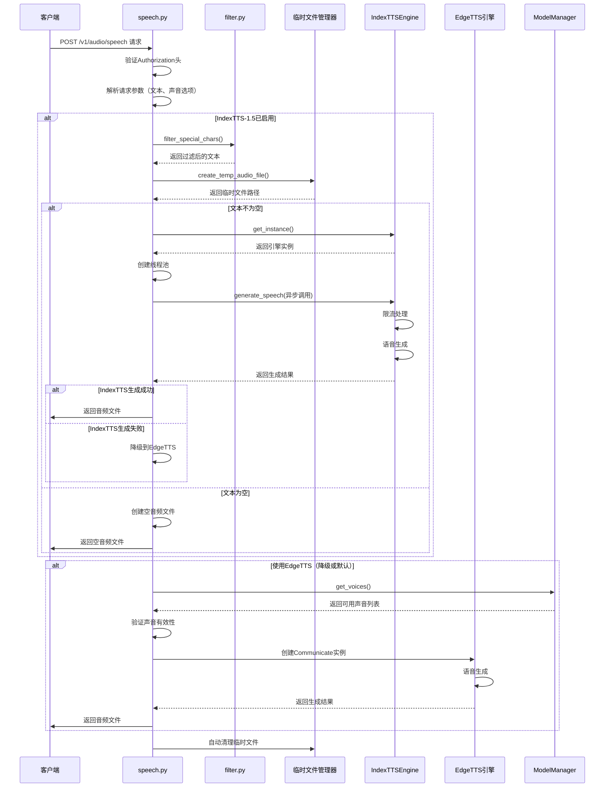
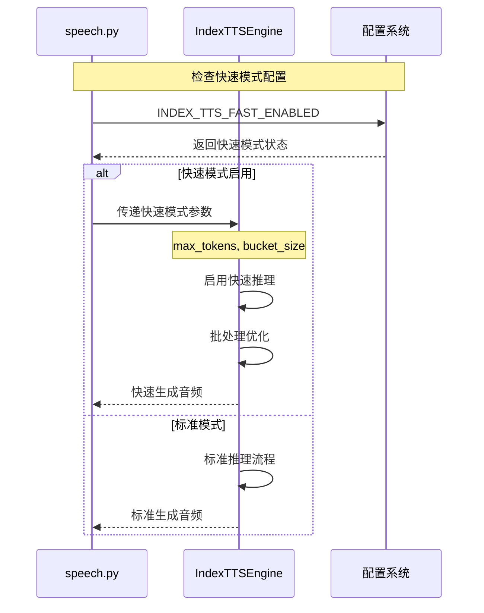
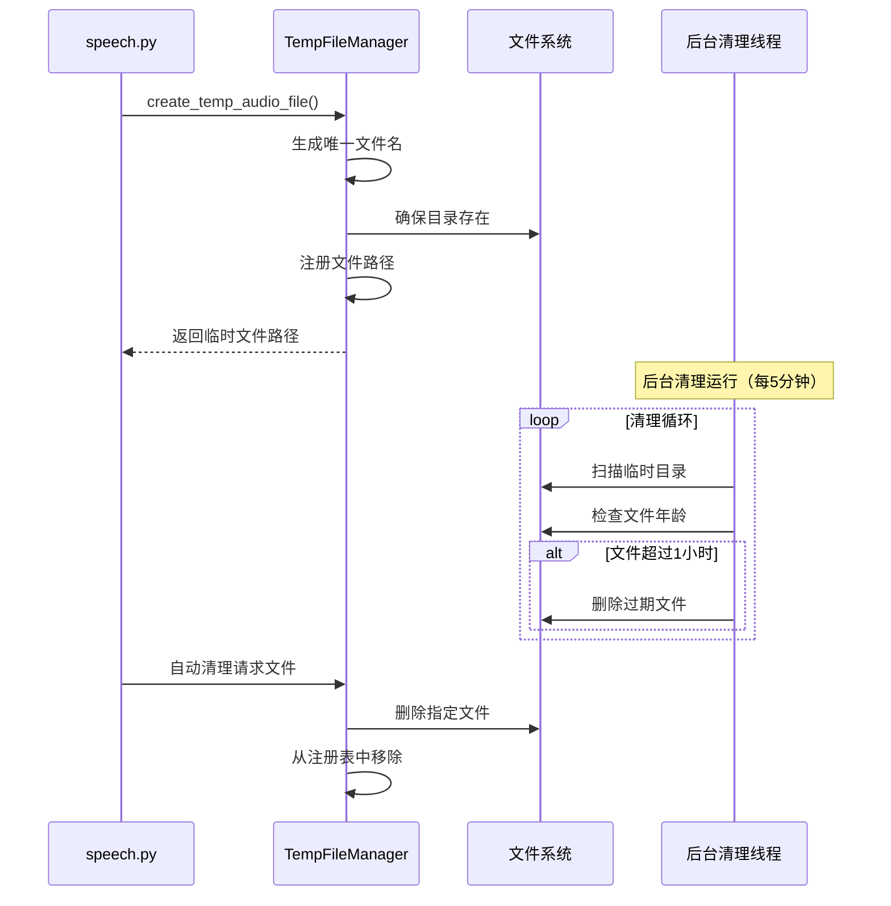

# any4any TTS系统实现与集成说明文档

## 1. 系统概述

any4any TTS（文本转语音）系统是一个增强型多引擎语音合成框架，集成了Microsoft EdgeTTS云服务和IndexTTS-1.5本地模型，提供统一接口、智能文本过滤、高性能音频生成和自动文件管理等功能。作为any4any多模态AI平台的核心组件，TTS系统与LLM、ASR、数字人等模块深度集成，支持企业级的语音合成服务。

### 1.1 核心功能

- **双引擎支持**：集成EdgeTTS云服务和IndexTTS-1.5本地模型，支持智能引擎切换
- **智能文本过滤**：多层文本预处理，移除URL、HTML标签、特殊字符和思考内容
- **统一接口**：提供OpenAI兼容的API接口，支持标准化的语音合成请求
- **高性能处理**：支持IndexTTS-1.5快速模式，提供流式音频生成能力
- **智能文件管理**：全局临时文件管理器，支持自动清理和后台维护
- **异步处理**：基于FastAPI的异步架构，支持高并发语音合成请求
- **错误处理**：完善的异常捕获、引擎降级和日志记录机制
- **配置驱动**：灵活的环境变量配置，支持运行时参数调整

### 1.2 系统架构

TTS系统采用模块化设计，主要包含以下核心组件：



**核心组件说明**：
- **API接口层**：处理HTTP请求、权限验证、参数解析和响应返回
- **文本过滤层**：智能文本预处理，移除影响语音合成的特殊内容
- **引擎实现**：EdgeTTS云服务和IndexTTS-1.5本地模型双引擎支持
- **文件管理**：统一的临时文件管理，支持自动清理和后台维护
- **配置管理**：灵活的系统配置，支持运行时参数调整

### 1.3 技术特性

- **双引擎架构**：云端EdgeTTS与本地IndexTTS-1.5的无缝集成
- **智能过滤**：多层文本预处理，包括URL、HTML、特殊字符、思考内容过滤
- **性能优化**：支持快速模式、批处理、流式生成等优化策略
- **资源管理**：单例模式的模型管理，全局文件管理器，内存优化
- **异步架构**：基于FastAPI的异步处理，支持高并发访问
- **降级机制**：引擎故障自动降级，确保服务高可用性

## 2. 工作流程

### 2.1 语音生成主流程



### 2.2 IndexTTS-1.5快速模式流程



### 2.3 临时文件管理流程



## 3. 核心组件详解

### 3.1 API接口层 (speech.py)

**文件位置**: `core/tts/speech.py`

**主要职责**:
- HTTP请求处理和权限验证
- 请求参数解析和验证
- 引擎选择和调用协调
- 响应返回和错误处理

**核心方法**:
```python
async def create_speech(
    request: Request,
    authorization: str = Header(None),
):
    """
    根据输入文本生成语音文件

    支持双引擎架构，自动降级机制
    集成临时文件管理器
    异步处理提高并发性能
    """
```

**技术特性**:
- **权限验证**: 通过verify_token进行API访问控制
- **异步处理**: 使用ThreadPoolExecutor处理同步模型调用
- **引擎降级**: IndexTTS失败时自动降级到EdgeTTS
- **文件管理**: 集成TempFileManager进行临时文件管理
- **性能监控**: 记录处理时间和生成状态

### 3.2 文本过滤器 (filter.py)

**文件位置**: `core/tts/filter.py`

**主要职责**:
- 多层文本预处理和过滤
- 移除影响语音合成的特殊内容
- 保持文本语义完整性

**核心功能**:
```python
def filter_special_chars(text: str) -> str:
    """
    过滤文本转语音特殊字符

    支持13层过滤策略：
    1. URL和链接移除
    2. HTML标签清理
    3. 邮箱地址过滤
    4. 特殊符号移除
    5. 数学符号清理
    6. Unicode字符过滤
    7. 控制字符移除
    8. 标点符号规范化
    9. 空白字符优化
    10. 图片相关文本清理
    11. 视频相关文本清理
    12. 版本号和文件扩展名过滤
    13. 括号内容处理
    """

def filter_think_content(text: str) -> str:
    """
    过滤<think>和</think>标签及其内容

    专门处理AI思考过程标记
    """
```

**过滤策略**:
- **智能识别**: 识别并移除URL、邮箱、HTML标签等非语音内容
- **语义保护**: 保持基本标点符号和文本语义完整性
- **特殊处理**: 专门处理AI思考内容标记和媒体文件引用
- **性能优化**: 使用正则表达式批量处理，提高过滤效率

### 3.3 IndexTTSEngine引擎

**文件位置**: `core/tts/index_tts_engine.py`

**主要职责**:
- IndexTTS-1.5模型的加载和管理
- 支持快速模式和标准模式
- 请求限流和资源管理
- 设备管理和性能优化

**核心特性**:
```python
class IndexTTSEngine:
    """
    IndexTTS-1.5模型引擎

    单例模式确保全局唯一实例
    支持快速模式和批处理优化
    内置请求限流和资源管理
    """

    def __init__(self, config=None):
        # 快速模式配置
        self._fast_max_tokens = config.get('max_tokens', Config.INDEX_TTS_FAST_MAX_TOKENS)
        self._fast_bucket_size = config.get('bucket_size', Config.INDEX_TTS_FAST_BATCH_SIZE)
        self._force_fast_mode = config.get('fast_mode', None)

        # 限流配置
        self._min_request_interval = config.get('min_request_interval', 0.001)
        self._processing_lock = threading.Lock()
```

**性能优化**:
- **快速模式**: 支持INDEX_TTS_FAST_ENABLED快速推理模式
- **批处理**: 可配置的批处理大小和令牌数量
- **限流保护**: 内置请求间隔限制，防止系统过载
- **内存管理**: 单例模式避免重复加载模型

### 3.4 临时文件管理器 (temp_file_manager.py)

**文件位置**: `core/tts/temp_file_manager.py`

**主要职责**:
- 全局临时文件生命周期管理
- 后台自动清理过期文件
- 文件注册和状态监控
- 线程安全的文件操作

**核心功能**:
```python
class TempFileManager:
    """
    临时文件管理器（单例模式）

    支持两种工作模式：
    1. 当前工作目录模式（默认）
    2. 专用临时目录模式（支持后台清理）
    """

    def create_temp_file(self, suffix: str = ".mp3", prefix: str = "temp_") -> str:
        """
        创建临时文件路径

        自动生成UUID文件名
        支持自定义前缀和后缀
        自动注册到管理器
        """

    def cleanup_file(self, filepath: str) -> bool:
        """
        清理指定文件

        线程安全的文件删除
        自动从注册表移除
        错误处理和日志记录
        """
```

**管理特性**:
- **单例模式**: 全局唯一实例，统一管理所有临时文件
- **后台清理**: 专用目录模式下支持后台自动清理（每5分钟）
- **线程安全**: 使用锁机制确保并发安全
- **状态监控**: 提供详细的状态信息和统计数据

### 3.5 文件响应处理 (file.py)

**文件位置**: `core/tts/file.py`

**主要职责**:
- 带自动清理功能的文件响应
- 音频文件信息获取
- 临时文件清理工具

**核心功能**:
```python
class file_response_with_cleanup(FileResponse):
    """
    带自动清理功能的文件响应

    继承FastAPI的FileResponse
    响应完成后自动清理文件
    支持自定义清理策略
    """

def cleanup_file(filepath: str):
    """
    清理临时文件

    安全的文件删除操作
    完善的错误处理机制
    详细的日志记录
    """

def get_audio_duration(file_path: str) -> float:
    """
    获取音频文件时长

    支持多种音频格式
    使用torchaudio进行解析
    错误处理和默认值返回
    """
```

## 4. 配置说明

### 4.1 环境变量配置

在`.env`文件中添加以下配置：

```bash
# EdgeTTS配置
EDGE_TTS_ENABLED=true                          # 是否启用EdgeTTS
EDGE_DEFAULT_VOICE=zh-CN-XiaoyiNeural         # 默认声音

# IndexTTS-1.5引擎配置
INDEX_TTS_MODEL_ENABLED=true                   # 是否启用IndexTTS-1.5
INDEX_TTS_MODEL_DIR=/path/to/IndexTTS-1.5      # IndexTTS-1.5模型路径
INDEX_TTS_DEVICE=cuda                          # 设备选择（cuda/cpu）
INDEX_TTS_MAX_WORKERS=2                        # 最大工作线程数
INDEX_TTS_TIMEOUT=60                           # 超时时间（秒）
INDEX_TTS_SUPPORTED_VOICES=["default"]          # 支持的声音列表

# IndexTTS-1.5快速模式配置
INDEX_TTS_FAST_ENABLED=true                    # 是否启用快速模式
INDEX_TTS_FAST_MAX_TOKENS=50                   # 快速模式最大令牌数
INDEX_TTS_FAST_BATCH_SIZE=16                   # 快速模式批处理大小
INDEX_TTS_STREAMING_MIN_SENTENCE_CHARS=15      # 流式生成最小句子字符数
INDEX_TTS_REFERENCE_AUDIO=default.wav          # 参考音频文件

# 临时文件管理配置
# （可选，不配置则使用当前工作目录）
TEMP_FILE_DIR=/tmp/any4any_tts                 # 临时文件目录
TEMP_FILE_MAX_AGE=3600                         # 最大文件保存时间（秒）
TEMP_FILE_CLEANUP_INTERVAL=300                 # 清理间隔（秒）
```

### 4.2 模型配置要求

**IndexTTS-1.5模型目录结构**:
```
IndexTTS-1.5/
├── config.yaml                    # 模型配置文件
├── model.pth                      # 模型权重文件
├── vocab.txt                      # 词汇表文件
└── other_model_files...           # 其他模型文件
```

**模型文件验证**:
```bash
# 检查必要文件
ls -la /path/to/IndexTTS-1.5/config.yaml
ls -la /path/to/IndexTTS-1.5/model.pth

# 检查文件权限
chmod -R 755 /path/to/IndexTTS-1.5/
```

### 4.3 性能优化配置

**快速模式优化**:
```bash
# 启用快速模式（推荐用于实时应用）
INDEX_TTS_FAST_ENABLED=true
INDEX_TTS_FAST_MAX_TOKENS=50        # 平衡质量和速度
INDEX_TTS_FAST_BATCH_SIZE=16        # 根据GPU内存调整
```

**并发处理优化**:
```bash
# 增加工作线程数（根据CPU核心数调整）
INDEX_TTS_MAX_WORKERS=4

# 调整超时时间（根据模型大小调整）
INDEX_TTS_TIMEOUT=120
```

**内存管理优化**:
```bash
# 使用GPU加速（推荐）
INDEX_TTS_DEVICE=cuda

# CPU模式优化
INDEX_TTS_DEVICE=cpu
INDEX_TTS_MAX_WORKERS=2
```

## 5. 使用指南

### 5.1 API调用

**基本语音合成请求**:
```bash
curl -X POST http://localhost:8888/v1/audio/speech \
  -H "Content-Type: application/json" \
  -H "Authorization: Bearer YOUR_API_KEY" \
  -d '{
    "input": "这是一个测试文本，用于演示TTS功能。",
    "voice": "zh-CN-XiaoyiNeural"
  }'
```

**使用IndexTTS-1.5引擎**:
```bash
curl -X POST http://localhost:8888/v1/audio/speech \
  -H "Content-Type: application/json" \
  -H "Authorization: Bearer YOUR_API_KEY" \
  -d '{
    "input": "使用IndexTTS-1.5模型进行语音合成",
    "voice": "default"
  }'
```

**批量语音合成**:
```bash
# 多个请求并行处理
for text in "文本1" "文本2" "文本3"; do
  curl -X POST http://localhost:8888/v1/audio/speech \
    -H "Content-Type: application/json" \
    -H "Authorization: Bearer YOUR_API_KEY" \
    -d "{\"input\": \"$text\", \"voice\": \"zh-CN-XiaoyiNeural\"}" \
    -o "output_$text.mp3" &
done
wait
```

### 5.2 Python SDK使用

**基本语音合成**:
```python
import requests
import json

def text_to_speech(text, voice="zh-CN-XiaoyiNeural", api_key="YOUR_API_KEY"):
    """文本转语音"""
    url = "http://localhost:8888/v1/audio/speech"
    headers = {
        "Content-Type": "application/json",
        "Authorization": f"Bearer {api_key}"
    }
    data = {
        "input": text,
        "voice": voice
    }

    response = requests.post(url, headers=headers, json=data)

    if response.status_code == 200:
        with open("output.mp3", "wb") as f:
            f.write(response.content)
        return "output.mp3"
    else:
        raise Exception(f"TTS failed: {response.text}")

# 使用示例
audio_file = text_to_speech("这是一个测试文本")
print(f"音频文件已保存到: {audio_file}")
```

**高级配置使用**:
```python
import asyncio
import aiohttp

async def batch_text_to_speech(texts, voice="zh-CN-XiaoyiNeural"):
    """批量文本转语音"""
    url = "http://localhost:8888/v1/audio/speech"
    headers = {
        "Content-Type": "application/json",
        "Authorization": "Bearer YOUR_API_KEY"
    }

    async with aiohttp.ClientSession() as session:
        tasks = []
        for i, text in enumerate(texts):
            data = {"input": text, "voice": voice}
            task = session.post(url, headers=headers, json=data)
            tasks.append(task)

        responses = await asyncio.gather(*tasks)

        for i, response in enumerate(responses):
            if response.status == 200:
                content = await response.read()
                with open(f"output_{i}.mp3", "wb") as f:
                    f.write(content)
            else:
                print(f"Request {i} failed: {await response.text()}")

# 使用示例
texts = ["第一个文本", "第二个文本", "第三个文本"]
asyncio.run(batch_text_to_speech(texts))
```

### 5.3 直接引擎使用

**IndexTTS-1.5直接调用**:
```python
from core.tts.index_tts_engine import IndexTTSEngine
from core.tts.temp_file_manager import create_temp_audio_file

# 获取引擎实例
engine = IndexTTSEngine.get_instance({
    'model_path': '/path/to/IndexTTS-1.5',
    'device': 'cuda',
    'fast_mode': True
})

# 生成语音
output_file = create_temp_audio_file()
success = engine.generate_speech(
    text="直接使用IndexTTS-1.5引擎",
    output_path=output_file,
    voice="default"
)

if success:
    print(f"语音文件已生成: {output_file}")
else:
    print("语音生成失败")
```

**EdgeTTS直接调用**:
```python
import asyncio
from edge_tts import Communicate

async def edge_tts_example():
    """EdgeTTS直接使用示例"""
    text = "使用EdgeTTS进行语音合成"
    voice = "zh-CN-XiaoyiNeural"
    output_file = "edge_output.mp3"

    communicate = Communicate(text, voice)
    await communicate.save(output_file)

    print(f"EdgeTTS语音文件已生成: {output_file}")

# 运行示例
asyncio.run(edge_tts_example())
```

## 6. 性能优化

### 6.1 IndexTTS-1.5性能优化

**快速模式配置**:
```python
# 快速模式参数优化
config = {
    'fast_mode': True,                    # 启用快速模式
    'max_tokens': 50,                     # 平衡质量和速度
    'bucket_size': 16,                    # 批处理大小
    'device': 'cuda'                      # 使用GPU加速
}

engine = IndexTTSEngine.get_instance(config)
```

**内存管理优化**:
```python
# 减少内存占用
config = {
    'device': 'cpu',                      # CPU模式减少内存占用
    'max_workers': 1,                     # 单线程处理
    'timeout': 30                         # 缩短超时时间
}
```

**并发处理优化**:
```python
import asyncio
from concurrent.futures import ThreadPoolExecutor

async def batch_tts_processing(texts, max_workers=4):
    """批量并发TTS处理"""
    engine = IndexTTSEngine.get_instance()

    with ThreadPoolExecutor(max_workers=max_workers) as executor:
        loop = asyncio.get_event_loop()
        tasks = []

        for text in texts:
            output_file = create_temp_audio_file()
            task = loop.run_in_executor(
                executor,
                engine.generate_speech,
                text,
                output_file,
                "default"
            )
            tasks.append((task, output_file))

        results = await asyncio.gather(*[task for task, _ in tasks])

        for i, (success, output_file) in enumerate(zip(results, [f for _, f in tasks])):
            if success:
                print(f"Task {i} completed: {output_file[1]}")
            else:
                print(f"Task {i} failed")
```

### 6.2 系统级优化

**临时文件管理优化**:
```python
from core.tts.temp_file_manager import TempFileManager

# 配置专用临时目录和清理策略
temp_manager = TempFileManager(
    temp_dir="/tmp/any4any_tts",           # 专用临时目录
    max_file_age=1800,                     # 30分钟自动清理
    cleanup_interval=180                   # 3分钟清理间隔
)

# 监控文件管理状态
status = temp_manager.get_status()
print(f"注册文件数: {status['registered_files']}")
print(f"总文件数: {status['total_files']}")
print(f"总大小: {status['total_size_mb']}MB")
```

**文本过滤优化**:
```python
# 自定义过滤策略
from core.tts.filter import filter_special_chars

def optimized_text_filter(text, enable_url_filter=True, enable_html_filter=True):
    """优化的文本过滤策略"""
    if not text:
        return ""

    # 基础清理
    text = text.strip()

    # 条件过滤
    if enable_url_filter:
        # URL过滤逻辑
        pass

    if enable_html_filter:
        # HTML过滤逻辑
        pass

    # 调用完整过滤
    return filter_special_chars(text)
```

### 6.3 监控和调试

**性能监控**:
```python
import time
import logging

# 启用详细日志
logging.getLogger('core.tts').setLevel(logging.DEBUG)

async def monitored_tts_request(text, voice="default"):
    """带监控的TTS请求"""
    start_time = time.time()

    try:
        # 执行TTS请求
        # ... TTS处理逻辑 ...

        end_time = time.time()
        processing_time = end_time - start_time

        logger.info(f"TTS request completed in {processing_time:.2f}s")
        return result

    except Exception as e:
        end_time = time.time()
        processing_time = end_time - start_time

        logger.error(f"TTS request failed after {processing_time:.2f}s: {e}")
        raise
```

**资源使用监控**:
```python
import psutil
import threading

def monitor_system_resources():
    """系统资源监控"""
    cpu_percent = psutil.cpu_percent(interval=1)
    memory_info = psutil.virtual_memory()

    print(f"CPU使用率: {cpu_percent}%")
    print(f"内存使用率: {memory_info.percent}%")
    print(f"可用内存: {memory_info.available / 1024 / 1024 / 1024:.2f}GB")

# 定期监控
def start_monitoring():
    """启动监控线程"""
    def monitor_loop():
        while True:
            monitor_system_resources()
            time.sleep(60)  # 每分钟监控一次

    monitor_thread = threading.Thread(target=monitor_loop, daemon=True)
    monitor_thread.start()
```

## 7. 故障排除

### 7.1 常见问题

**Q: IndexTTS-1.5模型加载失败**
- 检查模型路径配置是否正确
- 确认config.yaml文件存在且格式正确
- 验证模型文件完整性（model.pth等）
- 检查设备驱动（CUDA版本兼容性）
- 查看详细错误日志：`logging.getLogger('core.tts').setLevel(logging.DEBUG)`

**Q: EdgeTTS声音不可用**
- 检查网络连接是否正常
- 验证声音名称是否正确
- 查看可用声音列表：`ModelManager.get_voices()`
- 确认防火墙设置允许edge-tts访问

**Q: 临时文件清理失败**
- 检查文件权限设置
- 确认磁盘空间充足
- 验证临时文件目录路径
- 手动清理：`get_temp_file_manager().cleanup_all()`

**Q: TTS响应速度慢**
- 启用IndexTTS-1.5快速模式
- 使用GPU加速设备
- 调整批处理大小
- 检查网络连接（EdgeTTS）
- 监控系统资源使用情况

**Q: 文本过滤过度**
- 检查过滤日志输出
- 调整过滤策略
- 保留必要的标点符号
- 验证Unicode字符处理

### 7.2 性能调优

**提高生成速度**:
```bash
# 启用快速模式
INDEX_TTS_FAST_ENABLED=true
INDEX_TTS_FAST_MAX_TOKENS=30          # 减少令牌数量
INDEX_TTS_FAST_BATCH_SIZE=32          # 增加批处理大小

# 使用GPU加速
INDEX_TTS_DEVICE=cuda

# 减少超时时间
INDEX_TTS_TIMEOUT=30
```

**减少内存占用**:
```bash
# 使用CPU模式
INDEX_TTS_DEVICE=cpu

# 减少工作线程
INDEX_TTS_MAX_WORKERS=1

# 快速模式参数调整
INDEX_TTS_FAST_MAX_TOKENS=20
INDEX_TTS_FAST_BATCH_SIZE=8
```

**提高并发性能**:
```bash
# 增加工作线程
INDEX_TTS_MAX_WORKERS=4

# 调整限流参数
# 在IndexTTSEngine配置中
min_request_interval=0.001           # 减少请求间隔
```

### 7.3 调试配置

**详细日志配置**:
```python
import logging

# 启用TTS模块详细日志
logging.getLogger('core.tts').setLevel(logging.DEBUG)

# 启用IndexTTS详细日志
logging.getLogger('core.tts.index_tts_engine').setLevel(logging.DEBUG)

# 启用文件管理详细日志
logging.getLogger('core.tts.temp_file_manager').setLevel(logging.DEBUG)
```

**性能分析配置**:
```python
import cProfile
import pstats

def profile_tts_request():
    """TTS请求性能分析"""
    profiler = cProfile.Profile()
    profiler.enable()

    # 执行TTS请求
    # ... TTS处理逻辑 ...

    profiler.disable()

    # 分析结果
    stats = pstats.Stats(profiler)
    stats.sort_stats('cumulative')
    stats.print_stats(10)  # 显示前10个最耗时的函数

# 使用分析
profile_tts_request()
```

## 8. 扩展开发

### 8.1 自定义文本过滤器

```python
from core.tts.filter import filter_special_chars
import re

def custom_text_filter(text: str, custom_rules: dict = None) -> str:
    """自定义文本过滤器"""
    if not text:
        return ""

    # 调用基础过滤器
    text = filter_special_chars(text)

    # 应用自定义规则
    if custom_rules:
        for pattern, replacement in custom_rules.items():
            text = re.sub(pattern, replacement, text)

    return text

# 使用示例
custom_rules = {
    r'\b\d{4}-\d{2}-\d{2}\b': '[日期]',  # 替换日期格式
    r'\b\d{1,2}:\d{2}\b': '[时间]',      # 替换时间格式
}

filtered_text = custom_text_filter(original_text, custom_rules)
```

### 8.2 自定义引擎扩展

```python
from abc import ABC, abstractmethod

class CustomTTSEngine(ABC):
    """自定义TTS引擎基类"""

    @abstractmethod
    def generate_speech(self, text: str, output_path: str, voice: str = None) -> bool:
        """生成语音文件"""
        pass

    @abstractmethod
    def get_available_voices(self) -> list:
        """获取可用声音列表"""
        pass

class ExampleCustomEngine(CustomTTSEngine):
    """示例自定义引擎"""

    def generate_speech(self, text: str, output_path: str, voice: str = None) -> bool:
        # 实现自定义语音合成逻辑
        try:
            # 调用自定义TTS API或模型
            # ... 实现 ...
            return True
        except Exception as e:
            print(f"Custom TTS failed: {e}")
            return False

    def get_available_voices(self) -> list:
        return ["custom_voice_1", "custom_voice_2"]

# 集成到现有系统
def integrate_custom_engine():
    """集成自定义引擎"""
    # 在speech.py中添加引擎选择逻辑
    pass
```

### 8.3 批处理优化扩展

```python
import asyncio
from typing import List

class BatchTTSProcessor:
    """批量TTS处理器"""

    def __init__(self, engine, batch_size: int = 8):
        self.engine = engine
        self.batch_size = batch_size

    async def process_batch(self, texts: List[str], voice: str = "default") -> List[str]:
        """批量处理文本列表"""
        output_files = []

        for i in range(0, len(texts), self.batch_size):
            batch = texts[i:i + self.batch_size]
            batch_files = await self._process_single_batch(batch, voice)
            output_files.extend(batch_files)

        return output_files

    async def _process_single_batch(self, texts: List[str], voice: str) -> List[str]:
        """处理单个批次"""
        tasks = []

        for text in texts:
            output_file = create_temp_audio_file()
            task = asyncio.create_task(
                self._async_generate_speech(text, output_file, voice)
            )
            tasks.append((task, output_file))

        results = await asyncio.gather(*[task for task, _ in tasks])

        successful_files = []
        for success, output_file in zip(results, [f for _, f in tasks]):
            if success:
                successful_files.append(output_file[1])

        return successful_files

    async def _async_generate_speech(self, text: str, output_file: str, voice: str) -> bool:
        """异步生成语音"""
        loop = asyncio.get_event_loop()
        return await loop.run_in_executor(
            None,
            self.engine.generate_speech,
            text,
            output_file,
            voice
        )

# 使用示例
async def batch_processing_example():
    """批处理示例"""
    from core.tts.index_tts_engine import IndexTTSEngine

    engine = IndexTTSEngine.get_instance()
    processor = BatchTTSProcessor(engine, batch_size=4)

    texts = [f"这是第{i}个测试文本" for i in range(10)]
    output_files = await processor.process_batch(texts)

    print(f"批量生成完成，共{len(output_files)}个文件")
```

## 9. 最佳实践

### 9.1 生产环境部署

**硬件配置建议**:
```bash
# GPU服务器配置
INDEX_TTS_DEVICE=cuda
INDEX_TTS_FAST_ENABLED=true
INDEX_TTS_FAST_MAX_TOKENS=100
INDEX_TTS_FAST_BATCH_SIZE=32
INDEX_TTS_MAX_WORKERS=8

# CPU服务器配置
INDEX_TTS_DEVICE=cpu
INDEX_TTS_FAST_ENABLED=false
INDEX_TTS_MAX_WORKERS=4
INDEX_TTS_TIMEOUT=120
```

**安全配置**:
```bash
# 启用API认证
API_KEY=your_secure_api_key

# 临时文件安全
TEMP_FILE_DIR=/var/tmp/any4any_tts
TEMP_FILE_MAX_AGE=1800
TEMP_FILE_CLEANUP_INTERVAL=300

# 日志配置
LOG_LEVEL=INFO
LOG_FILE=/var/log/any4any/tts.log
```

**监控配置**:
```python
# 健康检查端点
@app.get("/health/tts")
async def tts_health_check():
    """TTS服务健康检查"""
    try:
        # 检查引擎状态
        engine_status = IndexTTSEngine.get_instance().model is not None

        # 检查文件管理器状态
        temp_status = get_temp_file_manager().get_status()

        return {
            "status": "healthy",
            "index_tts_loaded": engine_status,
            "temp_files": temp_status["registered_files"]
        }
    except Exception as e:
        return {
            "status": "unhealthy",
            "error": str(e)
        }
```

### 9.2 性能优化建议

**内存管理**:
- 定期监控内存使用情况
- 使用单例模式避免重复加载模型
- 配置合适的批处理大小
- 及时清理临时文件

**并发处理**:
- 使用异步处理提高并发性能
- 配置合适的工作线程数量
- 实现请求限流避免系统过载
- 使用连接池管理网络请求

**缓存策略**:
- 缓存常用文本的语音结果
- 实现智能预加载机制
- 使用内存缓存提高响应速度
- 定期清理过期缓存

### 9.3 错误处理策略

**引擎降级**:
```python
async def robust_tts_generation(text: str, voice: str = "default"):
    """健壮的TTS生成，支持多级降级"""

    # 第一级：IndexTTS-1.5
    if Config.INDEX_TTS_MODEL_ENABLED:
        try:
            return await generate_with_indextts(text, voice)
        except Exception as e:
            logger.warning(f"IndexTTS failed: {e}")

    # 第二级：EdgeTTS
    try:
        return await generate_with_edgetts(text, voice)
    except Exception as e:
        logger.error(f"EdgeTTS failed: {e}")

    # 第三级：返回空音频
    logger.error("All TTS engines failed, returning empty audio")
    return create_empty_audio_file()
```

**重试机制**:
```python
import asyncio
from tenacity import retry, stop_after_attempt, wait_exponential

@retry(
    stop=stop_after_attempt(3),
    wait=wait_exponential(multiplier=1, min=4, max=10)
)
async def reliable_tts_request(text: str, voice: str):
    """可靠的TTS请求，支持自动重试"""
    return await create_speech_request(text, voice)
```

## 10. 总结

any4any TTS系统已发展成为功能完整、性能优异的企业级语音合成平台。通过集成EdgeTTS和IndexTTS-1.5双引擎架构，系统在语音质量、处理速度和稳定性方面表现出色。

### 10.1 技术优势

1. **双引擎架构**: 云端EdgeTTS与本地IndexTTS-1.5的完美结合
2. **智能过滤**: 多层文本预处理，确保语音合成质量
3. **性能优化**: 快速模式、批处理、异步处理等多重优化
4. **资源管理**: 单例模式、全局文件管理器、内存优化
5. **高可用性**: 引擎降级、错误重试、健康监控等机制

### 10.2 应用价值

- **多模态AI**: 为any4any平台提供语音输出能力
- **智能客服**: 支持自然语音交互的客户服务系统
- **内容创作**: 自动化音频内容生成和处理
- **辅助工具**: 为视障用户提供语音播报服务
- **教育应用**: 语音合成辅助语言学习和教学

### 10.3 发展方向

通过持续的技术创新和功能完善，any4any TTS系统将继续提升语音合成质量、优化性能表现，为用户提供更加自然和流畅的语音服务。系统将支持更多的语音风格、更高质量的合成效果，以及更丰富的应用场景，为any4any多模态AI平台的发展提供强有力的语音合成支撑。