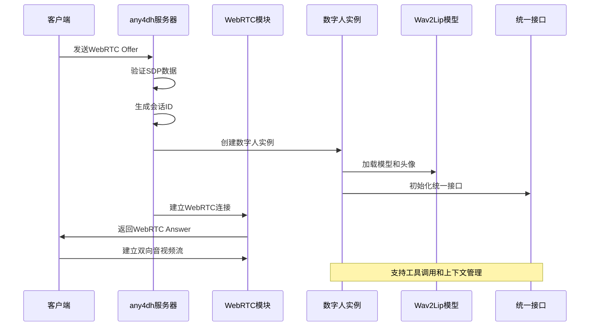
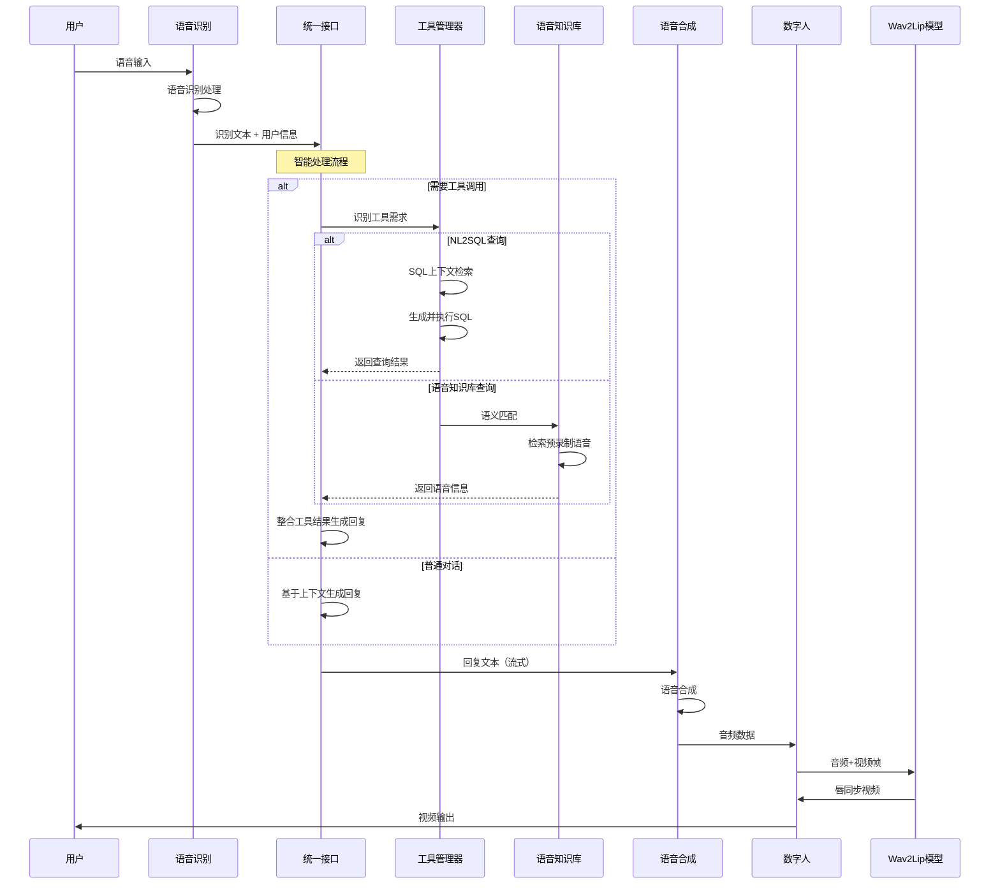
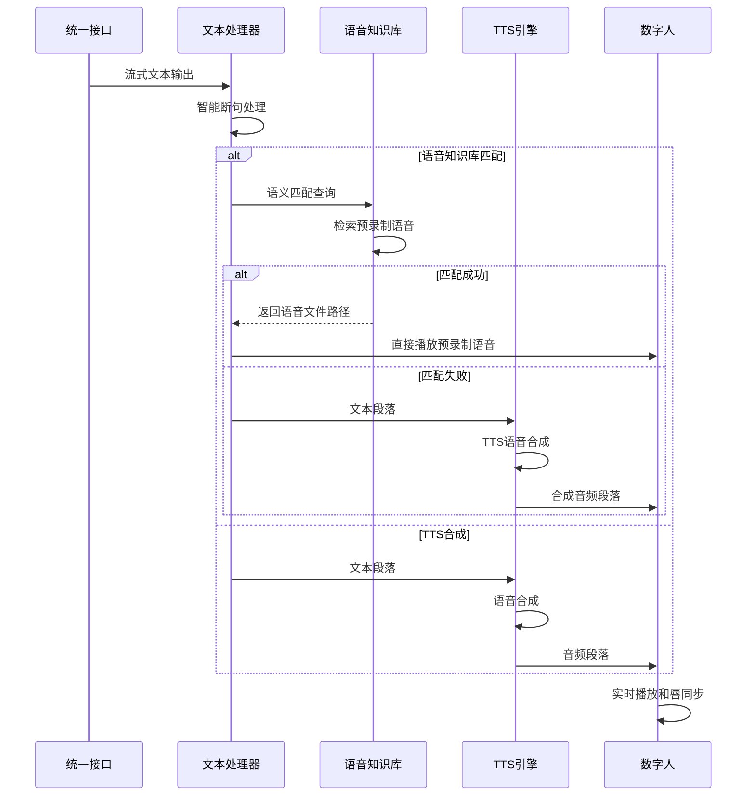
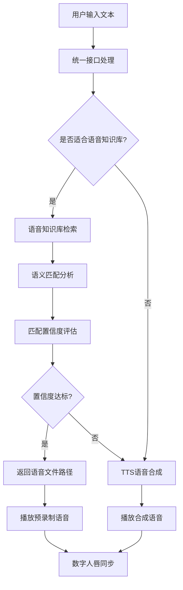

# any4dh 数字人系统说明文档

## 1. 系统概述

any4dh数字人系统是一个基于Wav2Lip的增强型实时交互数字人平台，提供完整的多模态人机交互解决方案。系统集成了语音识别、大语言模型对话、语音合成、数字人唇同步、语音知识库等核心功能，采用模块化架构设计，实现了WebRTC实时通信、流式TTS处理、多会话管理、统一接口集成等企业级功能。

### 1.1 核心功能

- **多模态交互**：支持ASR语音识别、LLM智能对话、TTS语音合成、唇同步生成的完整链路
- **统一接口集成**：集成UnifiedLLMInterface，支持工具调用、上下文感知、NL2SQL智能查询
- **语音知识库支持**：集成语音知识库检索，支持预录制语音的智能匹配和播放
- **数字人唇同步**：基于Wav2Lip技术实现精准的音频-视频同步
- **WebRTC实时通信**：低延迟的音视频流传输和双向通信（主要传输模式）
- **流式TTS处理**：支持分段TTS合成和实时音频流输出
- **多会话管理**：支持多个并发的数字人会话，每个会话独立管理
- **智能中断处理**：支持语音中断和状态管理
- **录音功能**：支持数字人音频和视频录制
- **WebRTC实时传输**：低延迟的音视频流传输
- **增强的错误处理**：完善的异常处理和资源管理机制

### 1.2 系统架构

数字人系统主要包含以下核心组件：

1. **any4dh_server.py**：FastAPI服务器，提供HTTP API和WebRTC服务
2. **live_talking/**：实时交互模块
   - `basereal.py`：数字人基础类
   - `lipreal.py`：Wav2Lip数字人实现
   - `lipasr.py`：语音识别处理
   - `ttsreal.py`：语音合成处理
   - `llm.py`：增强的LLM对话处理（集成统一接口）
   - `webrtc.py`：WebRTC通信处理
3. **wav2lip/**：Wav2Lip模型核心
   - `models/`：神经网络模型定义
   - `face_detection/`：人脸检测模块
4. **streaming_utils.py**：增强的流式TTS处理工具
5. **voice_file_service.py**：语音知识库文件服务
6. **统一接口集成**：与核心系统的统一LLM接口集成

### 1.3 技术特性

- **统一接口架构**：通过UnifiedLLMInterface集成any4any核心系统的所有功能
- **智能工具调用**：支持NL2SQL查询、语音知识库检索等工具的自动调用
- **上下文感知**：支持会话历史管理和上下文连续对话
- **语音知识库集成**：智能匹配预录制语音，提供更自然的语音体验
- **增强流式处理**：优化的流式TTS和实时响应处理
- **模块化设计**：高度模块化的架构，支持功能扩展和定制

## 2. 工作流程

### 2.1 增强的数字人会话建立流程



### 2.2 增强的语音对话处理流程



### 2.3 增强的流式TTS处理流程



### 2.4 语音知识库集成流程



## 3. 核心组件详解

### 3.1 any4dh_server.py - FastAPI服务器

负责提供数字人系统的HTTP API接口和WebRTC服务，集成了统一接口和语音知识库功能。

**主要功能：**
- **WebRTC连接管理**：处理offer/answer交换，建立实时通信
- **会话管理**：创建和管理数字人会话实例，支持独立会话上下文
- **统一接口集成**：集成UnifiedLLMInterface，支持工具调用和上下文感知
- **语音知识库支持**：提供语音知识库文件服务和API接口
- **增强语音对话**：提供完整的语音对话API，支持智能工具调用
- **流式处理**：支持流式语音对话和实时音频输出
- **文件管理**：临时音频文件的创建和清理
- **语音文件服务**：提供语音知识库文件的HTTP访问服务

**关键API接口：**

#### WebRTC连接
- `POST /any4dh/offer`：建立WebRTC连接，返回answer和sessionid
- `POST /any4dh/human`：发送文本消息给数字人（支持工具调用）
- `POST /any4dh/interrupt_talk`：中断当前语音

#### 增强语音对话
- `POST /any4dh/voice-chat`：完整语音对话（录音->ASR->统一接口->TTS）
- `POST /any4dh/voice-chat-stream`：流式语音对话，支持实时输出和工具调用
- `POST /any4dh/humanaudio`：上传音频文件进行处理

#### 语音知识库服务
- `GET /any4dh/voice/{audio_file}`：获取语音知识库文件
- 支持预录制语音文件的HTTP访问和流式播放

#### 会话控制
- `POST /any4dh/set_audiotype`：设置音频类型
- `POST /any4dh/record`：开始/停止录音
- `POST /any4dh/is_speaking`：检查是否正在说话
- `POST /any4dh/play-audio`：播放音频到数字人（支持语音知识库）

#### 系统管理
- `POST /any4dh/cleanup_temp_files`：清理临时文件

**工作原理：**
1. 接收WebRTC offer请求，验证SDP数据有效性
2. 创建新的数字人会话实例，加载Wav2Lip模型和头像资源
3. 初始化统一接口集成，支持工具调用和上下文管理
4. 建立WebRTC连接，设置音视频轨道和编解码器偏好
5. 处理各种交互请求，通过统一接口进行智能处理
6. 集成语音知识库服务，支持预录制语音的智能匹配
7. 管理临时音频文件的生命周期，确保资源及时清理

### 3.2 voice_file_service.py - 语音知识库文件服务

**文件位置**: `core/any4dh/voice_file_service.py`

专门负责语音知识库文件的HTTP访问服务，支持预录制语音文件的流式播放。

**主要功能：**
- **语音文件服务**：提供语音知识库文件的HTTP访问
- **文件信息查询**：获取语音文件的元数据信息
- **安全访问控制**：确保文件访问的安全性和有效性
- **多媒体支持**：支持多种音频格式的文件服务

**核心方法：**
```python
@staticmethod
def serve_voice_file(audio_file: str):
    """提供语音文件访问服务"""
    # 验证文件存在性
    # 返回FileResponse支持流式播放
    # 设置正确的MIME类型

@staticmethod
def get_voice_file_info(audio_file: str):
    """获取语音文件信息"""
    # 返回文件大小、路径等元数据
    # 支持文件存在性检查
```

### 3.3 live_talking/basereal.py - 数字人基础类

数字人系统的抽象基类，定义了通用的数字人行为和接口。

**主要功能：**
- **TTS引擎集成**：支持EdgeTTS和IndexTTS两种引擎
- **音频处理**：音频帧处理和文件输入支持
- **状态管理**：说话状态、录音状态管理
- **自定义配置**：支持自定义动作和音频配置

**工作原理：**
1. 初始化时根据配置选择合适的TTS引擎
2. 提供音频输入的标准接口，支持帧和文件两种格式
3. 管理数字人的各种状态（说话、录音等）
4. 加载和应用自定义配置文件

### 3.4 live_talking/lipreal.py - Wav2Lip数字人实现

基于Wav2Lip模型的具体数字人实现类。

**主要功能：**
- **模型加载**：加载Wav2Lip预训练模型
- **头像管理**：加载和管理数字人头像资源
- **唇同步生成**：实时生成与音频同步的唇部动作
- **视频流输出**：生成连续的视频帧输出

**关键函数：**

#### 模型管理
```python
def load_model(path):
    """加载Wav2Lip模型"""
    model = Wav2Lip()
    checkpoint = _load(path)
    # 处理state_dict，移除'module.'前缀
    model.load_state_dict(new_s)
    return model.eval()

def load_avatar(avatar_path_or_id):
    """加载数字人头像资源"""
    # 加载完整图像列表
    # 加载人脸图像列表
    # 加载坐标信息
    return frame_list_cycle, face_list_cycle, coord_list_cycle
```

#### 预热机制
```python
def warm_up(batch_size, model, modelres):
    """模型预热，优化首次推理性能"""
    img_batch = torch.ones(batch_size, 6, modelres, modelres).to(device)
    mel_batch = torch.ones(batch_size, 1, 80, 16).to(device)
    model(mel_batch, img_batch)
```

**工作原理：**
1. 加载预训练的Wav2Lip模型，处理state_dict兼容性
2. 加载数字人头像资源，包括完整图像、人脸图像和坐标信息
3. 执行模型预热，优化首次推理的性能
4. 运行时实时处理音频输入，生成对应的唇同步视频

### 3.5 live_talking/llm.py - 增强的LLM对话处理

**文件位置**: `core/any4dh/live_talking/llm.py`

增强的LLM对话处理模块，集成了统一接口，支持工具调用和上下文感知。

**主要功能：**
- **统一接口集成**：通过UnifiedLLMInterface集成any4any核心功能
- **流式响应处理**：支持流式文本输出的实时处理
- **智能断句处理**：根据标点符号进行智能断句
- **工具调用支持**：自动识别和调用NL2SQL、语音知识库等工具
- **上下文感知**：支持会话历史的上下文连续对话
- **实时响应**：低延迟的流式响应生成

**核心功能增强：**
```python
async def llm_response_async(message: str, any4dh_real: BaseReal):
    """增强的异步LLM响应处理"""
    # 集成UnifiedLLMInterface
    # 支持工具调用（NL2SQL、语音知识库）
    # 流式文本处理和智能断句
    # 实时TTS合成触发
```

**增强特性：**
- **工具自动调用**：自动识别查询需求并调用相应工具
- **上下文连续性**：支持跨轮对话的上下文管理
- **智能断句**：优化文本断句算法，提高TTS质量
- **实时处理**：流式处理减少响应延迟

### 3.6 wav2lip/models/ - Wav2Lip神经网络模型

包含Wav2Lip的核心神经网络架构定义。

**主要模型：**
- `wav2lip.py`：主要的Wav2Lip模型结构
- `wav2lip_v2.py`：改进版模型结构
- `syncnet.py`：同步性判别网络
- `conv.py`：卷积层定义

**模型特点：**
- **端到端训练**：直接从音频到视频的映射
- **高质量唇同步**：精准的音频-视频同步效果
- **实时推理**：支持实时视频生成
- **身份保持**：保持说话人的身份特征

### 3.7 streaming_utils.py - 增强的流式TTS处理工具

提供增强的流式文本处理和TTS合成工具，集成了语音知识库支持。

**主要功能：**
- **智能断句**：基于标点符号的文本分句算法
- **语音知识库集成**：支持预录制语音的智能匹配
- **流式处理**：支持LLM流式输出的实时处理
- **分段合成**：将文本分段进行TTS合成
- **并发控制**：使用信号量控制并发TTS任务
- **特殊字符过滤**：集成特殊字符过滤功能

**增强的算法：**

#### 智能断句优化
```python
def split_text_by_punctuation(text: str) -> List[str]:
    """根据标点符号智能断句（增强版）"""
    # 预处理：过滤特殊字符
    try:
        from core.tts.filter import filter_special_chars
        text = filter_special_chars(text)
    except ImportError:
        pass
    # 智能断句处理，避免过度碎片化
    return filtered_sentences
```

#### 语音知识库集成
```python
# 支持语音知识库的智能匹配
# 优先使用预录制语音，提高语音自然度
# 自动降级到TTS合成
```

**工作原理：**
1. 接收统一接口的流式文本输出
2. 使用增强的正则表达式检测句子边界
3. 对完整句子进行智能合并，避免过度碎片化
4. 集成特殊字符过滤确保TTS质量
5. 支持语音知识库的智能匹配和播放
6. 并发执行多个TTS任务，提高处理效率
7. 实时输出合成的音频段落

**关键算法：**

#### 智能断句
```python
def split_text_by_punctuation(text: str) -> List[str]:
    """根据标点符号智能断句"""
    sentence_endings = r'[。！？.!?；;]'
    # 按标点符号分割
    # 智能合并短句，避免过度碎片化
    # 过滤特殊字符
    return filtered_sentences
```

#### 流式处理
```python
class StreamingTTSProcessor:
    """流式TTS处理器"""
    async def process_streaming_response(self, user_input: str):
        """处理流式响应"""
        # 流式获取LLM输出
        # 检测完整句子
        # 并发进行TTS合成
        # 实时输出音频段落
```

**工作原理：**
1. 接收LLM的流式文本输出
2. 使用正则表达式检测句子边界
3. 对完整句子进行智能合并，避免过度碎片化
4. 并发执行多个TTS任务，提高处理效率
5. 实时输出合成的音频段落

### 3.8 live_talking/webrtc.py - WebRTC通信处理

处理WebRTC连接的建立和数据传输。

**主要功能：**
- **连接管理**：WebRTC连接的建立和维护
- **音视频流**：音频和视频数据的传输
- **编解码器**：支持多种音视频编解码器
- **ICE处理**：ICE候选和连接状态管理

## 4. 统一接口集成

### 4.1 UnifiedLLMInterface集成

any4dh系统通过集成UnifiedLLMInterface获得了强大的智能处理能力：

**集成特性：**
- **工具自动调用**：支持NL2SQL智能查询、语音知识库检索等工具
- **上下文感知**：支持跨轮对话的会话历史管理
- **多模态处理**：统一处理文本、语音、工具调用等多种输入
- **平台一致性**：与Web、API、钉钉等平台保持一致的功能体验

**集成方式：**
```python
from core.chat.unified_interface import UnifiedLLMInterface

async for chunk in UnifiedLLMInterface.generate_response_stream(
    content=message,
    sender="any4dh_user",
    user_nick="数字人用户",
    platform="any4dh",
    generation_id=f"any4dh_live_{int(time.time())}"
):
    # 处理流式响应，支持工具调用结果
```

### 4.2 工具调用支持

通过统一接口，any4dh数字人支持以下智能工具：

#### NL2SQL智能查询
- **自动识别查询需求**：识别用户的数据查询意图
- **上下文感知查询**：基于对话历史进行智能查询
- **自然语言回答**：将查询结果转换为自然语言回复

#### 语音知识库检索
- **语义匹配**：智能匹配预录制语音文件
- **质量评估**：评估匹配置信度
- **智能降级**：匹配失败时自动降级到TTS合成

### 4.3 会话上下文管理

- **独立会话管理**：每个数字人会话拥有独立的上下文
- **跨轮对话支持**：支持多轮对话的上下文连续性
- **智能记忆**：记住对话历史，提供连贯的交互体验

## 5. 数据模型设计

### 5.1 请求数据模型

```python
class OfferRequest(BaseModel):
    sdp: str          # WebRTC会话描述协议
    type: str         # offer类型

class HumanRequest(BaseModel):
    sessionid: int    # 会话ID
    type: str         # 消息类型（echo/chat）
    text: str         # 文本内容
    interrupt: bool   # 是否中断

class VoiceChatRequest:
    file: UploadFile  # 音频文件
    sessionid: str    # 可选的会话ID
```

### 5.2 响应数据格式

#### WebRTC连接响应
```json
{
    "sdp": "WebRTC Answer SDP",
    "type": "answer",
    "sessionid": 123456
}
```

#### 语音对话响应
```json
{
    "success": true,
    "recognized_text": "识别的文本",
    "response_text": "AI回复文本",
    "audio_synced": true,
    "audio_duration": 15000,
    "session_id": "voice_chat_session"
}
```

#### 流式响应格式
```json
{
    "type": "audio_segment",
    "data": {
        "success": true,
        "text": "文本段落",
        "audio_synced": true
    },
    "segment_index": 0
}
```

### 5.3 配置数据结构

```python
class OptConfig:
    def __init__(self, cfg):
        self.fps = cfg.ANY4DH_FPS                    # 帧率
        self.W = 450                                 # 视频宽度
        self.H = 450                                 # 视频高度
        self.avatar_id = cfg.ANY4DH_AVATAR_ID        # 头像ID
        self.batch_size = cfg.ANY4DH_BATCH_SIZE      # 批处理大小
        self.tts_engine = cfg.ANY4DH_TTS             # TTS引擎类型
        self.model = cfg.ANY4DH_MODEL                # 模型路径
        self.transport = cfg.ANY4DH_TRANSPORT        # 传输模式
```

## 6. 关键技术解决办法

### 6.1 WebRTC连接优化

**STUN服务器配置：**
```python
ice_server = RTCIceServer(urls='stun:stun.miwifi.com:3478')
```

**编解码器偏好设置：**
```python
# 优先使用H.264，其次是VP8
preferences = h264_codecs + vp8_codecs + rtx_codecs
transceiver.setCodecPreferences(preferences)
```

**连接状态监控：**
```python
@pc.on("connectionstatechange")
async def on_connectionstatechange():
    if pc.connectionState == "failed":
        await pc.close()
        pcs.discard(pc)
        del any4dh_reals[sessionid]
```

### 6.2 实时音频同步

**音频帧处理：**
```python
def put_audio_file(self, filebyte, datainfo={}):
    """将音频文件转换为帧序列"""
    input_stream = BytesIO(filebyte)
    stream = self.__create_bytes_stream(input_stream)
    # 按20ms分块处理
    while streamlen >= self.chunk:
        self.put_audio_frame(stream[idx:idx+self.chunk], datainfo)
```

**音频-视频同步：**
- 使用固定的帧率（50fps）确保同步性
- 音频按20ms分块，对应视频帧的时间间隔
- Wav2Lip模型直接处理音频频谱和视频帧的对应关系

### 6.3 流式TTS处理

**智能断句算法：**
1. 使用正则表达式识别句子结束标点
2. 避免在单词中间断开
3. 智能合并过短的句子
4. 过滤特殊字符确保TTS质量

**并发控制：**
```python
self.semaphore = asyncio.Semaphore(6)  # 限制并发TTS任务数

async with self.semaphore:
    result = await synthesize_speech_segment(sentence, sessionid, any4dh_reals)
```

**临时文件管理：**
- 使用统一的临时文件管理器
- 自动清理机制，避免磁盘空间泄漏
- 支持文件访问计数和延迟清理

### 6.4 模型加载优化

**延迟加载：**
```python
_any4dh_initialized = False

def initialize_any4dh(config=None):
    global _any4dh_initialized
    if _any4dh_initialized:
        return opt, model, avatar
    # 执行初始化
```

**模型预热：**
```python
@torch.no_grad()
def warm_up(batch_size, model, modelres):
    """预热模型，优化首次推理性能"""
    img_batch = torch.ones(batch_size, 6, modelres, modelres).to(device)
    mel_batch = torch.ones(batch_size, 1, 80, 16).to(device)
    model(mel_batch, img_batch)
```

**设备自适应：**
```python
device = "cuda" if torch.cuda.is_available() else \
          ("mps" if (hasattr(torch.backends, "mps") and torch.backends.mps.is_available()) else "cpu")
```

### 6.5 统一接口集成技术

**UnifiedLLMInterface集成**：
```python
# 配置统一接口支持
ANY4DH_USE_UNIFIED_INTERFACE = True

# 集成方式
from core.chat.unified_interface import UnifiedLLMInterface

# 支持工具调用和上下文感知
async for chunk in UnifiedLLMInterface.generate_response_stream(
    content=message,
    sender="any4dh_user",
    user_nick="数字人用户",
    platform="any4dh"
):
    # 处理流式响应
```

**工具调用处理**：
- 自动识别NL2SQL查询需求
- 智能调用语音知识库检索
- 上下文感知的对话生成

### 6.6 错误处理与资源管理

**WebRTC连接错误处理：**
- SDP格式验证
- 连接状态监控
- 自动清理失败的连接

**模型加载错误处理：**
- 文件存在性检查
- 模型兼容性处理
- 设备内存管理

**音频处理错误处理：**
- 文件格式验证
- 大小限制检查
- 编码错误处理

## 7. 配置项说明

### 7.1 基础配置

数字人系统的关键配置项：

| 配置项 | 说明 | 默认值 |
|-------|------|-------|
| ANY4DH_FPS | 视频帧率 | 50 |
| ANY4DH_AVATAR_ID | 数字人头像ID | 001 |
| ANY4DH_BATCH_SIZE | Wav2Lip批处理大小 | 16 |
| ANY4DH_TTS | TTS引擎类型 | edgetts |
| ANY4DH_WAV2LIP_MODEL_DIR | Wav2Lip模型路径 | /path/to/wav2lip |
| ANY4DH_AVATARS_DIR | 头像资源目录 | ./data/avatars |
| ANY4DH_TRANSPORT | 传输模式（主要支持webrtc） | webrtc |

### 7.2 统一接口配置

| 配置项 | 说明 | 默认值 |
|-------|------|-------|
| ANY4DH_USE_UNIFIED_INTERFACE | 启用统一接口集成 | true |
| TOOLS_ENABLED | 启用工具调用系统 | true |

### 7.3 语音知识库配置

| 配置项 | 说明 | 默认值 |
|-------|------|-------|
| ANY4DH_VOICE_KB_ENABLED | 启用语音知识库 | true |
| ANY4DH_VOICE_KB_FALLBACK_TO_TTS | 降级到TTS | true |
| ANY4DH_VOICE_KB_CONFIDENCE_THRESHOLD | 匹配置信度阈值 | 0.7 |
| VOICE_KB_AUDIO_DIR | 语音文件目录 | ./data/voice_kb |

### 7.4 IndexTTS配置

| 配置项 | 说明 | 默认值 |
|-------|------|-------|
| INDEX_TTS_MODEL_ENABLED | IndexTTS开关 | true |
| INDEX_TTS_FAST_ENABLED | 快速模式开关 | true |
| INDEX_TTS_FAST_MAX_TOKENS | 快速模式最大token数 | 50 |
| INDEX_TTS_FAST_BATCH_SIZE | 快速模式批大小 | 1 |

### 7.5 音频处理配置

```python
# 音频参数
self.sample_rate = 16000
self.chunk = self.sample_rate // opt.fps  # 320 samples per chunk

# TTS配置
self.tts_engine = cfg.ANY4DH_TTS
self.index_tts_model_dir = cfg.INDEX_TTS_MODEL_DIR
self.index_tts_device = cfg.INDEX_TTS_DEVICE
```

### 7.6 WebRTC配置

```python
# ICE服务器配置
ice_server = RTCIceServer(urls='stun:stun.miwifi.com:3478')

# 编解码器偏好
capabilities = RTCRtpSender.getCapabilities("video")
h264_codecs = [codec for codec in capabilities.codecs if codec.name == "H264"]
```

### 7.7 流式处理配置

```python
# 流式TTS配置
INDEX_TTS_STREAMING_MIN_SENTENCE_CHARS = 10  # 最小句子字符数
INDEX_TTS_FAST_ENABLED = true               # 快速模式
INDEX_TTS_FAST_MAX_TOKENS = 50              # 快速模式token限制
INDEX_TTS_FAST_BATCH_SIZE = 1               # 快速模式批大小
```

### 7.8 传输模式说明

**主要传输模式：**
- **WebRTC模式**：推荐使用，提供低延迟的实时音视频流传输
- **RTMP推流模式**：实验性支持，用于向RTMP服务器推流
- **虚拟摄像头模式**：实验性支持，输出到虚拟摄像头设备

**注意：**
- 建议在生产环境中使用WebRTC模式
- RTMP推流和虚拟摄像头模式为实验性功能，可能不稳定
- 不同传输模式的配置和使用方法请参考相关代码实现

## 8. 部署与运行

### 8.1 环境要求

**硬件要求：**
- GPU：推荐NVIDIA GPU（支持CUDA）
- 内存：至少8GB RAM
- 存储：足够存储模型和头像资源

**软件要求：**
- Python 3.10+
- PyTorch
- OpenCV
- FFmpeg
- 其他依赖见requirements.txt

### 8.2 模型准备

**Wav2Lip模型：**
```bash
# 下载预训练模型
wget https://github.com/Rudrabha/Wav2Lip/releases/download/v1.0/wav2lip_gan.pth
```

**头像资源准备：**
```
data/avatars/
├── 001/
│   ├── full_imgs/     # 完整图像序列
│   ├── face_imgs/     # 人脸图像序列
│   └── coords.pkl     # 人脸坐标信息
```

### 8.3 配置文件

```bash
# .env 配置示例
ANY4DH_FPS=50
ANY4DH_AVATAR_ID=001
ANY4DH_BATCH_SIZE=16
ANY4DH_TTS=index
ANY4DH_WAV2LIP_MODEL_DIR=/models/wav2lip_gan.pth
ANY4DH_AVATARS_DIR=./data/avatars
ANY4DH_TRANSPORT=webrtc

# IndexTTS配置
INDEX_TTS_MODEL_ENABLED=true
INDEX_TTS_MODEL_DIR=/models/indextts
INDEX_TTS_DEVICE=cuda
INDEX_TTS_FAST_ENABLED=true

# 统一接口配置
ANY4DH_USE_UNIFIED_INTERFACE=true
TOOLS_ENABLED=true

# 语音知识库配置
ANY4DH_VOICE_KB_ENABLED=true
ANY4DH_VOICE_KB_FALLBACK_TO_TTS=true
ANY4DH_VOICE_KB_CONFIDENCE_THRESHOLD=0.7
VOICE_KB_AUDIO_DIR=./data/voice_kb
```

### 8.4 启动方式

**集成模式（推荐）：**
```bash
# 通过主应用启动
python cli.py
```

**独立模式：**
```bash
# 直接启动数字人服务
python core/any4dh/any4dh_server.py --listenport 8888
```


## 9. 新功能使用指南

### 9.1 统一接口功能使用

#### 启用智能工具调用
```bash
# 确保配置文件中启用统一接口
ANY4DH_USE_UNIFIED_INTERFACE=true
TOOLS_ENABLED=true
```

#### 使用NL2SQL智能查询
用户可以直接向数字人提出数据查询问题：
- "查询今天有多少订单？"
- "统计各个产品的销售数量"
- "价格最高的产品是什么？"

系统会自动识别查询需求，调用NL2SQL工具，并以自然语言回答。

#### 使用语音知识库
系统会自动匹配预录制的语音文件：
- 提高语音的自然度和表现力
- 支持特定场景的高质量语音
- 自动降级到TTS合成

### 9.2 语音知识库配置

#### 准备语音文件
```
data/voice_kb/
├── greeting/
│   ├── hello.mp3      # 问候语音
│   ├── welcome.mp3    # 欢迎语音
│   └── goodbye.mp3    # 告别语音
├── common/
│   ├── yes.mp3        # 肯定回复
│   ├── no.mp3         # 否定回复
│   └── thanks.mp3     # 感谢语音
└── business/
    ├── appointment.mp3  # 预约相关
    └── inquiry.mp3      # 询问相关
```

#### 配置匹配规则
语音知识库会根据文本内容进行语义匹配，确保播放最合适的预录制语音。

### 9.3 多模态交互体验

#### 完整交互流程
1. 用户语音输入 → ASR识别
2. 文本传递给统一接口 → 智能处理（工具调用/上下文感知）
3. 生成回复文本 → 语音知识库匹配/TTS合成
4. 音频播放 → Wav2Lip唇同步生成
5. 视频流输出 → WebRTC实时传输

#### 上下文连续对话
- 数字人会记住对话历史
- 支持追问和多轮对话
- 提供连贯的交互体验

## 10. 性能优化建议

### 10.1 模型优化

**批处理优化：**
- 调整`batch_size`参数平衡延迟和吞吐量
- 使用模型预热减少首次推理延迟
- 启用混合精度训练提高推理速度

**内存管理：**
- 及时释放不需要的tensor
- 使用梯度累积减少内存占用
- 监控GPU内存使用情况

### 10.2 网络优化

**WebRTC优化：**
- 选择合适的编解码器（H.264通常效率更高）
- 配置合适的STUN/TURN服务器
- 监控网络连接质量

**音频优化：**
- 使用合适的音频格式（16kHz, mono）
- 启用音频压缩减少带宽占用
- 实现音频缓冲策略处理网络抖动

### 10.3 并发优化

**会话管理：**
- 限制并发会话数量避免资源耗尽
- 实现会话池复用资源
- 及时清理空闲会话

**TTS优化：**
- 使用信号量控制并发TTS任务
- 实现TTS结果缓存
- 启用流式处理减少延迟

### 10.4 统一接口性能优化

**工具调用优化：**
- 合理设置工具调用超时时间
- 优化工具调用的并发控制
- 实现工具结果缓存机制

**上下文管理优化：**
- 控制上下文长度避免性能影响
- 实现上下文缓存减少检索开销
- 优化相关性评分算法

### 10.5 系统监控

**性能指标：**
- 推理延迟（音频输入到视频输出）
- 网络延迟（WebRTC连接质量）
- 资源使用率（CPU、GPU、内存）

**日志监控：**
- 详细的错误日志记录
- 性能指标记录
- 用户行为分析

## 11. 故障排除

### 11.1 常见问题

**WebRTC连接失败：**
- 检查STUN服务器配置
- 验证防火墙设置
- 确认网络连接质量

**模型加载失败：**
- 检查模型文件路径
- 验证模型文件完整性
- 确认设备内存充足

**音频同步问题：**
- 检查音频采样率设置
- 验证音频格式兼容性
- 调整缓冲区大小

**统一接口相关：**
- 检查ANY4DH_USE_UNIFIED_INTERFACE配置
- 验证TOOLS_ENABLED设置
- 确认工具系统配置正确

**语音知识库问题：**
- 检查语音文件路径和权限
- 验证语音文件格式兼容性
- 调整匹配置信度阈值

**工具调用失败：**
- 检查工具系统配置
- 验证相关服务是否启动
- 查看工具调用超时设置

### 11.2 调试工具

**日志分析：**
```python
# 启用详细日志
import logging
logging.basicConfig(level=logging.DEBUG)
```

**性能分析：**
```python
# 使用cProfile进行性能分析
python -m cProfile -o profile.out script.py
```

**网络诊断：**
- WebRTC内部统计信息
- 网络延迟测试
- 带宽使用分析

### 11.3 性能调优

**延迟优化：**
- 减少批处理大小
- 优化模型推理
- 使用更快的编解码器

**质量优化：**
- 提高视频分辨率
- 使用更高质量的音频
- 优化模型参数

**稳定性优化：**
- 增加错误重试机制
- 实现优雅降级
- 添加健康检查

## 12. 扩展开发

### 12.1 自定义头像

**头像制作流程：**
1. 准备视频素材
2. 提取关键帧
3. 人脸检测和裁剪
4. 生成坐标信息
5. 组织目录结构

**工具脚本：**
```python
# 头像处理脚本示例
def process_avatar(video_path, output_dir):
    # 提取视频帧
    # 人脸检测
    # 生成坐标
    # 保存结果
    pass
```

### 12.2 自定义TTS引擎

**TTS引擎接口：**
```python
class CustomTTS:
    def __init__(self, opt, real):
        self.opt = opt
        self.real = real

    def put_msg_txt(self, msg, datainfo={}):
        # 实现TTS合成逻辑
        pass

    def put_audio_file(self, filebyte, datainfo={}):
        # 处理音频文件输入
        pass
```

### 12.3 新增传输协议

**传输协议接口：**
```python
class CustomTransport:
    def __init__(self, opt):
        self.opt = opt

    async def handle_connection(self, sessionid):
        # 实现自定义传输逻辑
        pass

    def send_audio(self, sessionid, audio_data):
        # 发送音频数据
        pass

    def send_video(self, sessionid, video_frame):
        # 发送视频数据
        pass
```

### 12.4 自定义工具集成

通过统一接口，可以轻松集成新的工具到any4dh系统：

**工具接口示例：**
```python
class CustomTool:
    def __init__(self):
        self.name = "custom_tool"
        self.description = "自定义工具描述"

    async def execute(self, input_text: str, context: str = ""):
        """执行自定义工具逻辑"""
        # 实现工具功能
        return result

# 注册到工具管理器
from core.chat.tool_manager import ToolManager
tool_manager = ToolManager()
tool_manager.register_tool(CustomTool())
```

### 12.5 集成外部服务

**AI服务集成：**
- 集成更多LLM模型
- 支持情感识别和分析
- 添加动作生成和表情控制
- 集成图像识别和处理

**业务系统集成：**
- 用户认证和权限管理
- 会话记录存储和分析
- CRM和ERP系统集成
- 数据分析和报表平台

**云服务集成：**
- 云端TTS服务
- 云端ASR服务
- 云端模型推理服务
- CDN内容分发

## 13. 总结

any4dh数字人系统已发展成为企业级多模态AI交互平台，通过集成统一接口，实现了从单纯的语音交互到智能工具调用的重大升级。系统不仅提供高质量的数字人视觉体验，还具备强大的智能处理能力，能够满足各种复杂的业务场景需求。

### 13.1 技术演进亮点

1. **统一接口集成**：成功集成UnifiedLLMInterface，获得完整的智能处理能力
2. **智能工具调用**：支持NL2SQL查询、语音知识库检索等工具的自动调用
3. **多模态融合**：实现了语音、文本、工具调用的无缝融合
4. **上下文感知**：支持跨轮对话的会话历史管理和连续交互
5. **语音知识库**：集成预录制语音，提供更自然的语音体验
6. **增强架构设计**：模块化的架构设计，支持灵活扩展和定制

### 13.2 核心竞争力

- **智能化交互**：超越简单的问答，提供智能的解决方案
- **多模态体验**：结合视觉、听觉、智能处理的完整体验
- **企业级能力**：支持复杂的业务逻辑和数据查询
- **高度可扩展**：模块化设计支持功能扩展和定制开发
- **性能优化**：多层次的性能优化策略，确保流畅体验

### 13.3 应用场景

系统适用于多种企业级应用场景：
- **智能客服**：提供24/7智能客服服务，支持数据查询和业务处理
- **数字员工**：作为企业数字员工，处理日常咨询和数据查询
- **教育培训**：作为智能导师，提供个性化教学和问答
- **金融服务**：作为金融顾问，提供理财建议和产品查询
- **医疗咨询**：作为医疗助手，提供健康咨询和信息查询
- **政务服务**：作为政务助手，提供政策咨询和服务指南

### 13.4 未来发展方向

1. **情感智能**：集成情感识别和情感表达能力
2. **多语言支持**：扩展支持更多语种的交互能力
3. **3D数字人**：从2D视频升级到3D实时渲染
4. **AR/VR集成**：支持增强现实和虚拟现实环境
5. **边缘计算**：支持边缘设备部署和离线处理
6. **云原生架构**：支持云端部署和弹性扩展

通过本文档的详细说明，开发者可以全面了解any4dh数字人系统的架构设计、核心功能和实现细节，为系统的部署、使用和扩展提供完整的技术指导。系统的模块化设计和统一接口架构确保了良好的可扩展性和维护性，为企业级AI应用提供了强大的技术基础。