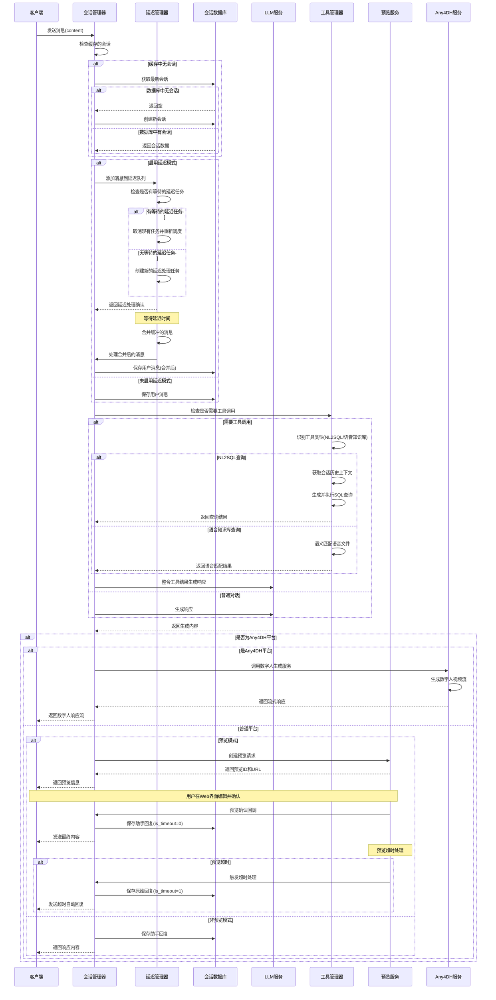
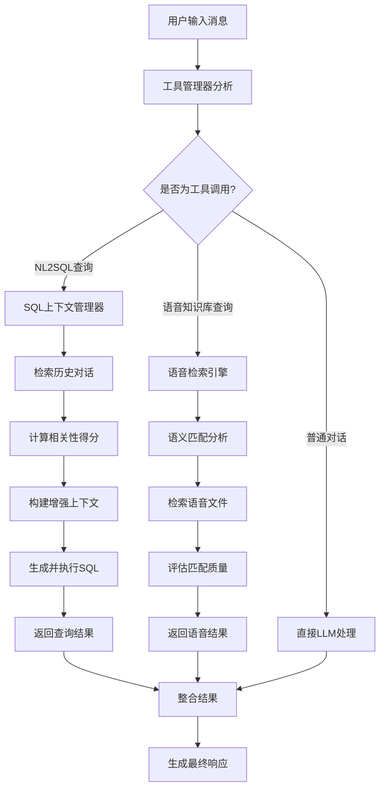
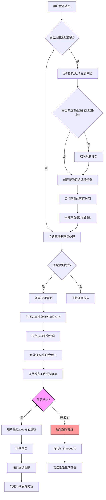
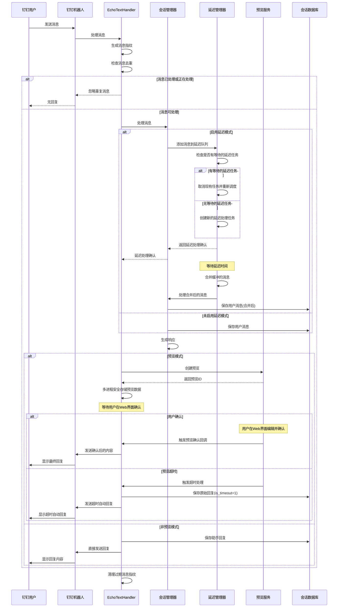
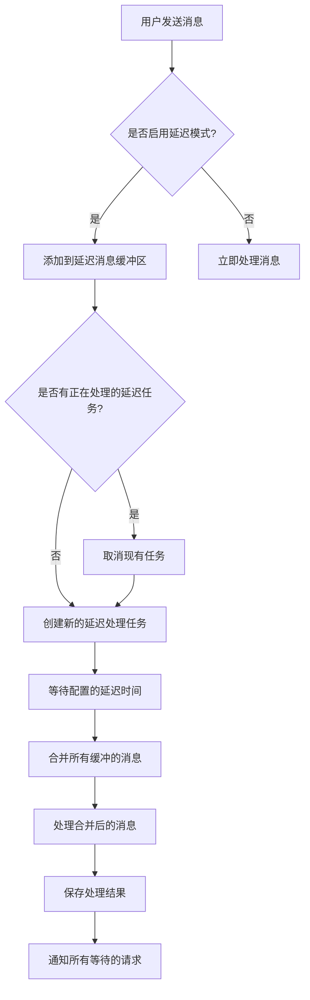

# any4any 会话管理系统说明文档

## 1. 系统概述

any4any会话管理系统是一个企业级多模态AI对话平台，提供完整的会话生命周期管理、上下文跟踪、预览编辑功能，并支持多种平台集成。系统设计遵循模块化架构，实现了业务逻辑与数据访问层的分离，集成了LLM对话、Any4DH数字人、语音知识库、NL2SQL智能查询等多种AI能力。

### 1.1 核心功能

- **多平台会话管理**：支持在不同平台（如Web、钉钉、API、Any4DH等）之间追踪和维护用户对话历史
- **多模态AI集成**：集成文本对话、语音交互、数字人形象等多种交互模式
- **智能工具系统**：集成NL2SQL智能查询、语音知识库检索等增强功能
- **预览模式**：提供生成内容的预览和编辑功能，支持人工干预
- **流式响应**：支持LLM流式生成响应内容和实时数字人驱动
- **持久化存储**：使用MySQL数据库存储会话和消息数据
- **钉钉集成**：支持钉钉机器人消息处理和预览确认后的消息发送
- **延迟模式**：智能合并短时间内的多条用户消息，减少API调用次数，优化对话体验
- **上下文感知**：支持会话历史的智能检索和上下文连续的对话交互

### 1.2 系统架构

系统主要包含以下核心组件：

1. **会话管理器（ConversationManager）**：处理会话业务逻辑和工具集成
2. **会话数据库（ConversationDatabase）**：负责数据持久化和上下文管理
3. **预览服务（PreviewService）**：管理预览和编辑功能
4. **延迟管理器（DelayManager）**：管理延迟消息的缓冲、合并和处理
5. **工具管理器（ToolManager）**：集成NL2SQL、语音知识库等智能工具
6. **Any4DH服务器**：数字人生成和实时交互服务
7. **统一接口（UnifiedInterface）**：提供跨平台的一致性体验
8. **钉钉消息管理器（EchoTextHandler）**：处理钉钉平台特定逻辑

## 2. 会话管理流程

### 2.1 基本会话流程（增强版）



### 2.2 智能工具系统与上下文感知

系统集成了强大的智能工具系统，能够自动识别用户意图并调用相应的专业工具，同时具备完整的上下文感知能力。

#### 2.2.1 工具自动识别机制

工具管理器（ToolManager）实现了智能的工具识别和调用机制：

- **NL2SQL智能查询**：自动识别数据查询需求，支持基于历史对话的上下文感知查询
- **语音知识库检索**：根据用户输入智能匹配预录制的语音文件，支持语义检索
- **追问识别**：支持多种追问模式，如"分别"、"都"、"谁"、"什么"等关键词识别

#### 2.2.2 上下文管理系统

**SQL上下文管理器（SQLContextManager）**：
- 智能检索相关的历史对话记录
- 计算消息相关性得分，基于时间衰减和关键词匹配
- 支持最大上下文长度和历史记录数量限制
- 自动过滤和整合上下文信息，提高SQL查询准确性

**上下文增强特性**：
- 支持跨轮对话的上下文连续性
- 智能识别查询意图的关联性
- 基于历史记录优化工具调用结果

#### 2.2.3 工具工作流程



### 2.3 会话持久化机制

会话管理系统通过MySQL数据库进行持久化存储，包含两个主要表：

1. **conversations表**：存储会话基本信息
2. **messages表**：存储消息内容，与会话表建立外键关联

系统使用内存缓存（`active_conversations`）提高性能，但所有关键数据都会持久化到数据库。缓存过期时间可配置（默认1小时）。所有工具调用的结果和上下文信息都会与会话关联存储，确保数据的完整性和可追溯性。

## 3. 多模态AI集成

### 3.1 Any4DH数字人系统

Any4DH（Any4Anyone Digital Human）是系统集成的数字人生成和交互服务，提供实时数字人视频流生成能力。

#### 3.1.1 核心功能
- **实时数字人生成**：基于文本输入生成对应的数字人视频流
- **语音驱动**：支持TTS语音同步的口型生成
- **WebRTC实时通信**：支持低延迟的实时视频流传输
- **多会话支持**：支持多个并发的数字人会话

#### 3.1.2 技术架构
- **Wav2Lip模型**：实现精准的语音到口型同步
- **IndexTTS-1.5**：高质量的文本转语音合成
- **实时流处理**：基于WebRTC的低延迟视频流传输
- **会话管理集成**：与会话管理系统无缝集成

### 3.2 语音知识库系统

语音知识库提供了基于语义匹配的预录制语音文件检索能力，为数字人提供更自然的语音响应。

#### 3.2.1 工作流程
1. **语音预处理**：将预录制语音文件进行特征提取和向量化
2. **语义索引**：建立语音文本内容的语义索引
3. **智能匹配**：基于用户输入进行语义相似度匹配
4. **质量评估**：评估匹配质量，决定是否使用预录制语音
5. **降级处理**：当匹配质量不足时，自动降级到TTS合成

#### 3.2.2 配置参数
- `ANY4DH_VOICE_KB_ENABLED`：是否启用语音知识库
- `ANY4DH_VOICE_KB_FALLBACK_TO_TTS`：是否允许降级到TTS
- `ANY4DH_VOICE_KB_CONFIDENCE_THRESHOLD`：匹配置信度阈值

## 4. 预览模式详解

### 4.1 预览模式工作原理

预览模式允许用户在最终发送前查看、编辑LLM生成的内容。系统将生成的内容保存到预览服务中，用户可以通过Web界面访问并进行编辑，确认后才会将内容发送给最终用户。

系统实现了超时机制（PREVIEW_TIMEOUT配置项），当预览确认时间超过设定阈值后，系统会自动将原始生成内容发送给用户，并将消息标记为超时自动回复（is_timeout=1）。

### 4.2 预览模式流程



### 4.3 预览服务核心功能

- **创建预览**：生成唯一的预览ID并存储请求数据，支持检查预览模式是否启用
- **内容编辑**：允许用户修改生成的内容，并将编辑前后的内容保存
- **预览确认**：用户确认后触发所有注册的回调函数，完成后续操作如发送钉钉消息
- **数据持久化**：将编辑前后的内容、会话信息、消息信息等保存到previews表，包含preview_id字段
- **会话关联**：智能提取或生成会话ID，确保预览内容与会话正确关联
- **异步回调支持**：支持注册和触发多个异步回调函数
- **预览超时处理**：监控预览确认状态，支持超时自动处理

## 5. 统一接口与多平台支持

### 5.1 统一接口架构

统一接口（UnifiedInterface）为不同平台提供一致性的会话管理体验，支持Web、钉钉、API、Any4DH等多种平台的统一接入。

#### 5.1.1 核心特性
- **跨平台会话连续性**：用户在不同平台间的对话历史保持连续
- **统一响应格式**：所有平台使用统一的响应数据格式
- **平台适配器**：为不同平台提供专门的适配器处理平台特性
- **流式响应支持**：统一的流式响应处理机制

#### 5.1.2 接口设计
```python
async def unified_process_message(
    sender_id: str,
    sender_name: str,
    platform: str,
    content: str,
    **kwargs
) -> Dict[str, Any]:
    """统一的消息处理接口"""
    # 平台特性适配
    # 会话管理
    # 工具调用
    # 响应生成
    # 平台特定处理
```

### 5.2 平台特性支持

#### 5.2.1 Web平台
- 支持流式和非流式响应
- 完整的预览模式功能
- Markdown渲染和思考过程展示
- 延迟模式支持

#### 5.2.2 钉钉平台
- 机器人消息处理
- 消息去重机制
- 预览确认回调
- 内容过滤处理

#### 5.2.3 Any4DH平台
- 实时数字人视频流
- 语音知识库集成
- WebRTC低延迟传输
- 多模态响应处理

#### 5.2.4 API平台
- OpenAI兼容接口
- 标准化响应格式
- 完整的工具调用支持
- 会话上下文管理

## 6. 钉钉平台集成

### 6.1 钉钉消息处理流程

钉钉平台集成是会话管理系统的重要特性，支持通过钉钉机器人进行交互，并在预览模式下进行特殊处理。



### 6.2 钉钉平台特殊处理

1. **多进程安全的内存存储机制**：使用基于文件锁和文件存储的实现，确保在多进程环境下安全存储预览相关信息
2. **消息去重机制**：实现了基于消息指纹的去重逻辑，避免重复处理相同消息，去重窗口为预览超时时间+300秒
3. **预览确认回调**：注册专用回调函数，在用户确认预览后发送钉钉消息
4. **超时自动发送**：预览模式下，如果用户未在规定时间内确认，系统会自动发送原始生成内容
5. **多格式消息ID提取**：支持从多种数据结构和位置提取消息ID，增强兼容性
6. **循环消息检测**：防止机器人回复自己发送的消息，避免消息循环
7. **内容过滤**：支持根据配置过滤think标签内容（NO_THINK配置项）

## 7. 延迟模式详解

### 7.1 延迟模式工作原理

延迟模式是系统新增的重要功能，通过智能合并短时间内的多条用户消息，减少不必要的API调用，优化用户体验和系统性能。当启用延迟模式时，系统会将用户在配置的延迟时间内发送的多条消息合并为一条，然后再统一处理。

延迟模式的核心优势包括：
- **减少API调用**：避免频繁发送相似或相关的短消息
- **优化对话体验**：用户可以连续发送多条消息，系统会一次性回复
- **提高上下文连贯性**：合并后的消息提供更完整的上下文信息
- **降低系统负载**：减少不必要的处理和资源消耗

### 7.2 延迟模式处理流程



### 7.3 延迟管理器核心功能

延迟管理器（DelayManager）采用单例模式实现，负责管理延迟消息的整个生命周期：

- **消息缓冲**：使用字典结构按用户ID缓存延迟期间收到的消息
- **延迟处理**：使用异步任务实现定时处理，支持取消和重新调度
- **消息合并**：将同一用户在延迟时间内的多条消息合并为一条
- **回调机制**：支持注册多个处理回调函数，灵活扩展处理逻辑
- **并发安全**：使用异步锁确保数据访问的线程安全性
- **状态跟踪**：维护用户消息处理状态，支持查询缓冲消息数量
- **资源管理**：提供缓冲区清理功能，避免内存泄漏

### 7.4 延迟模式与其他功能的协同

延迟模式与系统其他功能（如预览模式、钉钉集成）协同工作，保持功能的一致性：

- **与预览模式协同**：合并后的消息在预览模式下正常创建预览
- **与钉钉集成协同**：钉钉平台消息在延迟模式下同样支持消息去重和处理
- **与上下文管理协同**：合并消息保持正确的会话上下文关联

## 8. 数据库设计

### 8.1 表结构

#### conversations表
| 字段名 | 类型 | 说明 |
|-------|------|------|
| conversation_id | varchar(50) | 会话唯一标识ID（主键） |
| sender | varchar(100) | 发送者唯一标识 |
| user_nick | varchar(100) | 用户昵称或显示名称 |
| platform | varchar(50) | 来源平台(如: wechat, web, app等) |
| created_time | datetime | 会话创建时间 |
| last_active | datetime | 会话最后活跃时间 |
| message_count | int(11) | 会话中的消息总数 |

#### previews表
| 字段名 | 类型 | 说明 |
|-------|------|------|
| id | int(11) | 自增ID（主键） |
| conversation_id | varchar(100) | 会话ID |
| message_id | varchar(100) | 对话ID |
| current_request | mediumtext | 当前请求内容 |
| saved_content | mediumtext | 编辑保存后的内容 |
| pre_content | mediumtext | 编辑前的内容 |
| full_request | mediumtext | 历史全部请求及响应内容 |
| response_time | float | 响应用时(秒) |
| user_id | int(11) | 响应人员ID |
| preview_id | varchar(50) | 预览唯一标识ID |
| created_at | timestamp | 创建时间 |
| updated_at | timestamp | 更新时间 |

#### messages表
| 字段名 | 类型 | 说明 |
|-------|------|------|
| message_id | varchar(50) | 消息唯一标识ID（主键） |
| conversation_id | varchar(50) | 所属会话ID（外键） |
| content | text | 消息内容 |
| sender_type | varchar(20) | 发送者类型(user-用户, assistant-助手) |
| is_timeout | tinyint(1) | 是否为超时自动回复(0-否, 1-是) |
| timestamp | datetime | 消息发送时间 |
| sequence_number | int(11) | 消息在会话中的顺序号 |

### 8.2 索引设计

系统在关键表上建立了多个索引以提高查询性能：

- conversations表：用户平台联合索引、平台索引、最后活跃时间索引
- messages表：会话ID索引、消息时间索引、会话消息顺序索引

## 9. 关键技术解决办法

### 9.1 进程安全的单例模式

会话管理器使用进程安全的单例模式实现，确保每个进程拥有独立的会话管理器实例，避免在多进程环境中出现冲突。系统采用两级初始化策略：主进程完全初始化所有资源（数据库连接、LLM服务等），非主进程使用轻量级初始化，只加载必要的属性。

```python
# 单例模式实现
def get_conversation_manager():
    """获取全局会话管理器实例，实现单例模式
    
    确保会话管理器只在主进程中实例化，避免资源浪费和冲突
    非主进程将返回一个轻量级实例
    """
    import os
    import logging
    global _global_conversation_manager, _conversation_manager_pid
    
    current_pid = os.getpid()
    
    # 检查是否为主进程
    # 方法1：通过环境变量明确标记（优先级最高）
    is_main_process = os.environ.get('IS_MAIN_PROCESS') == 'true'
    
    # 方法2：如果没有明确标记，通过端口判断
    if not is_main_process:
        current_port = os.environ.get('CURRENT_PORT', 'unknown')
        # 从日志观察，非主进程使用9999端口
        is_main_process = current_port != '9999' and current_port != 'unknown'
    
    # 只在需要时创建新实例
    if _global_conversation_manager is None or _conversation_manager_pid != current_pid:
        # 记录日志信息
        if _global_conversation_manager is None:
            if is_main_process:
                logging.info(f"Creating new conversation manager for main process {current_pid}")
            else:
                logging.info(f"Creating lightweight conversation manager for non-main process {current_pid}")
        else:
            if is_main_process:
                logging.info(f"Process {current_pid} (main): Conversation manager belongs to process {_conversation_manager_pid}, recreating...")
            else:
                logging.info(f"Process {current_pid} (non-main): Conversation manager belongs to process {_conversation_manager_pid}, recreating lightweight instance...")
        
        # 创建实例
        _global_conversation_manager = ConversationManager()
        _conversation_manager_pid = current_pid
    
    return _global_conversation_manager
```

### 9.2 预览内容处理机制

预览服务实现了内容的生成、编辑和确认的完整流程，同时支持内容持久化和回调通知。系统采用单例模式实现预览服务，确保全局只有一个预览管理器实例：

- **内容提取**：从LLM响应中提取可见内容（处理think标签等）
- **内容编辑**：支持用户在Web界面编辑生成内容，并将编辑前后的内容保存
- **回调通知**：用户确认后通知相关平台（如钉钉）发送最终内容
- **数据库持久化**：将预览数据保存到previews表，包括会话信息、消息信息、预览ID等
- **内容安全处理**：对保存的内容进行特殊处理，移除可能导致问题的特殊字符
- **会话关联**：智能提取或生成会话ID，确保预览内容与会话正确关联
- **超时管理**：实现预览确认的超时机制，超时后自动处理

### 9.3 多进程安全的数据存储

系统实现了基于文件锁和文件存储的多进程安全数据存储机制，用于在多进程环境中安全存储预览相关信息和消息去重数据：

- **文件锁机制**：使用fcntl.flock实现多进程间的互斥访问
- **JSON文件存储**：将数据序列化存储到临时文件中
- **过期时间管理**：支持为存储的数据设置过期时间，自动清理过期数据

### 9.4 消息去重机制

系统实现了基于消息指纹的去重机制，避免重复处理相同的消息：

- **消息指纹生成**：使用发送者ID、内容、消息ID、会话ID等组合生成唯一的消息指纹
- **处理中消息标记**：标记正在处理的消息，防止并发处理
- **去重窗口**：设置合理的去重窗口（预览超时时间+300秒），避免过度去重

### 9.5 延迟模式消息处理机制

系统实现了高效的延迟消息处理机制，确保消息合并和延迟处理的正确性：

- **单例模式实现**：使用单例模式确保全局只有一个延迟管理器实例
- **异步任务调度**：使用asyncio.Task实现消息的延迟处理和任务调度
- **消息合并逻辑**：将短时间内的多条消息智能合并为一条，保留完整上下文
- **合并消息标识**：为合并后的消息添加特殊标记，便于追踪和调试
- **用户状态管理**：维护每个用户的处理状态和等待请求计数
- **异步事件通知**：使用asyncio.Event实现处理完成后的通知机制

### 9.6 多平台适配

系统通过platform字段区分不同来源平台，实现了统一的会话管理接口，同时为特定平台（如钉钉）提供定制化处理逻辑。

## 10. 配置项说明

会话管理系统的关键配置项：

| 配置项 | 说明 | 默认值 |
|-------|------|-------|
| PREVIEW_MODE | 是否启用预览模式 | 可配置 |
| PREVIEW_TIMEOUT | 预览超时时间（秒） | 可配置 |
| NO_THINK | 是否过滤think标签内容 | 可配置 |
| TEMPERATURE | LLM生成温度参数 | 可配置 |
| MAX_LENGTH | 最大生成长度 | 可配置 |
| TOP_P | 采样参数 | 可配置 |
| REPETITION_PENALTY | 重复惩罚参数 | 可配置 |
| CLIENT_ID | 钉钉客户端ID | 可配置 |
| CLIENT_SECRET | 钉钉客户端密钥 | 可配置 |
| ROBOT_CODE | 钉钉机器人代码 | 可配置 |
| DELAY_MODE | 是否启用延迟模式 | 可配置 |
| DELAY_TIME | 延迟处理时间（秒） | 可配置 |
| TOOLS_ENABLED | 是否启用工具系统 | true |
| ANY4DH_ENABLED | 是否启用Any4DH数字人服务 | false |
| ANY4DH_VOICE_KB_ENABLED | 是否启用语音知识库 | true |
| ANY4DH_VOICE_KB_FALLBACK_TO_TTS | 语音知识库降级到TTS | true |
| ANY4DH_VOICE_KB_CONFIDENCE_THRESHOLD | 语音匹配置信度阈值 | 0.7 |
| DINGTALK_ENABLED | 是否启用钉钉服务 | true |
| API_BASE_URL | 统一API基础URL | 可配置 |

### 10.1 工具系统配置

工具系统相关的配置项控制着NL2SQL和语音知识库等智能功能的行为：

- **TOOLS_ENABLED**: 控制整个工具系统的启用状态

### 10.2 Any4DH数字人配置

Any4DH数字人系统的配置项控制着数字人生成和语音处理功能：

- **ANY4DH_ENABLED**: 控制Any4DH服务的整体启用状态
- **ANY4DH_VOICE_KB_ENABLED**: 控制语音知识库功能的启用
- **ANY4DH_VOICE_KB_FALLBACK_TO_TTS**: 设置语音匹配失败时的降级策略
- **ANY4DH_VOICE_KB_CONFIDENCE_THRESHOLD**: 设置语音匹配的置信度阈值

### 10.3 服务控制配置

新增的服务控制配置项允许灵活控制各个服务的启用状态：

- **DINGTALK_ENABLED**: 控制钉钉服务的启用状态，当设置为false时不注册和启动钉钉相关服务
- **API_BASE_URL**: 统一的API基础URL配置，合并了原有的API_BASE_URL和API_URL配置项

## 11. API接口

### 11.1 会话管理相关接口

- **处理消息**：`process_message(sender, user_nick, platform, content, is_timeout=False)`
  - 参数说明：sender-发送者ID，user_nick-用户昵称，platform-平台类型，content-消息内容，is_timeout-是否为超时自动回复
  - 返回值：助手回复内容和会话ID
  
- **流式处理消息**：`process_stream_message(sender, user_nick, platform, content, generation_id, is_timeout=False)`
  - 参数说明：同process_message，额外的generation_id用于标识流式生成
  - 返回值：流式生成的文本块
  
- **获取最新会话**：`get_latest_conversation(sender, user_nick, platform)`
  - 参数说明：sender-发送者ID，user_nick-用户昵称，platform-平台类型
  - 返回值：最新会话数据或None
  
- **创建新会话**：`create_new_conversation(sender, user_nick, platform)`
  - 参数说明：sender-发送者ID，user_nick-用户昵称，platform-平台类型
  - 返回值：新创建的会话信息
  
- **清理缓存**：`cleanup_cache()`
  - 功能：清理过期的缓存会话
  
- **处理带延迟的消息**：`_process_with_delay(sender, user_nick, platform, content, delay_time, message_id)`
  - 参数说明：sender-发送者ID，user_nick-用户昵称，platform-平台类型，content-消息内容，delay_time-延迟时间，message_id-消息ID
  - 返回值：处理结果
  
- **处理延迟合并后的消息**：`_handle_delayed_messages(request_data)`
  - 参数说明：request_data-包含合并消息和请求信息的数据字典
  - 功能：处理延迟合并后的消息并生成响应

### 11.2 延迟管理相关接口

- **添加消息到延迟队列**：`delay_manager.add_message(user_id, content, request_data, delay_time)`
  - 参数说明：user_id-用户ID，content-消息内容，request_data-请求数据，delay_time-延迟时间
  - 返回值：创建的异步任务
  
- **添加处理回调函数**：`delay_manager.add_processing_callback(callback)`
  - 参数说明：callback-回调函数
  - 功能：注册消息处理完成后的回调函数
  
- **获取缓冲消息数量**：`delay_manager.get_buffered_count(user_id)`
  - 参数说明：user_id-用户ID
  - 返回值：用户当前缓冲的消息数量
  
- **清空缓冲区**：`delay_manager.clear_buffers(user_id=None)`
  - 参数说明：user_id-用户ID（可选，为空时清空所有缓冲区）
  - 功能：清空指定用户或所有用户的消息缓冲区

### 11.3 预览相关接口

- **创建预览**：`create_preview(request_data)`
  - 参数说明：request_data-请求数据字典
  - 返回值：预览请求对象
  
- **设置生成内容**：`set_generated_content(preview_id, content)`
  - 参数说明：preview_id-预览ID，content-生成的内容
  - 返回值：更新后的预览对象
  
- **更新预览内容**：`update_content(preview_id, edited_content, session=None)`
  - 参数说明：preview_id-预览ID，edited_content-编辑后的内容，session-会话信息
  - 返回值：更新后的预览对象
  
- **确认预览**：`confirm_preview(preview_id)`
  - 参数说明：preview_id-预览ID
  - 返回值：OpenAI兼容格式的响应数据
  
- **获取预览**：`get_preview(preview_id)`
  - 参数说明：preview_id-预览ID
  - 返回值：预览请求对象
  
- **获取预览内容**：`get_content(preview_id)`
  - 参数说明：preview_id-预览ID
  - 返回值：预览内容（优先返回编辑后的内容）
  
- **获取待处理预览列表**：`get_pending_previews()`
  - 返回值：等待确认的预览列表
  
- **注册确认回调**：`register_confirm_callback(callback)`
  - 参数说明：callback-回调函数
  - 功能：注册预览确认后的回调函数

### 11.4 智能工具相关接口

#### 11.4.1 NL2SQL上下文管理接口

- **获取增强上下文**：`context_manager.get_enhanced_context(question, conversation_manager, user_id, platform)`
  - 参数说明：question-当前问题，conversation_manager-会话管理器，user_id-用户ID，platform-平台类型
  - 返回值：增强的上下文字符串

- **构建历史上下文**：`context_manager.build_context_from_history(history_messages, current_question)`
  - 参数说明：history_messages-历史消息列表，current_question-当前问题
  - 返回值：构建的上下文字符串

#### 11.4.2 语音知识库接口

- **处理语音查询**：`voice_workflow.process_voice_query(user_input)`
  - 参数说明：user_input-用户输入文本
  - 返回值：包含语音匹配结果的字典

- **语音检索**：`voice_retriever.search_voice(query, top_k)`
  - 参数说明：query-查询文本，top_k-返回结果数量
  - 返回值：语音搜索结果列表

### 11.5 Any4DH数字人接口

- **创建数字人会话**：`create_any4dh_session(sessionid)`
  - 参数说明：sessionid-会话ID
  - 返回值：数字人会话实例

- **生成数字人响应**：`generate_digital_human_response(text, sessionid)`
  - 参数说明：text-输入文本，sessionid-会话ID
  - 返回值：数字人视频流

### 11.6 统一接口API

- **统一消息处理**：`unified_interface.process_message(sender_id, sender_name, platform, content, **kwargs)`
  - 参数说明：sender_id-发送者ID，sender_name-发送者名称，platform-平台类型，content-消息内容
  - 返回值：统一格式的响应数据

- **跨平台会话查询**：`unified_interface.get_conversation_history(sender_id, platform)`
  - 参数说明：sender_id-发送者ID，platform-平台类型
  - 返回值：跨平台的会话历史记录

## 12. 前端增强功能

### 12.1 Markdown渲染优化

前端实现了完整的Markdown渲染支持，包括：
- **思考过程展示**：支持LLM思考过程的折叠展示
- **代码高亮**：支持代码块的语法高亮
- **数学公式**：支持LaTeX数学公式渲染
- **表格和列表**：完整的Markdown表格和列表支持
- **流式渲染**：支持流式响应的实时Markdown渲染

### 12.2 用户体验优化

- **无弹窗设计**：移除了影响用户体验的弹窗提示
- **智能消息格式化**：自动识别和格式化不同类型的消息内容
- **延迟模式指示**：在延迟模式下提供清晰的状态指示
- **预览模式集成**：无缝的预览编辑体验

## 13. 系统监控与维护

### 13.1 健康检查

系统提供完整的健康检查机制：
- **模型状态监控**：监控所有AI模型的运行状态
- **数据库连接检查**：验证数据库连接的可用性
- **服务状态监控**：监控各个服务的运行状态
- **资源使用监控**：监控系统资源的使用情况

### 13.2 日志系统

- **分级日志记录**：支持不同级别的日志记录
- **结构化日志**：使用结构化格式便于日志分析
- **性能监控日志**：记录关键操作的性能指标
- **错误追踪**：完整的错误堆栈追踪

## 14. 总结

any4any会话管理系统已经发展成为一个企业级多模态AI对话平台，不仅提供了完整的多平台会话管理功能，还集成了Any4DH数字人、语音知识库、NL2SQL智能查询等先进AI能力。系统支持预览模式、非预览模式和延迟模式，特别优化了钉钉平台的集成体验，并通过统一接口为不同平台提供一致性的用户体验。

### 14.1 技术演进亮点

1. **多模态AI集成**：从单一的文本对话发展为集文本、语音、数字人视频于一体的多模态交互平台
2. **智能工具系统**：集成NL2SQL和语音知识库等智能工具，具备完整的上下文感知能力
3. **统一接口架构**：实现跨平台的统一会话管理和响应格式，支持Web、钉钉、API、Any4DH等多种平台
4. **前端体验优化**：实现完整的Markdown渲染、思考过程展示和无弹窗设计
5. **服务化架构**：模块化的服务设计，支持灵活的服务启停控制

### 14.2 核心竞争优势

- **多平台支持和统一的会话管理**：用户在不同平台间享受连续的对话体验
- **智能的延迟消息合并处理**：有效减少API调用，优化系统性能和用户体验
- **灵活的预览和编辑机制**：支持内容质量控制的人工干预
- **强大的上下文感知能力**：基于历史对话的智能工具调用和响应生成
- **高效的数据存储和缓存策略**：确保系统的高性能和可扩展性
- **完善的服务监控和维护机制**：提供全方位的系统健康检查和日志管理

### 14.3 应用场景

系统适用于多种复杂的企业级对话场景：
- **企业智能客服**：支持多渠道接入和智能问答
- **数字人交互**：提供生动的数字人客服和虚拟助手
- **数据查询分析**：通过NL2SQL实现自然语言的数据查询
- **知识库检索**：基于语义匹配的智能知识检索
- **内容创作辅助**：支持预览编辑的高质量内容生成

any4any会话管理系统通过持续的技术创新和功能完善，已成为一个功能全面、性能优异、易于扩展的企业级AI对话平台，能够满足各种复杂的业务需求，为用户提供稳定、高效、智能的对话服务体验。