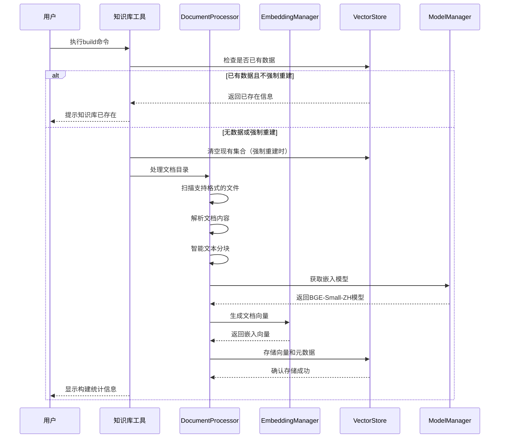
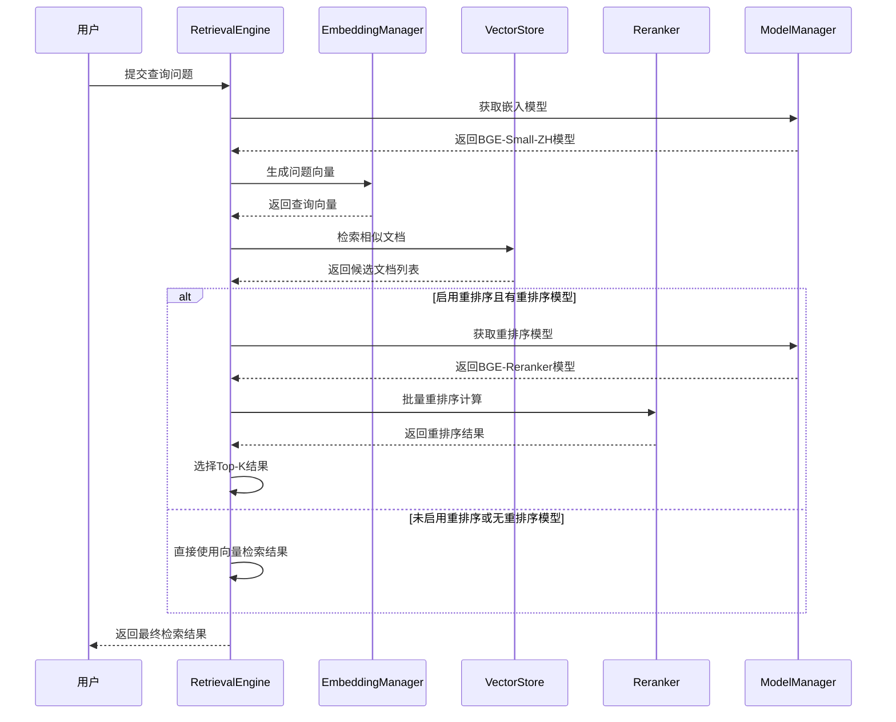
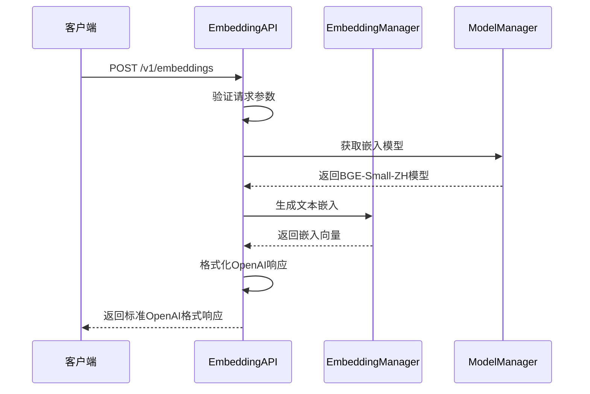

# any4any 知识库系统说明文档

## 1. 系统概述

any4any知识库系统是一个基于向量检索的增强型智能文档管理和问答框架，集成了BGE重排序模型和高性能向量存储技术。系统提供完整的文档处理流水线，从多格式文档解析到智能语义检索，支持重排序优化和OpenAI兼容的API接口。该系统是any4any多模态AI系统的核心组件，与LLM、ASR、TTS等模块深度集成，提供企业级的知识管理和问答服务。

### 1.1 核心功能

- **多格式文档处理**：支持PDF、DOCX、TXT等多种常见文档格式的加载和解析
- **智能文本分块**：实现基于句子的文本分块算法，支持可配置的块大小和重叠大小
- **高性能向量生成**：集成BGE-Small-ZH模型，支持生成高质量的中文文本嵌入向量
- **持久化向量存储**：基于ChromaDB实现向量的高效存储和检索，支持余弦相似度计算
- **语义检索**：提供基于向量相似度的语义搜索功能，支持Top-K检索
- **BGE重排序优化**：集成BGE-Reranker模型，进一步优化检索结果的相关性
- **智能问答**：结合检索结果和LLM模型，生成基于文档内容的精确回答
- **OpenAI兼容API**：提供与OpenAI Embedding API完全兼容的接口
- **统一模型管理**：通过ModelManager实现模型的按需加载和统一管理
- **批处理优化**：支持重排序模型的批处理计算，提高检索效率
- **动态配置**：支持运行时配置调整，包括重排序开关、检索参数等

### 1.2 系统架构

知识库系统采用模块化架构设计，主要包含以下核心组件：

1. **DocumentProcessor（文档处理器）**：负责文档加载、解析和智能分块
2. **EmbeddingManager（嵌入管理器）**：负责文本向量的生成和管理，支持全局模型共享
3. **VectorStore（向量存储）**：负责向量的持久化存储、检索和管理，基于ChromaDB
4. **RetrievalEngine（检索引擎）**：负责语义检索和重排序，支持BGE-Reranker优化
5. **KnowledgeBaseServer（知识库服务）**：提供知识库相关功能的HTTP API服务
6. **EmbeddingAPI（嵌入API）**：提供OpenAI兼容的/v1/embeddings接口

### 1.3 技术特性

- **BGE模型集成**：使用BGE-Small-ZH进行向量生成，BGE-Reranker进行结果重排序
- **模型按需加载**：通过ModelManager实现模型的懒加载和内存优化
- **批处理优化**：重排序过程支持批处理，提高计算效率
- **余弦相似度**：使用余弦相似度进行向量检索，提高检索精度
- **持久化存储**：ChromaDB提供高可靠性的向量数据持久化
- **配置驱动**：通过环境变量实现灵活的系统配置

## 2. 工作流程

### 2.1 知识库构建流程



### 2.2 智能检索流程



### 2.3 OpenAI兼容API工作流程



## 3. 核心组件详解

### 3.1 DocumentProcessor（文档处理器）

**文件位置**: `core/embedding/document_processor.py`

**主要职责**:
- 多格式文档的加载和解析
- 智能文本分块处理
- 文档元数据提取和管理

**核心方法**:
```python
def process_directory(self, directory_path: str, force_rebuild: bool = False) -> Dict[str, Any]:
    """
    处理整个目录的文档

    参数:
        directory_path: 文档目录路径
        force_rebuild: 是否强制重建

    返回:
        包含处理统计信息的字典
    """

def chunk_text(self, text: str, chunk_size: int = None, overlap: int = None) -> List[str]:
    """
    智能文本分块

    基于句子边界进行分块，支持重叠设置以保持上下文连续性
    """
```

**支持的文档格式**:
- **PDF**: 使用PyMuPDF进行文本提取
- **DOCX**: 使用python-docx进行文档解析
- **TXT**: 直接文本文件读取

**分块算法特性**:
- 基于句子边界的智能分块
- 可配置的块大小和重叠大小
- 保持语义完整性的分块策略

### 3.2 EmbeddingManager（嵌入管理器）

**文件位置**: `core/embedding/embedding_manager.py`

**主要职责**:
- BGE-Small-ZH模型的加载和管理
- 文本向量的生成和缓存
- 与ModelManager的集成

**核心方法**:
```python
def get_embeddings(self, texts: List[str]) -> np.ndarray:
    """
    获取文本的向量表示

    使用BGE-Small-ZH模型生成高质量的中文文本嵌入
    """

def use_global_model(self) -> bool:
    """
    使用ModelManager管理的全局嵌入模型

    实现模型共享和内存优化
    """

def get_embeddings_as_list(self, texts: List[str]) -> List[List[float]]:
    """
    获取适用于ChromaDB的向量格式
    """
```

**技术特性**:
- **BGE-Small-ZH集成**: 专门针对中文文本优化的嵌入模型
- **全局模型共享**: 通过ModelManager避免重复加载
- **平均池化策略**: 使用平均池化生成句子级嵌入
- **向量归一化**: L2归一化确保向量一致性

### 3.3 VectorStore（向量存储）

**文件位置**: `core/embedding/vector_store.py`

**主要职责**:
- ChromaDB的连接和管理
- 向量数据的持久化存储
- 高效的相似性检索

**核心方法**:
```python
def add_vectors(self, vectors: List[List[float]], metadata_list: List[Dict[str, Any]]):
    """
    添加向量和元数据到ChromaDB

    自动生成唯一ID并组织文档结构
    """

def search_similar(self, query_vector: List[float], top_k: int = None) -> List[Tuple[float, Dict[str, Any]]]:
    """
    搜索相似的向量

    基于余弦相似度进行向量检索
    """

def delete_file_vectors(self, file_name: str) -> bool:
    """
    删除指定文件的所有向量

    支持文档级别的数据管理
    """

def get_stats(self) -> Dict[str, Any]:
    """
    获取向量库统计信息

    提供存储状态和文件统计
    """
```

**ChromaDB配置**:
- **持久化存储**: 使用PersistentClient确保数据持久性
- **余弦相似度**: 配置HNSW空间为余弦相似度
- **匿名遥测禁用**: 确保数据隐私和安全

### 3.4 RetrievalEngine（检索引擎）

**文件位置**: `core/embedding/retrieval_engine.py`

**主要职责**:
- 统一的检索API接口
- BGE-Reranker重排序优化
- 批处理计算优化

**核心方法**:
```python
def retrieve_documents(self, question: str, top_k: int = None, use_rerank: bool = None) -> Dict[str, Any]:
    """
    检索相关文档并返回结果

    支持BGE-Reranker重排序优化
    """

def simple_search(self, question: str, top_k: int = None, use_rerank: bool = None) -> List[Dict[str, Any]]:
    """
    简单搜索接口，保持向后兼容性
    """

def get_collection_stats(self) -> Dict[str, Any]:
    """
    获取向量库统计信息
    """

def delete_document_by_file(self, file_name: str) -> Dict[str, Any]:
    """
    根据文件名删除相关文档
    """
```

**重排序优化**:
- **BGE-Reranker集成**: 使用BGE-Reranker模型进行结果重排序
- **候选倍数机制**: 检索更多候选文档以提高重排序效果
- **批处理计算**: 支持批处理以提高重排序效率
- **动态开关**: 支持运行时开启/关闭重排序功能

### 3.5 EmbeddingAPI（嵌入API）

**文件位置**: `core/embedding/openai_api.py`

**主要职责**:
- 提供OpenAI兼容的嵌入API接口
- 请求验证和响应格式化
- 与EmbeddingManager的集成

**API端点**:
```python
@router.post("/v1/embeddings", response_model=EmbeddingResponse)
async def create_embeddings(request: EmbeddingRequest):
    """
    OpenAI兼容的嵌入API

    支持单个文本和批量文本处理
    """
```

**请求/响应格式**:
- **输入验证**: 最大输入数量和长度限制
- **标准格式**: 完全兼容OpenAI API响应格式
- **错误处理**: 标准HTTP状态码和错误信息

## 4. 配置说明

### 4.1 环境变量配置

在`.env`文件中添加以下配置：

```bash
# 知识库系统配置
KNOWLEDGE_BASE_ENABLED=true                    # 是否启用知识库系统
VECTOR_DB_PATH=./data/vector_db               # ChromaDB存储路径
DOCS_PATH=./data/docs                         # 文档存储路径

# 嵌入模型配置
EMBEDDING_MODEL_ENABLED=true                  # 是否启用嵌入模型按需加载
EMBEDDING_MODEL_DIR=/path/to/bge-small-zh     # BGE-Small-ZH模型路径

# 文档处理配置
DOC_CHUNK_SIZE=500                            # 文档分块大小（字符数）
DOC_CHUNK_OVERLAP=50                          # 分块重叠大小（字符数）
SUPPORTED_FILE_TYPES=.pdf,.docx,.txt          # 支持的文档类型

# 检索配置
TOP_K=3                                       # 默认检索结果数量
RERANK_MODEL_ENABLED=true                     # 是否启用重排序模型
RERANK_MODEL_DIR=/path/to/bge-reranker-base   # BGE-Reranker模型路径
RERANK_CANDIDATE_FACTOR=10                    # 重排序候选倍数
RERANK_BATCH_SIZE=16                          # 重排序批处理大小
```

### 4.2 模型配置要求

**BGE-Small-ZH模型**:
```bash
# 模型下载路径示例
EMBEDDING_MODEL_DIR=/path/to/models/bge-small-zh-v1.5

# 确保模型文件包含：
# - pytorch_model.bin
# - config.json
# - tokenizer.json
# - vocab.txt
```

**BGE-Reranker模型**:
```bash
# 模型下载路径示例
RERANK_MODEL_DIR=/path/to/models/bge-reranker-base

# 可选配置，不启用重排序时可不配置
```

### 4.3 性能优化配置

**批处理优化**:
```bash
# 重排序批处理大小（根据GPU内存调整）
RERANK_BATCH_SIZE=16

# 重排序候选倍数（检索数量 = TOP_K * RERANK_CANDIDATE_FACTOR）
RERANK_CANDIDATE_FACTOR=10
```

**文档处理优化**:
```bash
# 分块大小（根据文档类型和需求调整）
DOC_CHUNK_SIZE=500
DOC_CHUNK_OVERLAP=50
```

## 5. 使用指南

### 5.1 命令行工具使用

**知识库构建**:
```bash
# 构建知识库
python cli.py kb build --path ./data/docs

# 强制重建知识库
python cli.py kb build --path ./data/docs --force

# 查看构建状态
python cli.py kb stats
```

**知识库查询**:
```bash
# 搜索文档
python cli.py kb search "查询问题"

# 指定返回结果数量
python cli.py kb search "查询问题" --top-k 5

# 禁用重排序
python cli.py kb search "查询问题" --no-rerank
```

**知识库管理**:
```bash
# 删除文件相关文档
python cli.py kb delete --filename document.pdf

# 查看向量库统计
python cli.py kb stats
```

### 5.2 API调用

**OpenAI兼容嵌入API**:
```bash
curl -X POST http://localhost:8888/v1/embeddings \
  -H "Content-Type: application/json" \
  -d '{
    "input": "这是一个测试文本",
    "model": "bge-small-zh"
  }'
```

**批量文本嵌入**:
```bash
curl -X POST http://localhost:8888/v1/embeddings \
  -H "Content-Type: application/json" \
  -d '{
    "input": ["文本1", "文本2", "文本3"],
    "model": "bge-small-zh"
  }'
```

**知识库搜索API**:
```bash
curl -X POST http://localhost:8888/kb/search \
  -H "Content-Type: application/json" \
  -d '{
    "question": "查询问题",
    "top_k": 3,
    "use_rerank": true
  }'
```

### 5.3 Python SDK使用

**基本检索**:
```python
from core.embedding.retrieval_engine import RetrievalEngine
from core.embedding.embedding_manager import EmbeddingManager
from core.embedding.vector_store import VectorStore

# 初始化组件
embedding_manager = EmbeddingManager()
vector_store = VectorStore()
retrieval_engine = RetrievalEngine(embedding_manager, vector_store)

# 搜索文档
results = retrieval_engine.simple_search("查询问题", top_k=3)
for result in results:
    print(f"文件: {result['file_name']}")
    print(f"内容: {result['chunk_text']}")
    print(f"相似度: {result['score']}")
```

**高级检索**:
```python
# 完整检索结果
result = retrieval_engine.retrieve_documents(
    question="查询问题",
    top_k=5,
    use_rerank=True
)

print(f"查询问题: {result['question']}")
print(f"是否有结果: {result['has_results']}")

for doc in result['documents']:
    print(f"相似度分数: {doc['score']}")
    print(f"文档内容: {doc['chunk_text']}")
```

## 6. BGE模型集成详解

### 6.1 BGE-Small-ZH嵌入模型

**模型特点**:
- **中文优化**: 专门针对中文文本优化的嵌入模型
- **轻量级设计**: Small版本在保持性能的同时减少计算资源消耗
- **语义理解**: 深度理解中文语义和上下文关系
- **高效计算**: 支持批量处理和GPU加速

**集成特性**:
```python
class EmbeddingManager:
    def __init__(self):
        # 通过ModelManager共享全局模型
        self.model = None
        self.tokenizer = None

    def get_embeddings(self, texts: List[str]) -> np.ndarray:
        # 使用BGE-Small-ZH生成嵌入
        # 支持批量处理提高效率
        # 自动处理tokenization和模型推理
```

**性能优化**:
- **平均池化**: 使用平均池化生成句子级嵌入
- **L2归一化**: 确保向量在同一尺度上比较
- **批量处理**: 支持多文本并行处理
- **GPU加速**: 自动使用GPU加速计算

### 6.2 BGE-Reranker重排序模型

**模型特点**:
- **相关性重排序**: 专门用于文档相关性重排序
- **精确匹配**: 提高检索结果的相关性和准确性
- **批处理优化**: 支持批量计算提高效率
- **动态控制**: 支持运行时开启/关闭

**重排序流程**:
```python
def retrieve_documents(self, question: str, top_k: int = 3, use_rerank: bool = True):
    # 1. 初始向量检索
    initial_results = self.vector_store.search_similar(
        question_embedding,
        top_k=top_k * Config.RERANK_CANDIDATE_FACTOR
    )

    # 2. BGE-Reranker重排序
    if use_rerank and self.reranker:
        reranked_results = self.reranker.compute_score([
            [question, doc['chunk_text']] for doc in initial_results
        ])
        # 3. 选择Top-K结果
        final_results = sorted(reranked_results, reverse=True)[:top_k]

    return final_results
```

**配置优化**:
```bash
# 重排序候选倍数（影响检索精度和性能）
RERANK_CANDIDATE_FACTOR=10

# 批处理大小（根据GPU内存调整）
RERANK_BATCH_SIZE=16

# 重排序开关（可动态控制）
RERANK_MODEL_ENABLED=true
```

## 7. 性能优化

### 7.1 模型加载优化

**按需加载机制**:
```python
class EmbeddingManager:
    def __init__(self):
        self._model_loaded = False

    def get_embeddings(self, texts: List[str]):
        if not self._model_loaded:
            self._load_model()  # 首次调用时加载
            self._model_loaded = True
```

**全局模型共享**:
- 通过ModelManager实现模型全局共享
- 避免重复加载相同模型
- 显著减少内存占用

### 7.2 检索性能优化

**候选文档策略**:
```python
# 智能候选文档数量计算
initial_top_k = top_k * Config.RERANK_CANDIDATE_FACTOR
# 平衡检索精度和计算效率
```

**批处理计算**:
```python
# 重排序批处理优化
batch_size = Config.RERANK_BATCH_SIZE
for i in range(0, len(documents), batch_size):
    batch_docs = documents[i:i + batch_size]
    batch_scores = self.reranker.compute_score(batch_pairs)
```

**向量索引优化**:
- ChromaDB HNSW索引提供高效近似最近邻搜索
- 余弦相似度计算优化
- 持久化索引缓存

### 7.3 内存管理优化

**模型内存管理**:
- 懒加载减少启动时间
- 模型共享避免重复占用
- GPU内存自动管理

**向量存储优化**:
- ChromaDB自动内存管理
- 增量向量添加
- 智能数据压缩

## 8. 故障排除

### 8.1 常见问题

**Q: 模型加载失败**
- 检查模型路径配置是否正确
- 确认模型文件完整性
- 查看ModelManager日志信息
- 验证设备内存是否充足

**Q: 向量检索结果不准确**
- 调整分块参数（DOC_CHUNK_SIZE和DOC_CHUNK_OVERLAP）
- 启用BGE-Reranker重排序
- 检查文档质量和预处理效果
- 调整TOP_K和RERANK_CANDIDATE_FACTOR参数

**Q: 重排序性能较慢**
- 减少RERANK_BATCH_SIZE以适应GPU内存
- 降低RERANK_CANDIDATE_FACTOR减少计算量
- 考虑禁用重排序（use_rerank=False）
- 优化GPU内存使用

**Q: ChromaDB连接问题**
- 检查VECTOR_DB_PATH路径权限
- 确认磁盘空间充足
- 验证ChromaDB版本兼容性
- 查看ChromaDB日志信息

**Q: 文档解析失败**
- 确认文档格式在支持列表中
- 检查文档文件是否损坏
- 验证文档编码格式
- 查看DocumentProcessor日志

### 8.2 性能调优

**检索精度优化**:
- 增加RERANK_CANDIDATE_FACTOR提高候选文档数量
- 调整DOC_CHUNK_SIZE优化文本分块
- 启用重排序提高结果相关性
- 优化文档预处理流程

**检索速度优化**:
- 减少RERANK_CANDIDATE_FACTOR降低计算量
- 增加RERANK_BATCH_SIZE提高批处理效率
- 使用SSD存储提高I/O性能
- 启用GPU加速模型计算

**内存使用优化**:
- 调整批处理大小适应可用内存
- 使用模型懒加载减少启动内存
- 定期清理不必要的向量数据
- 监控ChromaDB内存使用情况

### 8.3 调试模式

**详细日志配置**:
```python
import logging
logging.getLogger('core.embedding').setLevel(logging.DEBUG)
```

**关键监控指标**:
- 模型加载时间和状态
- 向量生成速度和准确性
- 检索响应时间和结果质量
- 重排序计算效率
- ChromaDB存储性能

## 9. 扩展开发

### 9.1 自定义文档处理器

扩展DocumentProcessor支持新文档格式：
```python
class CustomDocumentProcessor(DocumentProcessor):
    def _parse_custom_format(self, file_path: str) -> str:
        # 实现自定义格式解析逻辑
        pass

    def process_directory(self, directory_path: str):
        # 扩展处理逻辑
        super().process_directory(directory_path)
        # 添加自定义处理
```

### 9.2 自定义嵌入模型

集成其他嵌入模型：
```python
class CustomEmbeddingManager(EmbeddingManager):
    def _load_custom_model(self):
        # 加载自定义嵌入模型
        pass

    def get_embeddings(self, texts: List[str]):
        # 使用自定义模型生成嵌入
        pass
```

### 9.3 自定义重排序模型

集成其他重排序模型：
```python
class CustomRetrievalEngine(RetrievalEngine):
    def _custom_rerank(self, question: str, documents: List[str]):
        # 实现自定义重排序逻辑
        pass
```

### 9.4 API扩展

添加新的API端点：
```python
@router.post("/kb/custom_search")
async def custom_search(request: CustomSearchRequest):
    # 实现自定义搜索逻辑
    pass
```

## 10. 最佳实践

### 10.1 文档管理最佳实践

**文档组织结构**:
```
data/docs/
├── technical/
│   ├── api-docs/
│   └── user-guides/
├── business/
│   ├── reports/
│   └── policies/
└── general/
    ├── faq/
    └── tutorials/
```

**文档质量要求**:
- 确保文档内容准确和完整
- 使用清晰的标题和段落结构
- 避免过多的格式化和特殊字符
- 定期更新和维护文档内容

### 10.2 检索优化建议

**分块参数优化**:
- **技术文档**: 建议使用较小的块大小（300-500字符）
- **长文档**: 可以使用较大的块大小（800-1000字符）
- **重叠设置**: 通常为块大小的10-20%

**检索参数调整**:
- **高精度场景**: 增加TOP_K和RERANK_CANDIDATE_FACTOR
- **快速响应场景**: 减少候选文档数量，考虑禁用重排序
- **批量查询**: 使用批处理API提高效率

### 10.3 系统部署建议

**硬件配置建议**:
- **CPU**: 8核心以上，支持多线程处理
- **内存**: 16GB以上，支持模型和向量数据缓存
- **GPU**: 可选，用于加速模型计算
- **存储**: SSD存储，提高I/O性能

**监控和维护**:
- 定期检查模型加载状态
- 监控向量库存储使用情况
- 记录检索性能指标
- 定期更新模型和依赖库

## 11. 总结

any4any知识库系统已发展成为功能完整、性能优异的智能文档管理和问答系统。通过集成BGE-Small-ZH嵌入模型和BGE-Reranker重排序模型，系统在中文语义理解和文档检索方面表现出色。

### 11.1 技术优势

1. **BGE模型集成**: 专门针对中文优化的嵌入和重排序模型
2. **模块化架构**: 松耦合的组件设计，易于扩展和维护
3. **性能优化**: 批处理、模型共享、懒加载等多重优化
4. **OpenAI兼容**: 标准化的API接口，易于集成
5. **企业级特性**: 完善的错误处理、日志记录和配置管理

### 11.2 应用价值

- **企业知识管理**: 高效组织和管理企业文档资源
- **智能客服系统**: 基于文档知识的自动问答
- **文档检索系统**: 快速准确的文档内容检索
- **学习辅助系统**: 基于教材资料的知识问答
- **研究支持工具**: 学术文献的智能检索和分析

### 11.3 发展方向

通过持续的技术创新和功能完善，any4any知识库系统将继续提升检索精度、优化性能表现，为用户提供更加智能和高效的文档管理和问答服务。系统将支持更多的文档格式、更先进的检索算法，以及更丰富的应用场景，为any4any多模态AI系统的发展提供强有力的知识管理支撑。