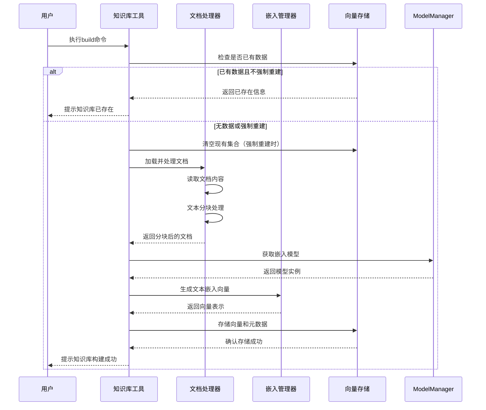
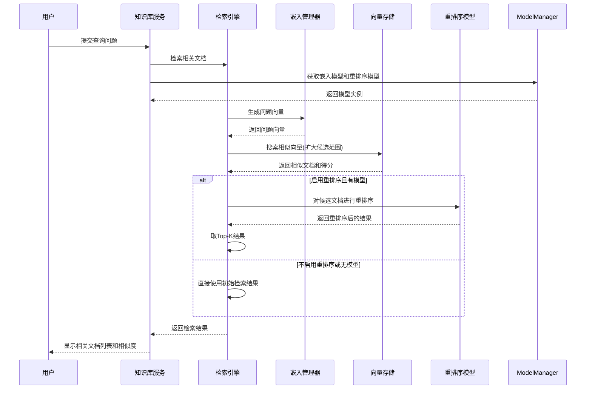

# any4any 知识库系统说明文档

## 1. 系统概述

any4any知识库系统是一个基于向量检索的智能文档管理和问答框架，提供完整的文档处理、向量存储、语义检索和智能问答功能。系统采用模块化架构设计，实现了文档处理、向量生成、向量存储和检索引擎的解耦，支持多种文档格式和灵活的配置选项。

### 1.1 核心功能

- **多格式文档处理**：支持PDF、DOCX、TXT等多种常见文档格式的加载和解析
- **智能文本分块**：实现基于句子的文本分块算法，支持可配置的块大小和重叠大小
- **高效向量生成**：集成Hugging Face的Transformer模型，支持生成高质量的文本嵌入向量
- **持久化向量存储**：基于ChromaDB实现向量的高效存储和检索，支持余弦相似度计算
- **语义检索**：提供基于向量相似度的语义搜索功能，支持Top-K检索
- **重排序优化**：集成重排序模型，进一步优化检索结果的相关性
- **智能问答**：结合检索结果和LLM模型，生成基于文档内容的精确回答
- **命令行工具**：提供完整的命令行工具，支持知识库构建、查询、搜索、统计等操作
- **OpenAI兼容API**：提供与OpenAI Embedding API兼容的接口
- **延迟初始化**：组件采用延迟初始化机制，提高系统启动效率

### 1.2 系统架构

知识库系统主要包含以下核心组件：

1. **文档处理器（DocumentProcessor）**：负责文档加载、解析和分块
2. **嵌入管理器（EmbeddingManager）**：负责文本向量的生成和管理，支持懒加载
3. **向量存储（VectorStore）**：负责向量的存储、检索和管理，基于ChromaDB
4. **检索引擎（RetrievalEngine）**：负责语义检索，支持重排序功能
5. **知识库服务（KnowledgeBaseServer）**：提供知识库相关功能的API服务
6. **API接口**：提供OpenAI兼容的嵌入API接口

## 2. 工作流程

### 2.1 知识库构建流程



### 2.2 智能检索流程



## 3. 核心组件详解

### 3.1 文档处理器（DocumentProcessor）

文档处理器负责加载、解析和分块处理各种格式的文档，是知识库构建的第一步。

**主要功能：**
- **多格式支持**：支持PDF、DOCX、TXT文件格式的解析
- **智能分块**：基于句子的文本分块算法，保持语义完整性
- **编码自动检测**：TXT文件自动检测编码格式，确保正确读取
- **元数据提取**：提取文档名称、路径、分块索引等元数据信息

**工作原理：**
1. 遍历指定目录中的所有文件
2. 根据文件扩展名选择对应的解析器（PDF、DOCX、TXT）
3. 使用对应库读取并合并文档内容
4. 使用正则表达式按句子分割文本
5. 根据配置的块大小进行分块，确保语义完整性
6. 为每个分块添加完整的元数据信息，包括文件名、分块索引、总块数等

### 3.2 嵌入管理器（EmbeddingManager）

嵌入管理器负责将文本转换为向量表示，是知识库语义检索的核心组件。

**主要功能：**
- **全局模型共享**：优先使用ModelManager中的全局嵌入模型
- **本地模型加载**：在全局模型不可用时加载本地模型
- **懒加载机制**：首次使用时才加载模型，提高系统启动效率
- **批量向量化**：支持批量文本的向量生成，提高效率
- **向量格式转换**：支持numpy数组和Python列表格式的向量输出
- **均值池化**：使用注意力掩码的均值池化计算句子嵌入

**工作原理：**
1. 初始化时不加载模型，采用延迟加载策略
2. 首次调用get_embeddings时触发模型加载
3. 尝试使用ModelManager中的全局嵌入模型，失败时本地加载
4. 使用Hugging Face的AutoTokenizer和AutoModel处理文本
5. 对输入文本进行tokenization和padding处理
6. 通过模型前向传播获取token级别的嵌入
7. 应用注意力掩码的均值池化获取句子级嵌入
8. 对嵌入向量进行L2归一化
9. 根据需要返回numpy数组或Python列表格式的向量

### 3.3 向量存储（VectorStore）

向量存储基于ChromaDB实现，负责向量的持久化存储和高效检索。

**主要功能：**
- **向量添加**：将文本向量和元数据添加到向量库
- **相似度搜索**：基于余弦相似度的Top-K检索
- **文件管理**：支持按文件名查询和删除向量
- **统计信息**：提供向量库的统计信息，包括向量总数、文件数等
- **持久化存储**：自动处理向量的持久化保存

**工作原理：**
1. 初始化ChromaDB持久化客户端，禁用匿名遥测
2. 创建或获取名为"documents"的集合，使用余弦相似度空间
3. 存储时生成唯一ID，关联向量、文档内容和完整元数据
4. 检索时将余弦距离转换为相似度分数（1-距离）
5. 按文件名删除时先查询所有相关ID，再批量删除
6. ChromaDB自动处理向量索引和持久化存储
7. 统计信息计算时获取所有元数据并分析文件数量

### 3.4 检索引擎（RetrievalEngine）

检索引擎集成了嵌入管理器和向量存储，提供端到端的检索功能，支持重排序优化。

**主要功能：**
- **语义检索**：将查询转换为向量并搜索相似文档
- **重排序优化**：支持重排序模型对检索结果进一步优化
- **批处理重排序**：支持批量处理重排序计算，提高效率
- **灵活配置**：支持配置检索参数和重排序选项
- **统计查询**：提供向量库统计信息查询功能
- **文档管理**：支持按文件名删除文档

**工作原理：**
1. 初始化时接收嵌入管理器、向量存储和可选的重排序器
2. 检索时首先将查询文本转换为向量表示
3. 扩大检索范围以获取足够的候选文档（用于重排序）
4. 如果启用重排序且有重排序模型，则执行以下步骤：
   - 提取候选文档文本内容
   - 构建(query, document)对
   - 批量调用重排序模型计算相关性分数
   - 根据分数对文档重新排序
   - 取前Top-K个结果
5. 如果不启用重排序或无模型，则直接使用初始检索结果
6. 格式化返回结果，包含文档信息、文件名、得分等
7. 提供统计查询和文档删除等辅助功能


## 4. 数据库设计

知识库系统使用ChromaDB作为向量数据库，采用以下数据模型：

### 4.1 集合结构

系统使用单一集合（"documents"）存储所有文档的向量表示，集合使用余弦相似度空间（cosine）。

### 4.2 数据结构

每个向量条目包含以下内容：

| 字段名 | 类型 | 说明 |
|-------|------|------|
| documents | str | 文档块的原始文本内容 |
| embeddings | List[float] | 文本的向量表示 |
| metadatas | Dict | 元数据信息 |
| ids | str | 唯一标识符（UUID） |

### 4.3 元数据结构

元数据包含以下关键字段：

| 字段名 | 类型 | 说明 |
|-------|------|------|
| file_name | str | 原始文件名 |
| chunk_text | str | 文档块文本内容 |
| chunk_index | int | 文档块在原文档中的索引 |
| total_chunks | int | 原文档的总块数 |

## 5. 关键技术解决办法

### 5.1 文本分块策略

系统实现了基于句子的文本分块算法，确保分块边界位于句子结束处，保持语义完整性。

```python
# 文本分块核心逻辑
sentences = re.split(r'[。！？!?\.\n]', text)  # 按多种标点符号分割句子
sentences = [s.strip() for s in sentences if s.strip()]  # 过滤空句子
chunks = []
current_chunk = ""

for sentence in sentences:
    if len(current_chunk) + len(sentence) <= self.chunk_size:  # 检查是否超长
        current_chunk += sentence + "。"
    else:
        if current_chunk:
            chunks.append(current_chunk.strip())
        current_chunk = sentence + "。"
if current_chunk:
    chunks.append(current_chunk.strip())  # 添加最后一个块
```

### 5.2 向量生成与归一化

系统使用均值池化和L2归一化技术确保向量质量和稳定性：

1. **均值池化**：考虑注意力掩码，对有效token的嵌入进行加权平均
2. **L2归一化**：将向量投影到单位球面上，使余弦相似度计算更稳定
3. **延迟加载**：采用懒加载策略，首次使用时才加载模型
4. **全局模型共享**：优先使用ModelManager中的全局模型

### 5.3 相似度计算与转换

系统采用余弦距离进行相似性计算，并将距离转换为相似度分数：

```python
# 距离转相似度
similarity = 1 - results['distances'][0][i]
```

这种转换使结果更符合用户直觉（值越大表示越相似）。

### 5.4 重排序优化

系统集成了重排序功能，对初步检索结果进行进一步优化：

```python
# 重排序核心逻辑
if use_rerank and self.reranker and Config.RERANK_MODEL_ENABLED:
    documents = [metadata['chunk_text'] for _, metadata in similar_docs]
    # 批处理计算相关性分数
    batch_pairs = [[question, doc] for doc in documents]
    batch_scores = self.reranker.compute_score(batch_pairs)
    # 排序并取Top-K结果
    reranked_results.sort(key=lambda x: x['score'], reverse=True)
    final_docs = reranked_results[:top_k]
```

### 5.5 错误处理与日志记录

系统在每个组件中实现了完善的错误处理和日志记录机制，确保系统稳定性并提供调试信息：

- 所有关键操作都有try-except块
- 详细的日志记录（INFO、ERROR级别）
- 统一的日志配置和初始化
- 异常信息和堆栈跟踪记录

### 5.6 模块化设计

系统采用严格的模块化设计，每个组件职责明确，接口清晰：

- 组件间通过依赖注入解耦
- 统一的配置管理
- 清晰的函数接口和返回类型
- 延迟初始化机制
- 全局模型共享策略

## 6. 配置项说明

知识库系统的关键配置项：

| 配置项 | 说明 | 默认值 |
|-------|------|-------|
| KNOWLEDGE_BASE_ENABLED | 是否启用知识库功能 | 可配置 |
| RERANK_MODEL_ENABLED | 是否启用重排序功能 | 可配置 |
| RERANK_CANDIDATE_FACTOR | 重排序候选文档倍数 | 10 |
| RERANK_BATCH_SIZE | 重排序批处理大小 | 可配置 |
| EMBEDDING_MODEL_DIR | 嵌入模型路径 | /mnt/c/models/bge-small-zh-v1.5 |
| VECTOR_DB_PATH | 向量数据库存储路径 | data/vector_db |
| DOCS_PATH | 文档目录路径 | data/docs |
| DOC_CHUNK_SIZE | 文档分块大小 | 500 |
| DOC_CHUNK_OVERLAP | 文档分块重叠大小 | 50 |
| TOP_K | 检索返回的最相关文档数量 | 3 |
| SUPPORTED_FILE_TYPES | 支持的文件类型 | ['.pdf', '.docx', '.txt'] |

## 7. API接口

### 7.1 OpenAI兼容API

#### 创建嵌入

- **接口路径**：`POST /v1/embeddings`
- **功能描述**：将输入文本转换为向量表示
- **请求参数**：
  - `input`: str或List[str]，要生成嵌入的文本
  - `model`: str，模型名称
- **响应格式**：
  ```json
  {
    "object": "list",
    "data": [
      {
        "object": "embedding",
        "embedding": [0.1, 0.2, ...],
        "index": 0
      }
    ],
    "model": "model_name",
    "usage": {
      "prompt_tokens": 10,
      "total_tokens": 10
    }
  }
  ```


### 7.3 服务API接口

#### 知识库服务

KnowledgeBaseServer类提供了以下主要方法：

- **build_knowledge_base(force_rebuild=False)**: 构建知识库
- **retrieve_documents(question, top_k=3, use_rerank=True)**: 检索相关文档
- **simple_search(question, top_k=5)**: 简单搜索
- **get_collection_stats()**: 获取集合统计信息

## 8. 使用示例

### 8.1 使用API接口

知识库功能现在通过API接口进行访问，具体使用方法请参考API文档。

## 9. 性能优化建议

### 9.1 分块大小调优

根据文档类型和内容特点，可以调整`DOC_CHUNK_SIZE`参数：
- 对于长文本，增大块大小可减少总块数
- 对于短文本，减小块大小可提高检索精度

### 9.2 模型选择

- 对于中文内容，建议使用bge-small-zh-v1.5或其他中文优化模型
- 对于英文内容，可选择bge-small-en-v1.5等英文模型
- 如需更高精度，可考虑使用更大的模型如bge-base或bge-large

### 9.3 检索参数调整

- `TOP_K`参数控制检索结果数量，默认为3
- `RERANK_CANDIDATE_FACTOR`控制重排序候选文档倍数，默认为10
- `RERANK_BATCH_SIZE`控制重排序批处理大小
- 增大`TOP_K`可获取更多相关文档，但可能引入噪声
- 适当调整重排序参数可平衡检索质量和性能

### 9.4 批量处理

处理大量文档时，建议批量处理而非单条处理，以提高效率。

### 9.5 重排序优化

- 启用重排序可提高检索质量，但会增加计算开销
- 根据实际需求平衡检索速度和质量
- 调整`RERANK_CANDIDATE_FACTOR`可控制候选文档数量