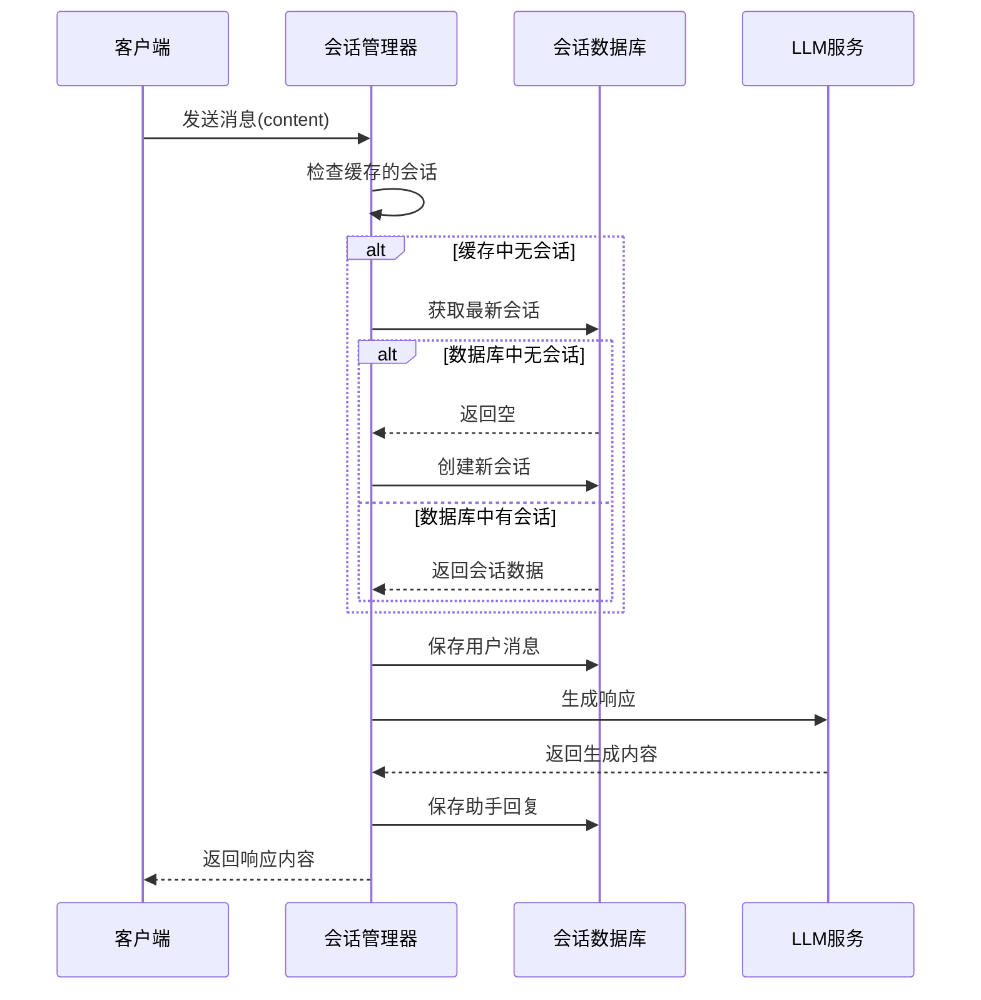
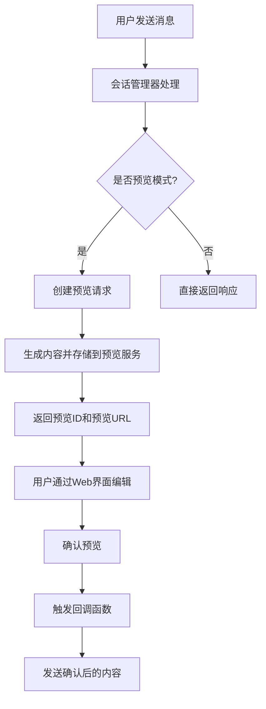
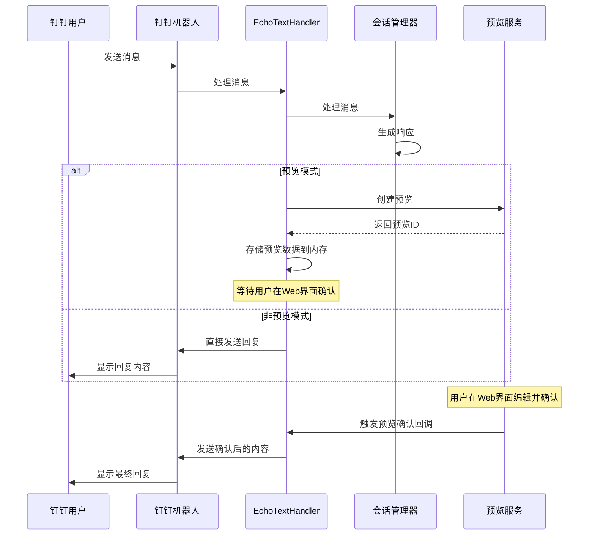

# ANY4ANY 会话管理系统说明文档

## 1. 系统概述

ANY4ANY会话管理系统是一个支持多平台的对话管理框架，提供完整的会话生命周期管理、上下文跟踪、预览编辑功能，并支持多种平台集成（特别是钉钉平台）。系统设计遵循模块化架构，实现了业务逻辑与数据访问层的分离。

### 1.1 核心功能

- **多平台会话管理**：支持在不同平台（如Web、钉钉、API等）之间追踪和维护用户对话历史
- **预览模式**：提供生成内容的预览和编辑功能，支持人工干预
- **流式响应**：支持LLM流式生成响应内容
- **持久化存储**：使用MySQL数据库存储会话和消息数据
- **钉钉集成**：支持钉钉机器人消息处理和预览确认后的消息发送

### 1.2 系统架构

系统主要包含以下核心组件：

1. **会话管理器（ConversationManager）**：处理会话业务逻辑
2. **会话数据库（ConversationDatabase）**：负责数据持久化
3. **预览服务（PreviewService）**：管理预览和编辑功能
4. **钉钉消息管理器（EchoTextHandler）**：处理钉钉平台特定逻辑

## 2. 会话管理流程

### 2.1 基本会话流程



### 2.2 会话持久化机制

会话管理系统通过MySQL数据库进行持久化存储，包含两个主要表：

1. **conversations表**：存储会话基本信息
2. **messages表**：存储消息内容，与会话表建立外键关联

系统使用内存缓存（`active_conversations`）提高性能，但所有关键数据都会持久化到数据库。缓存过期时间可配置（默认1小时）。

## 3. 预览模式详解

### 3.1 预览模式工作原理

预览模式允许用户在最终发送前查看、编辑LLM生成的内容。系统将生成的内容保存到预览服务中，用户可以通过Web界面访问并进行编辑，确认后才会将内容发送给最终用户。

### 3.2 预览模式流程



### 3.3 预览服务核心功能

- **创建预览**：生成唯一的预览ID并存储请求数据
- **内容编辑**：允许用户修改生成的内容
- **预览确认**：用户确认后触发回调，完成后续操作
- **数据持久化**：将编辑前后的内容保存到previews表

## 4. 钉钉平台集成

### 4.1 钉钉消息处理流程

钉钉平台集成是会话管理系统的重要特性，支持通过钉钉机器人进行交互，并在预览模式下进行特殊处理。



### 4.2 钉钉平台特殊处理

1. **内存存储机制**：使用内存字典存储预览相关信息，包括发送者ID、原始内容等
2. **预览确认回调**：注册专用回调函数，在用户确认预览后发送钉钉消息
3. **多格式预览ID处理**：支持从不同响应格式中提取预览ID

## 5. 数据库设计

### 5.1 表结构

#### conversations表
| 字段名 | 类型 | 说明 |
|-------|------|------|
| conversation_id | varchar(50) | 会话唯一标识ID（主键） |
| sender | varchar(100) | 发送者唯一标识 |
| user_nick | varchar(100) | 用户昵称或显示名称 |
| platform | varchar(50) | 来源平台(如: wechat, web, app等) |
| created_time | datetime | 会话创建时间 |
| last_active | datetime | 会话最后活跃时间 |
| message_count | int(11) | 会话中的消息总数 |

#### messages表
| 字段名 | 类型 | 说明 |
|-------|------|------|
| message_id | varchar(50) | 消息唯一标识ID（主键） |
| conversation_id | varchar(50) | 所属会话ID（外键） |
| content | text | 消息内容 |
| sender_type | varchar(20) | 发送者类型(user-用户, assistant-助手) |
| timestamp | datetime | 消息发送时间 |
| sequence_number | int(11) | 消息在会话中的顺序号 |

#### previews表
| 字段名 | 类型 | 说明 |
|-------|------|------|
| id | int(11) | 自增ID（主键） |
| conversation_id | varchar(100) | 会话ID |
| message_id | varchar(100) | 对话ID |
| current_request | mediumtext | 当前请求内容 |
| saved_content | mediumtext | 编辑保存后的内容 |
| pre_content | mediumtext | 编辑前的内容 |
| full_request | mediumtext | 历史全部请求及响应内容 |
| response_time | float | 响应用时(秒) |
| user_id | int(11) | 响应人员ID |
| created_at | timestamp | 创建时间 |
| updated_at | timestamp | 更新时间 |

### 5.2 索引设计

系统在关键表上建立了多个索引以提高查询性能：

- conversations表：用户平台联合索引、平台索引、最后活跃时间索引
- messages表：会话ID索引、消息时间索引、会话消息顺序索引

## 6. 关键技术解决办法

### 6.1 进程安全的单例模式

会话管理器使用进程安全的单例模式实现，确保每个进程拥有独立的会话管理器实例，避免在多进程环境中出现冲突。

```python
# 单例模式实现
def get_conversation_manager():
    """获取全局会话管理器实例，实现单例模式"""
    import os
    import logging
    global _global_conversation_manager, _conversation_manager_pid
    
    current_pid = os.getpid()
    
    # 检查是否为主进程
    is_main_process = os.environ.get('IS_MAIN_PROCESS') == 'true'
    if not is_main_process:
        current_port = os.environ.get('CURRENT_PORT', 'unknown')
        is_main_process = current_port != '9999' and current_port != 'unknown'
    
    # 确保每个进程有独立的实例
    if _global_conversation_manager is None or _conversation_manager_pid != current_pid:
        _global_conversation_manager = ConversationManager()
        _conversation_manager_pid = current_pid
    
    return _global_conversation_manager
```

### 6.2 预览内容处理机制

预览服务实现了内容的生成、编辑和确认的完整流程，同时支持内容持久化和回调通知：

- **内容提取**：从LLM响应中提取可见内容（处理think标签等）
- **内容编辑**：支持用户在Web界面编辑生成内容
- **回调通知**：用户确认后通知相关平台（如钉钉）发送最终内容

### 6.3 多平台适配

系统通过platform字段区分不同来源平台，实现了统一的会话管理接口，同时为特定平台（如钉钉）提供定制化处理逻辑。

## 7. 配置项说明

会话管理系统的关键配置项：

| 配置项 | 说明 | 默认值 |
|-------|------|-------|
| PREVIEW_MODE | 是否启用预览模式 | 可配置 |
| PREVIEW_TIMEOUT | 预览超时时间 | 可配置 |

## 8. API接口

### 8.1 会话管理相关接口

- **处理消息**：`process_message(sender, user_nick, platform, content)`
- **流式处理消息**：`process_stream_message(sender, user_nick, platform, content, generation_id)`
- **获取会话历史**：通过数据库查询接口获取

### 8.2 预览相关接口

- **创建预览**：`create_preview(request_data)`
- **更新预览内容**：`update_content(preview_id, edited_content)`
- **确认预览**：`confirm_preview(preview_id)`
- **获取预览**：`get_preview(preview_id)`

## 9. 总结

ANY4ANY会话管理系统提供了完整的多平台会话管理功能，支持预览模式和非预览模式，特别优化了钉钉平台的集成体验。系统采用模块化设计，实现了业务逻辑与数据访问的分离，具有良好的扩展性和维护性。

通过合理的数据库设计和缓存机制，系统能够高效地处理会话数据，并支持上下文连续的对话交互。预览模式的实现为内容质量控制提供了灵活的人工干预手段，特别适合需要内容审核的场景。