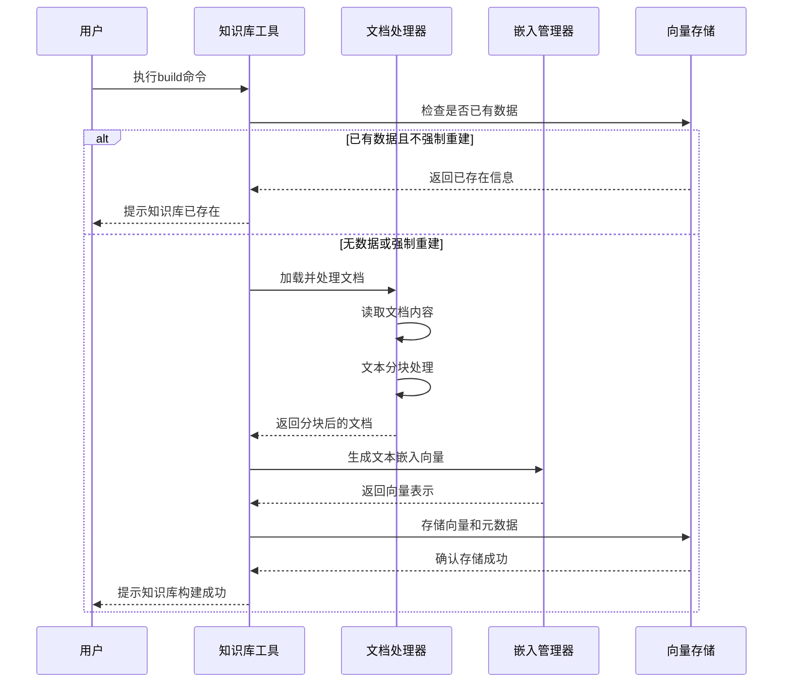
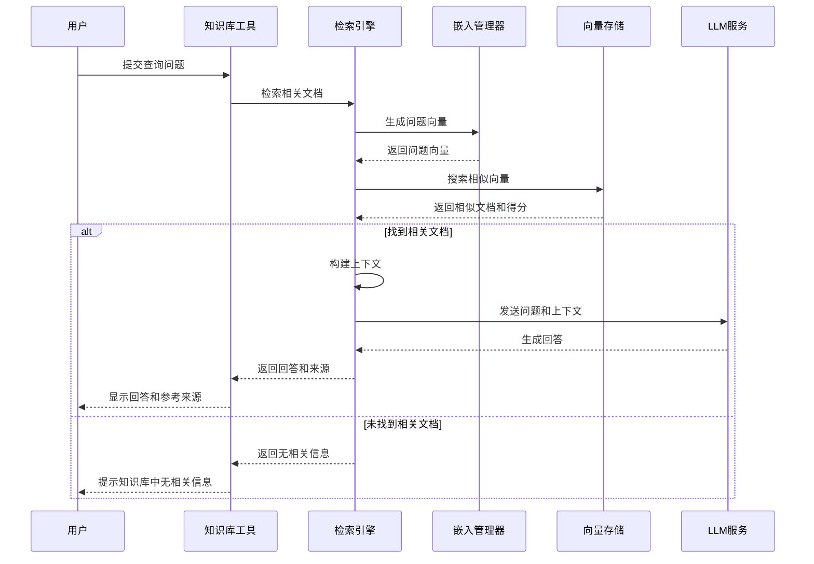

# any4any 知识库系统说明文档

## 1. 系统概述

any4any知识库系统是一个基于向量检索的智能文档管理和问答框架，提供完整的文档处理、向量存储、语义检索和智能问答功能。系统采用模块化架构设计，实现了文档处理、向量生成、向量存储和检索引擎的解耦，支持多种文档格式和灵活的配置选项。

### 1.1 核心功能

- **多格式文档处理**：支持PDF、DOCX、TXT等多种常见文档格式的加载和解析
- **智能文本分块**：实现基于句子的文本分块算法，支持可配置的块大小和重叠大小
- **高效向量生成**：集成Hugging Face的Transformer模型，支持生成高质量的文本嵌入向量
- **持久化向量存储**：基于ChromaDB实现向量的高效存储和检索，支持余弦相似度计算
- **语义检索**：提供基于向量相似度的语义搜索功能，支持Top-K检索
- **智能问答**：结合检索结果和LLM模型，生成基于文档内容的精确回答
- **命令行工具**：提供完整的命令行工具，支持知识库构建、查询、搜索、统计等操作
- **OpenAI兼容API**：提供与OpenAI Embedding API兼容的接口

### 1.2 系统架构

知识库系统主要包含以下核心组件：

1. **文档处理器（DocumentProcessor）**：负责文档加载、解析和分块
2. **嵌入管理器（EmbeddingManager）**：负责文本向量的生成和管理
3. **向量存储（VectorStore）**：负责向量的存储、检索和管理
4. **检索引擎（RetrievalEngine）**：负责语义检索和智能问答
5. **知识库工具（KnowledgeBaseTool）**：提供命令行接口和工具函数
6. **API接口**：提供OpenAI兼容的嵌入API接口

## 2. 工作流程

### 2.1 知识库构建流程



### 2.2 智能问答流程



## 3. 核心组件详解

### 3.1 文档处理器（DocumentProcessor）

文档处理器负责加载、解析和分块处理各种格式的文档，是知识库构建的第一步。

**主要功能：**
- **多格式支持**：支持PDF、DOCX、TXT文件格式的解析
- **智能分块**：基于句子的文本分块算法，保持语义完整性
- **编码自动检测**：TXT文件自动检测编码格式，确保正确读取
- **元数据提取**：提取文档名称、路径等元数据信息

**工作原理：**
1. 遍历指定目录中的所有文件
2. 根据文件扩展名选择对应的解析器
3. 读取并合并文档内容
4. 使用正则表达式按句子分割文本
5. 根据配置的块大小和重叠大小进行分块
6. 为每个分块添加元数据信息

### 3.2 嵌入管理器（EmbeddingManager）

嵌入管理器负责将文本转换为向量表示，是知识库语义检索的核心组件。

**主要功能：**
- **模型加载**：自动加载配置的嵌入模型
- **批量向量化**：支持批量文本的向量生成，提高效率
- **向量格式转换**：支持numpy数组和Python列表格式的向量输出
- **均值池化**：使用注意力掩码的均值池化计算句子嵌入

**工作原理：**
1. 使用Hugging Face的AutoTokenizer和AutoModel加载模型
2. 对输入文本进行tokenization和padding处理
3. 通过模型前向传播获取token级别的嵌入
4. 应用注意力掩码的均值池化获取句子级嵌入
5. 对嵌入向量进行L2归一化
6. 返回标准化的向量表示

### 3.3 向量存储（VectorStore）

向量存储基于ChromaDB实现，负责向量的持久化存储和高效检索。

**主要功能：**
- **向量添加**：将文本向量和元数据添加到向量库
- **相似度搜索**：基于余弦相似度的Top-K检索
- **文件管理**：支持按文件名查询和删除向量
- **统计信息**：提供向量库的统计信息，如向量总数、文件数等

**工作原理：**
1. 初始化ChromaDB客户端并创建集合
2. 存储时关联向量、文档内容和元数据
3. 检索时将余弦距离转换为相似度分数（1-距离）
4. 按文件名删除时先查询所有相关ID，再批量删除
5. ChromaDB自动处理向量索引和持久化存储

### 3.4 检索引擎（RetrievalEngine）

检索引擎集成了嵌入管理器和向量存储，提供端到端的检索和问答功能。

**主要功能：**
- **语义检索**：将查询转换为向量并搜索相似文档
- **上下文构建**：自动构建包含检索结果的上下文
- **智能问答**：结合检索结果和LLM生成回答
- **OpenAI API兼容**：支持调用OpenAI兼容的模型API

**工作原理：**
1. 接收用户查询并生成向量表示
2. 在向量库中搜索Top-K个最相似的文档
3. 构建包含检索结果的上下文提示
4. 调用LLM模型生成基于上下文的回答
5. 返回回答、来源文档和相似度分数

### 3.5 知识库工具（KnowledgeBaseTool）

知识库工具提供命令行接口，是用户与知识库系统交互的主要方式。

**主要功能：**
- **知识库构建**：扫描文档目录并构建向量数据库
- **智能查询**：基于知识库内容回答问题
- **语义搜索**：搜索相关文档但不生成回答
- **统计查询**：查看知识库的统计信息
- **文件管理**：删除特定文件的向量

**工作原理：**
1. 初始化所有组件（嵌入管理器、向量存储、检索引擎）
2. 解析命令行参数并执行相应操作
3. 构建时处理文档并生成向量
4. 查询时执行检索和问答流程
5. 提供详细的日志输出和错误处理

## 4. 数据库设计

知识库系统使用ChromaDB作为向量数据库，采用以下数据模型：

### 4.1 集合结构

系统使用单一集合（"documents"）存储所有文档的向量表示，集合使用余弦相似度空间（cosine）。

### 4.2 数据结构

每个向量条目包含以下内容：

| 字段名 | 类型 | 说明 |
|-------|------|------|
| documents | str | 文档块的原始文本内容 |
| embeddings | List[float] | 文本的向量表示 |
| metadatas | Dict | 元数据信息 |
| ids | str | 唯一标识符（UUID） |

### 4.3 元数据结构

元数据包含以下关键字段：

| 字段名 | 类型 | 说明 |
|-------|------|------|
| file_name | str | 原始文件名 |
| chunk_text | str | 文档块文本内容 |
| chunk_index | int | 文档块在原文档中的索引 |
| total_chunks | int | 原文档的总块数 |

## 5. 关键技术解决办法

### 5.1 文本分块策略

系统实现了基于句子的文本分块算法，确保分块边界位于句子结束处，保持语义完整性。

```python
# 文本分块核心逻辑
sentences = re.split(r'[。！？!?\.\n]', text)  # 按多种标点符号分割句子
chunks = []
current_chunk = ""

for sentence in sentences:
    if len(current_chunk) + len(sentence) <= self.chunk_size:  # 检查是否超长
        current_chunk += sentence + "。"
    else:
        if current_chunk:
            chunks.append(current_chunk.strip())
        current_chunk = sentence + "。"
```

### 5.2 向量生成与归一化

系统使用均值池化和L2归一化技术确保向量质量和稳定性：

1. **均值池化**：考虑注意力掩码，对有效token的嵌入进行加权平均
2. **L2归一化**：将向量投影到单位球面上，使余弦相似度计算更稳定

### 5.3 相似度计算与转换

系统采用余弦距离进行相似性计算，并将距离转换为相似度分数：

```python
# 距离转相似度
similarity = 1 - results['distances'][0][i]
```

这种转换使结果更符合用户直觉（值越大表示越相似）。

### 5.4 错误处理与日志记录

系统在每个组件中实现了完善的错误处理和日志记录机制，确保系统稳定性并提供调试信息：

- 所有关键操作都有try-except块
- 详细的日志记录（INFO、ERROR级别）
- 统一的日志配置和初始化

### 5.5 模块化设计

系统采用严格的模块化设计，每个组件职责明确，接口清晰：

- 组件间通过依赖注入解耦
- 统一的配置管理
- 清晰的函数接口和返回类型

## 6. 配置项说明

知识库系统的关键配置项：

| 配置项 | 说明 | 默认值 |
|-------|------|-------|
| USE_KNOWLEDGE_BASE | 是否启用知识库功能 | 可配置 |
| EMBEDDING_MODEL_DIR | 嵌入模型路径 | /mnt/c/models/bge-small-zh-v1.5 |
| VECTOR_DB_PATH | 向量数据库存储路径 | data/vector_db |
| DOCS_PATH | 文档目录路径 | data/docs |
| DOC_CHUNK_SIZE | 文档分块大小 | 500 |
| DOC_CHUNK_OVERLAP | 文档分块重叠大小 | 50 |
| TOP_K | 检索返回的最相关文档数量 | 3 |
| SUPPORTED_FILE_TYPES | 支持的文件类型 | ['.pdf', '.docx', '.txt'] |

## 7. API接口

### 7.1 OpenAI兼容API

#### 创建嵌入

- **接口路径**：`POST /v1/embeddings`
- **功能描述**：将输入文本转换为向量表示
- **请求参数**：
  - `input`: str或List[str]，要生成嵌入的文本
  - `model`: str，模型名称
- **响应格式**：
  ```json
  {
    "object": "list",
    "data": [
      {
        "object": "embedding",
        "embedding": [0.1, 0.2, ...],
        "index": 0
      }
    ],
    "model": "model_name",
    "usage": {
      "prompt_tokens": 10,
      "total_tokens": 10
    }
  }
  ```

### 7.2 命令行接口

#### 构建知识库

```bash
python -m core.embedding.kb_tool build [--force]
```
- `--force`: 强制重建知识库，清空现有数据

#### 查询知识库

```bash
python -m core.embedding.kb_tool query "你的问题" [--top-k 3]
```
- `question`: 要查询的问题
- `--top-k`: 返回的最相关文档数量（默认3）

#### 搜索相关文档

```bash
python -m core.embedding.kb_tool search "搜索关键词" [--top-k 5]
```
- `question`: 搜索关键词
- `--top-k`: 返回的最相关文档数量（默认5）

#### 查看统计信息

```bash
python -m core.embedding.kb_tool stats
```

#### 删除文件向量

```bash
python -m core.embedding.kb_tool delete "filename.pdf"
```
- `file_name`: 要删除的文件名

## 8. 使用示例

### 8.1 构建知识库

1. 将文档放入`data/docs`目录
2. 执行构建命令：
   ```bash
   python -m core.embedding.kb_tool build
   ```
3. 查看构建进度和统计信息

### 8.2 查询知识库

```bash
python -m core.embedding.kb_tool query "什么是向量数据库？"
```

输出示例：
```
Query: 什么是向量数据库？

Answer: 向量数据库是一种专门设计用于存储和检索向量嵌入的数据库系统。它能够高效地执行相似度搜索，找出与查询向量最相似的向量集合。

Reference sources (total 3):

1. File: vector_database_intro.pdf
   Similarity: 0.921
   Content: 向量数据库是一种特殊类型的数据库，专门优化用于存储和检索高维向量数据。与传统关系型数据库不同，向量数据库...

2. File: ai_models_overview.docx
   Similarity: 0.785
   Content: 现代AI系统经常使用向量表示数据，例如文本嵌入、图像特征等。向量数据库提供了高效的相似度搜索机制...

3. File: data_storage_trends.txt
   Similarity: 0.712
   Content: 随着人工智能技术的发展，向量数据的存储需求迅速增长。向量数据库作为一种新兴的数据库类型...
```

### 8.3 使用搜索功能

```bash
python -m core.embedding.kb_tool search "机器学习模型"
```

输出示例：
```
Search query: 机器学习模型
Found 5 relevant results:

1. File: ml_basics.pdf
   Similarity: 0.897
   Content: 机器学习模型是一种能够从数据中学习并做出预测的算法。常见的机器学习模型包括线性回归、决策树、神经网络等...

2. File: ai_models_overview.docx
   Similarity: 0.876
   Content: 现代机器学习模型可以分为监督学习、无监督学习和强化学习三大类。每种类型的模型都有其特定的应用场景...

3. File: deep_learning_notes.txt
   Similarity: 0.812
   Content: 深度学习是机器学习的一个分支，其模型主要基于人工神经网络。深度神经网络模型通常包含多个隐藏层...

4. File: model_training_guide.pdf
   Similarity: 0.765
   Content: 训练机器学习模型是一个迭代过程，包括数据准备、模型选择、参数调整、评估和部署等步骤...

5. File: nlp_models.pdf
   Similarity: 0.721
   Content: 自然语言处理（NLP）领域有许多专门的机器学习模型，如词袋模型、TF-IDF、Word2Vec等...
```

## 9. 性能优化建议

### 9.1 分块大小调优

根据文档类型和内容特点，可以调整`DOC_CHUNK_SIZE`和`DOC_CHUNK_OVERLAP`参数：
- 对于长文本，增大块大小可减少总块数
- 对于短文本，减小块大小可提高检索精度
- 适当的重叠有助于保持上下文连续性

### 9.2 模型选择

- 对于中文内容，建议使用bge-small-zh-v1.5或其他中文优化模型
- 对于英文内容，可选择bge-small-en-v1.5等英文模型
- 如需更高精度，可考虑使用更大的模型如bge-base或bge-large

### 9.3 检索参数调整

- `TOP_K`参数控制检索结果数量，默认为3
- 增大`TOP_K`可获取更多相关文档，但可能引入噪声
- 减小`TOP_K`可提高相关性，但可能漏掉一些有用信息

### 9.4 批量处理

处理大量文档时，建议批量处理而非单条处理，以提高效率。